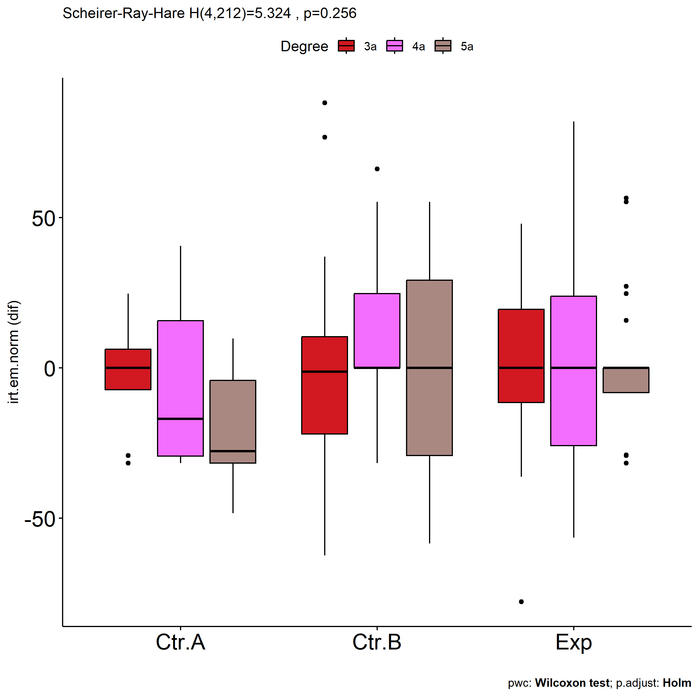
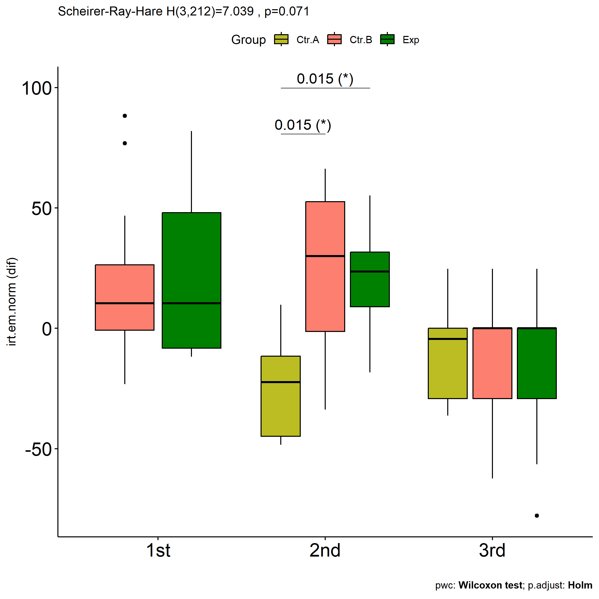

Non-Parametric ANCOVA tests for for assess H4(null) hypothesis
================
Geiser C. Challco <geiser@alumni.usp.br>

- [Setting Initial Variables](#setting-initial-variables)
- [Descriptive Statistics of Initial
  Data](#descriptive-statistics-of-initial-data)
- [One-way factor analysis for: *irt.em.norm ~
  Group*](#one-way-factor-analysis-for-irtemnorm--group)
  - [Pre-test and Post-test PairWise comparisons for: *irt.em.norm ~
    Group*](#pre-test-and-post-test-pairwise-comparisons-for-irtemnorm--group)
  - [Kruskal and Wilcoxon PairWise comparisons for: *irt.em.norm ~
    Group*](#kruskal-and-wilcoxon-pairwise-comparisons-for-irtemnorm--group)
- [Two-way factor analysis for: *irt.em.norm ~
  Group:Gender*](#two-way-factor-analysis-for-irtemnorm--groupgender)
  - [Pre-test and Post-test PairWise comparisons for: *irt.em.norm ~
    Group:Gender*](#pre-test-and-post-test-pairwise-comparisons-for-irtemnorm--groupgender)
  - [Scheirer and Wilcoxon PairWise comparisons for: *irt.em.norm ~
    Group:Gender*](#scheirer-and-wilcoxon-pairwise-comparisons-for-irtemnorm--groupgender)
- [Two-way factor analysis for: *irt.em.norm ~
  Group:Town*](#two-way-factor-analysis-for-irtemnorm--grouptown)
  - [Pre-test and Post-test PairWise comparisons for: *irt.em.norm ~
    Group:Town*](#pre-test-and-post-test-pairwise-comparisons-for-irtemnorm--grouptown)
  - [Scheirer and Wilcoxon PairWise comparisons for: *irt.em.norm ~
    Group:Town*](#scheirer-and-wilcoxon-pairwise-comparisons-for-irtemnorm--grouptown)
- [Two-way factor analysis for: *irt.em.norm ~
  Group:Degree*](#two-way-factor-analysis-for-irtemnorm--groupdegree)
  - [Pre-test and Post-test PairWise comparisons for: *irt.em.norm ~
    Group:Degree*](#pre-test-and-post-test-pairwise-comparisons-for-irtemnorm--groupdegree)
  - [Scheirer and Wilcoxon PairWise comparisons for: *irt.em.norm ~
    Group:Degree*](#scheirer-and-wilcoxon-pairwise-comparisons-for-irtemnorm--groupdegree)
- [Two-way factor analysis for: *irt.em.norm ~
  Group:qtl.irt.em.norm*](#two-way-factor-analysis-for-irtemnorm--groupqtlirtemnorm)
  - [Pre-test and Post-test PairWise comparisons for: *irt.em.norm ~
    Group:qtl.irt.em.norm*](#pre-test-and-post-test-pairwise-comparisons-for-irtemnorm--groupqtlirtemnorm)
  - [Scheirer and Wilcoxon PairWise comparisons for: *irt.em.norm ~
    Group:qtl.irt.em.norm*](#scheirer-and-wilcoxon-pairwise-comparisons-for-irtemnorm--groupqtlirtemnorm)

# Setting Initial Variables

``` r
dv = "irt.em.norm"
dv.pos = "pos.irt.em.norm"
dv.pre = "pre.irt.em.norm"
dv.dif = "dif.irt.em.norm"

fatores2 <- c("Gender","Town","Degree","qtl.irt.em.norm")
lfatores2 <- as.list(fatores2)
names(lfatores2) <- fatores2

fatores1 <- c("Group", fatores2)
lfatores1 <- as.list(fatores1)
names(lfatores1) <- fatores1

lfatores <- c(lfatores1)

color <- list()
color[["prepost"]] = c("#ffee65","#f28e2B")
color[["Group"]] = c("#bcbd22","#fd7f6f","#008000")
color[["Gender"]] = c("#FF007F","#4D4DFF")
color[["Town"]] = c("#AA00CC","#00AA99")
color[["Degree"]] = c("#d21820","#f36dff","#aa8882")


level <- list()
level[["Group"]] = c("Ctr.A","Ctr.B","Exp")
level[["Gender"]] = c("Female","Male")
level[["Town"]] = c("Sorocaba - SP","Limoeiro - PE")
level[["Degree"]] = c("3a","4a","5a")
level[["qtl.irt.em.norm"]] = c("1st","2nd","3rd")
level[["qtl.score"]] = c("1st","2nd","3rd")

# ..

color[["Group:Gender"]] = c(
  "Ctr.A:Female"="#ffccbb", "Ctr.B:Female"="#ff99cc", "Exp:Female"="#FF007F",
  "Ctr.A:Male"="#aabbff", "Ctr.B:Male"="#bbaaff", "Exp:Male"="#4D4DFF",
  "Ctr.A.Female"="#ffccbb", "Ctr.B.Female"="#ff99cc", "Exp.Female"="#FF007F",
  "Ctr.A.Male"="#aabbff", "Ctr.B.Male"="#bbaaff", "Exp.Male"="#4D4DFF"
)
color[["Group:Town"]] = c(
  "Ctr.A:Sorocaba - SP"="#AA00FF", "Ctr.B:Sorocaba - SP"="#FF00FF", "Exp:Sorocaba - SP"="#AA00FF",
  "Ctr.A:Limoeiro - PE"="#00EEFF", "Ctr.B:Limoeiro - PE"="#00EECC", "Exp:Limoeiro - PE"="#00CFCF",
  "Ctr.A.Sorocaba - SP"="#AA00FF", "Ctr.B.Sorocaba - SP"="#FF00FF", "Exp.Sorocaba - SP"="#AA00FF",
  "Ctr.A.Limoeiro - PE"="#00EEFF", "Ctr.B.Limoeiro - PE"="#00EECC", "Exp.Limoeiro - PE"="#00CFCF"
)


for (coln in c("vocab")) {
  color[[paste0(coln,".quintile")]] = c("#BF0040","#FF0000","#800080","#0000FF","#4000BF")
  level[[paste0(coln,".quintile")]] = c("1st quintile","2nd quintile","3rd quintile","4th quintile","5th quintile")
  color[[paste0("grupo:",coln,".quintile")]] = c(
    "Experimental.1st quintile"="#BF0040", "Controle.1st quintile"="#d8668c",
    "Experimental.2nd quintile"="#FF0000", "Controle.2nd quintile"="#ff7f7f",
    "Experimental.3rd quintile"="#8fce00", "Controle.3rd quintile"="#ddf0b2",
    "Experimental.4th quintile"="#0000FF", "Controle.4th quintile"="#b2b2ff",
    "Experimental.5th quintile"="#4000BF", "Controle.5th quintile"="#b299e5",
    
    "Experimental:1st quintile"="#BF0040", "Controle:1st quintile"="#d8668c",
    "Experimental:2nd quintile"="#FF0000", "Controle:2nd quintile"="#ff7f7f",
    "Experimental:3rd quintile"="#8fce00", "Controle:3rd quintile"="#ddf0b2",
    "Experimental:4th quintile"="#0000FF", "Controle:4th quintile"="#b2b2ff",
    "Experimental:5th quintile"="#4000BF", "Controle:5th quintile"="#b299e5")
}


gdat <- read_excel("../data/data.xlsx", sheet = "data")
gdat <- gdat[!is.na(gdat[[dv.pre]]) & !is.na(gdat[[dv.pos]]),]


dat <- gdat
dat$Group <- factor(dat[["Group"]], level[["Group"]])
for (coln in c(names(lfatores))) {
  if (length(level[[coln]]) > 0)
    plevel = level[[coln]][level[[coln]] %in% unique(dat[[coln]])]
  else
    plevel = unique(dat[[coln]])[!is.na(unique(dat[[coln]]))]
  
  dat[[coln]] <- factor(dat[[coln]], plevel)
}

dat <- dat[,c("ID", names(lfatores), dv.pre, dv.pos, dv.dif)]

dat.long <- rbind(dat, dat)
dat.long$time <- c(rep("pre", nrow(dat)), rep("pos", nrow(dat)))
dat.long$time <- factor(dat.long$time, c("pre","pos"))
dat.long[[dv]] <- c(dat[[dv.pre]], dat[[dv.pos]])


for (f in c("Group", names(lfatores))) {
  if (is.null(color[[f]]) && length(unique(dat[[f]])) > 0) 
      color[[f]] <- distinctColorPalette(length(unique(dat[[f]])))
}

for (f in c(fatores2)) {
  if (is.null(color[[paste0("Group:",f)]]) && length(unique(dat[[f]])) > 0)
    color[[paste0("Group:",f)]] <- distinctColorPalette(
      length(unique(dat[["Group"]]))*length(unique(dat[[f]])))
}

ldat <- list()
laov <- list()
lpwc <- list()
lemms <- list()
```

# Descriptive Statistics of Initial Data

``` r
df <- get.descriptives(dat, c(dv.pre, dv.pos, dv.dif), c("Group"),
                       symmetry.test = T, normality.test = F)
df <- plyr::rbind.fill(
  df, do.call(plyr::rbind.fill, lapply(lfatores2, FUN = function(f) {
    if (nrow(dat) > 0 && sum(!is.na(unique(dat[[f]]))) > 1)
      get.descriptives(dat, c(dv.pre,dv.pos), c("Group", f), include.global = F,
                       symmetry.test = T, normality.test = F)
    }))
)
```

    ## Warning: There was 1 warning in `mutate()`.
    ## ℹ In argument: `ci = abs(stats::qt(alpha/2, .data$n - 1) * .data$se)`.
    ## Caused by warning:
    ## ! There was 1 warning in `mutate()`.
    ## ℹ In argument: `ci = abs(stats::qt(alpha/2, .data$n - 1) * .data$se)`.
    ## Caused by warning in `stats::qt()`:
    ## ! NaNs produced
    ## There was 1 warning in `mutate()`.
    ## ℹ In argument: `ci = abs(stats::qt(alpha/2, .data$n - 1) * .data$se)`.
    ## Caused by warning:
    ## ! There was 1 warning in `mutate()`.
    ## ℹ In argument: `ci = abs(stats::qt(alpha/2, .data$n - 1) * .data$se)`.
    ## Caused by warning in `stats::qt()`:
    ## ! NaNs produced

``` r
df <- df[,c("variable",fatores1[fatores1 %in% colnames(df)],
            colnames(df)[!colnames(df) %in% c(fatores1,"variable")])]
```

| variable        | Group | Gender | Town          | Degree | qtl.irt.em.norm |   n |    mean |  median |     min |     max |     sd |     se |      ci |    iqr | symmetry |   skewness |   kurtosis |
|:----------------|:------|:-------|:--------------|:-------|:----------------|----:|--------:|--------:|--------:|--------:|-------:|-------:|--------:|-------:|:---------|-----------:|-----------:|
| pre.irt.em.norm | Ctr.A |        |               |        |                 |  27 |  79.820 |  75.243 |  23.198 | 100.000 | 24.345 |  4.685 |   9.630 | 24.757 | NO       | -0.9163297 | -0.4230660 |
| pre.irt.em.norm | Ctr.B |        |               |        |                 | 107 |  67.001 |  75.243 |   0.000 | 100.000 | 31.006 |  2.997 |   5.943 | 64.576 | YES      | -0.4264144 | -1.1733724 |
| pre.irt.em.norm | Exp   |        |               |        |                 |  87 |  75.968 | 100.000 |  11.805 | 100.000 | 29.909 |  3.207 |   6.375 | 41.985 | NO       | -0.8941781 | -0.5904994 |
| pos.irt.em.norm | Ctr.A |        |               |        |                 |  27 |  68.692 |  70.801 |   0.000 | 100.000 | 28.823 |  5.547 |  11.402 | 44.318 | NO       | -0.5800729 | -0.5871072 |
| pos.irt.em.norm | Ctr.B |        |               |        |                 | 107 |  72.305 |  70.801 |   0.000 | 100.000 | 31.462 |  3.042 |   6.030 | 50.390 | NO       | -0.8021967 | -0.5672608 |
| pos.irt.em.norm | Exp   |        |               |        |                 |  87 |  76.809 | 100.000 |   0.000 | 100.000 | 28.708 |  3.078 |   6.118 | 33.945 | NO       | -0.9894760 | -0.0644938 |
| dif.irt.em.norm | Ctr.A |        |               |        |                 |  27 | -11.129 | -11.452 | -48.335 |  40.593 | 23.220 |  4.469 |   9.186 | 30.440 | YES      |  0.3887749 | -0.8171220 |
| dif.irt.em.norm | Ctr.B |        |               |        |                 | 107 |   5.304 |   0.000 | -62.411 |  88.195 | 30.086 |  2.909 |   5.766 | 36.209 | YES      |  0.2028154 | -0.0227014 |
| dif.irt.em.norm | Exp   |        |               |        |                 |  87 |   0.841 |   0.000 | -77.790 |  81.972 | 27.233 |  2.920 |   5.804 | 30.530 | YES      |  0.1153149 |  0.5893188 |
| pre.irt.em.norm | Ctr.A | Female |               |        |                 |  16 |  78.327 |  75.243 |  23.198 | 100.000 | 25.157 |  6.289 |  13.405 | 24.757 | NO       | -0.8737072 | -0.5057954 |
| pre.irt.em.norm | Ctr.A | Male   |               |        |                 |  11 |  81.993 | 100.000 |  33.776 | 100.000 | 24.142 |  7.279 |  16.219 | 25.947 | NO       | -0.8392723 | -0.8694852 |
| pre.irt.em.norm | Ctr.B | Female |               |        |                 |  61 |  68.435 |  75.243 |   0.000 | 100.000 | 31.873 |  4.081 |   8.163 | 62.927 | YES      | -0.4937090 | -1.2058790 |
| pre.irt.em.norm | Ctr.B | Male   |               |        |                 |  44 |  65.258 |  75.243 |   0.000 | 100.000 | 29.604 |  4.463 |   9.000 | 66.224 | YES      | -0.3521042 | -1.1009559 |
| pre.irt.em.norm | Ctr.B |        |               |        |                 |   2 |  61.599 |  61.599 |  23.198 | 100.000 | 54.307 | 38.401 | 487.930 | 38.401 | few data |  0.0000000 |  0.0000000 |
| pre.irt.em.norm | Exp   | Female |               |        |                 |  48 |  81.634 | 100.000 |  11.805 | 100.000 | 27.760 |  4.007 |   8.061 | 25.801 | NO       | -1.1966678 | -0.0306234 |
| pre.irt.em.norm | Exp   | Male   |               |        |                 |  35 |  72.462 |  75.243 |  11.805 | 100.000 | 30.226 |  5.109 |  10.383 | 41.985 | NO       | -0.7598312 | -0.6708181 |
| pre.irt.em.norm | Exp   |        |               |        |                 |   4 |  38.650 |  33.776 |  11.805 |  75.243 | 26.503 | 13.251 |  42.172 | 15.860 | few data |  0.0000000 |  0.0000000 |
| pos.irt.em.norm | Ctr.A | Female |               |        |                 |  16 |  69.404 |  69.560 |   0.000 | 100.000 | 28.641 |  7.160 |  15.262 | 36.209 | NO       | -0.8170235 |  0.0439962 |
| pos.irt.em.norm | Ctr.A | Male   |               |        |                 |  11 |  67.656 |  70.801 |  22.432 | 100.000 | 30.456 |  9.183 |  20.460 | 56.467 | YES      | -0.2103297 | -1.6583238 |
| pos.irt.em.norm | Ctr.B | Female |               |        |                 |  61 |  68.719 |  70.801 |   0.000 | 100.000 | 33.205 |  4.252 |   8.504 | 58.460 | NO       | -0.6074327 | -1.0280483 |
| pos.irt.em.norm | Ctr.B | Male   |               |        |                 |  44 |  78.290 | 100.000 |   0.000 | 100.000 | 26.595 |  4.009 |   8.086 | 36.209 | NO       | -0.9675592 |  0.1300550 |
| pos.irt.em.norm | Ctr.B |        |               |        |                 |   2 |  50.000 |  50.000 |   0.000 | 100.000 | 70.711 | 50.000 | 635.310 | 50.000 | few data |  0.0000000 |  0.0000000 |
| pos.irt.em.norm | Exp   | Female |               |        |                 |  48 |  77.994 |  73.154 |  22.210 | 100.000 | 23.388 |  3.376 |   6.791 | 31.682 | NO       | -0.5868276 | -0.8253412 |
| pos.irt.em.norm | Exp   | Male   |               |        |                 |  35 |  79.735 | 100.000 |   0.000 | 100.000 | 31.121 |  5.260 |  10.691 | 30.440 | NO       | -1.2808741 |  0.3794228 |
| pos.irt.em.norm | Exp   |        |               |        |                 |   4 |  36.989 |  22.210 |   3.538 | 100.000 | 42.919 | 21.460 |  68.294 | 24.115 | few data |  0.0000000 |  0.0000000 |
| pre.irt.em.norm | Ctr.A |        | Limoeiro - PE |        |                 |  27 |  79.820 |  75.243 |  23.198 | 100.000 | 24.345 |  4.685 |   9.630 | 24.757 | NO       | -0.9163297 | -0.4230660 |
| pre.irt.em.norm | Ctr.B |        | Sorocaba - SP |        |                 |  47 |  77.846 |  75.243 |  28.443 | 100.000 | 23.843 |  3.478 |   7.001 | 30.440 | NO       | -0.6133257 | -0.9990874 |
| pre.irt.em.norm | Ctr.B |        | Limoeiro - PE |        |                 |  60 |  58.505 |  64.368 |   0.000 | 100.000 | 33.420 |  4.314 |   8.633 | 66.224 | YES      | -0.0731669 | -1.4811890 |
| pre.irt.em.norm | Exp   |        | Sorocaba - SP |        |                 |  34 |  85.210 | 100.000 |  44.797 | 100.000 | 20.666 |  3.544 |   7.211 | 29.133 | NO       | -0.8889809 | -0.8073689 |
| pre.irt.em.norm | Exp   |        | Limoeiro - PE |        |                 |  53 |  70.040 |  75.243 |  11.805 | 100.000 | 33.418 |  4.590 |   9.211 | 66.224 | NO       | -0.6007832 | -1.2442855 |
| pos.irt.em.norm | Ctr.A |        | Limoeiro - PE |        |                 |  27 |  68.692 |  70.801 |   0.000 | 100.000 | 28.823 |  5.547 |  11.402 | 44.318 | NO       | -0.5800729 | -0.5871072 |
| pos.irt.em.norm | Ctr.B |        | Sorocaba - SP |        |                 |  47 |  87.034 | 100.000 |  22.210 | 100.000 | 19.951 |  2.910 |   5.858 | 29.199 | NO       | -1.2872746 |  0.7918853 |
| pos.irt.em.norm | Ctr.B |        | Limoeiro - PE |        |                 |  60 |  60.767 |  68.318 |   0.000 | 100.000 | 34.057 |  4.397 |   8.798 | 77.790 | YES      | -0.2916065 | -1.2474711 |
| pos.irt.em.norm | Exp   |        | Sorocaba - SP |        |                 |  34 |  90.477 | 100.000 |  29.058 | 100.000 | 17.834 |  3.059 |   6.223 | 18.568 | NO       | -1.7714176 |  2.5018433 |
| pos.irt.em.norm | Exp   |        | Limoeiro - PE |        |                 |  53 |  68.041 |  70.801 |   0.000 | 100.000 | 30.994 |  4.257 |   8.543 | 52.640 | NO       | -0.5465605 | -0.8193517 |
| pre.irt.em.norm | Ctr.A |        |               | 3a     |                 |   8 |  93.811 | 100.000 |  75.243 | 100.000 | 11.460 |  4.052 |   9.581 |  6.189 | few data |  0.0000000 |  0.0000000 |
| pre.irt.em.norm | Ctr.A |        |               | 4a     |                 |   6 |  58.710 |  60.020 |  23.198 | 100.000 | 29.421 | 12.011 |  30.875 | 38.712 | YES      |  0.1077257 | -1.8720932 |
| pre.irt.em.norm | Ctr.A |        |               | 5a     |                 |  13 |  80.955 |  75.243 |  33.776 | 100.000 | 22.184 |  6.153 |  13.406 | 24.757 | NO       | -0.7898945 | -0.6301285 |
| pre.irt.em.norm | Ctr.B |        |               | 3a     |                 |  31 |  43.905 |  33.776 |   0.000 | 100.000 | 30.045 |  5.396 |  11.021 | 57.741 | YES      |  0.2218743 | -1.4465895 |
| pre.irt.em.norm | Ctr.B |        |               | 4a     |                 |  39 |  75.369 |  75.243 |  23.198 | 100.000 | 27.153 |  4.348 |   8.802 | 55.203 | NO       | -0.5417854 | -1.3233269 |
| pre.irt.em.norm | Ctr.B |        |               | 5a     |                 |  37 |  77.531 |  75.243 |  23.198 | 100.000 | 25.516 |  4.195 |   8.507 | 50.390 | NO       | -0.6103511 | -1.1159734 |
| pre.irt.em.norm | Exp   |        |               | 3a     |                 |  26 |  60.812 |  68.523 |  11.805 | 100.000 | 32.371 |  6.348 |  13.075 | 60.169 | YES      | -0.1887932 | -1.4573425 |
| pre.irt.em.norm | Exp   |        |               | 4a     |                 |  36 |  81.315 | 100.000 |  18.028 | 100.000 | 25.589 |  4.265 |   8.658 | 31.682 | NO       | -1.0088869 | -0.3108235 |
| pre.irt.em.norm | Exp   |        |               | 5a     |                 |  25 |  84.031 | 100.000 |  11.805 | 100.000 | 28.277 |  5.655 |  11.672 | 24.757 | NO       | -1.5481709 |  1.0239133 |
| pos.irt.em.norm | Ctr.A |        |               | 3a     |                 |   8 |  92.390 | 100.000 |  68.318 | 100.000 | 14.107 |  4.987 |  11.794 |  7.300 | few data |  0.0000000 |  0.0000000 |
| pos.irt.em.norm | Ctr.A |        |               | 4a     |                 |   6 |  53.381 |  53.662 |  22.210 | 100.000 | 30.104 | 12.290 |  31.592 | 39.479 | YES      |  0.2742672 | -1.6493269 |
| pos.irt.em.norm | Ctr.A |        |               | 5a     |                 |  13 |  61.174 |  68.318 |   0.000 | 100.000 | 27.450 |  7.613 |  16.588 | 23.494 | NO       | -0.6135628 | -0.2194748 |
| pos.irt.em.norm | Ctr.B |        |               | 3a     |                 |  31 |  44.695 |  43.533 |   0.000 | 100.000 | 32.472 |  5.832 |  11.911 | 48.591 | YES      |  0.2250872 | -1.1649190 |
| pos.irt.em.norm | Ctr.B |        |               | 4a     |                 |  39 |  88.162 | 100.000 |  22.210 | 100.000 | 19.642 |  3.145 |   6.367 | 30.440 | NO       | -1.4765532 |  1.5116893 |
| pos.irt.em.norm | Ctr.B |        |               | 5a     |                 |  37 |  78.723 | 100.000 |  22.210 | 100.000 | 25.642 |  4.216 |   8.549 | 31.682 | NO       | -0.8361870 | -0.5069593 |
| pos.irt.em.norm | Exp   |        |               | 3a     |                 |  26 |  62.436 |  66.055 |   0.000 | 100.000 | 34.130 |  6.693 |  13.785 | 63.872 | YES      | -0.2961140 | -1.3058029 |
| pos.irt.em.norm | Exp   |        |               | 4a     |                 |  36 |  81.799 | 100.000 |  22.210 | 100.000 | 23.510 |  3.918 |   7.955 | 29.820 | NO       | -0.9374265 | -0.3189419 |
| pos.irt.em.norm | Exp   |        |               | 5a     |                 |  25 |  84.572 | 100.000 |   3.538 | 100.000 | 24.695 |  4.939 |  10.193 | 29.199 | NO       | -1.6090705 |  2.2351419 |
| pre.irt.em.norm | Ctr.A |        |               |        | 1st             |   1 |  23.198 |  23.198 |  23.198 |  23.198 |        |        |         |  0.000 | few data |  0.0000000 |  0.0000000 |
| pre.irt.em.norm | Ctr.A |        |               |        | 2nd             |   5 |  46.002 |  44.797 |  33.776 |  72.864 | 15.995 |  7.153 |  19.861 | 11.021 | few data |  0.0000000 |  0.0000000 |
| pre.irt.em.norm | Ctr.A |        |               |        | 3rd             |  21 |  90.569 | 100.000 |  75.243 | 100.000 | 12.319 |  2.688 |   5.608 | 24.757 | few data |  0.0000000 |  0.0000000 |
| pre.irt.em.norm | Ctr.B |        |               |        | 1st             |  14 |  15.376 |  11.805 |   0.000 |  28.443 |  8.884 |  2.374 |   5.130 | 11.393 | YES      | -0.2973692 | -1.1580640 |
| pre.irt.em.norm | Ctr.B |        |               |        | 2nd             |  33 |  45.620 |  44.797 |  33.776 |  72.864 | 13.715 |  2.387 |   4.863 | 13.583 | NO       |  0.9057667 | -0.6149984 |
| pre.irt.em.norm | Ctr.B |        |               |        | 3rd             |  60 |  90.806 | 100.000 |  75.243 | 100.000 | 11.975 |  1.546 |   3.094 | 24.757 | few data |  0.0000000 |  0.0000000 |
| pre.irt.em.norm | Exp   |        |               |        | 1st             |   9 |  14.983 |  11.805 |  11.805 |  23.198 |  4.979 |  1.660 |   3.827 |  6.223 | NO       |  0.7796101 | -1.3784196 |
| pre.irt.em.norm | Exp   |        |               |        | 2nd             |  21 |  50.997 |  47.360 |  33.776 |  72.864 | 14.441 |  3.151 |   6.573 | 28.639 | YES      |  0.1626342 | -1.5980329 |
| pre.irt.em.norm | Exp   |        |               |        | 3rd             |  57 |  94.797 | 100.000 |  75.243 | 100.000 | 10.165 |  1.346 |   2.697 |  0.000 | few data |  0.0000000 |  0.0000000 |
| pos.irt.em.norm | Ctr.A |        |               |        | 1st             |   1 |  63.791 |  63.791 |  63.791 |  63.791 |        |        |         |  0.000 | few data |  0.0000000 |  0.0000000 |
| pos.irt.em.norm | Ctr.A |        |               |        | 2nd             |   5 |  22.541 |  22.432 |   0.000 |  43.533 | 15.434 |  6.902 |  19.164 |  2.319 | YES      | -0.1193175 | -1.4055909 |
| pos.irt.em.norm | Ctr.A |        |               |        | 3rd             |  21 |  79.913 |  71.066 |  43.533 | 100.000 | 19.144 |  4.177 |   8.714 | 31.682 | YES      | -0.1747550 | -1.3927684 |
| pos.irt.em.norm | Ctr.B |        |               |        | 1st             |  14 |  32.288 |  22.210 |   0.000 | 100.000 | 34.995 |  9.353 |  20.206 | 32.650 | NO       |  0.9346271 | -0.6248980 |
| pos.irt.em.norm | Ctr.B |        |               |        | 2nd             |  33 |  69.806 |  68.318 |   0.000 | 100.000 | 30.844 |  5.369 |  10.937 | 56.467 | YES      | -0.4999557 | -1.0393866 |
| pos.irt.em.norm | Ctr.B |        |               |        | 3rd             |  60 |  83.017 | 100.000 |  12.832 | 100.000 | 22.190 |  2.865 |   5.732 | 29.820 | NO       | -1.0981852 |  0.5464010 |
| pos.irt.em.norm | Exp   |        |               |        | 1st             |   9 |  35.637 |  22.210 |   0.000 | 100.000 | 36.024 | 12.008 |  27.691 | 64.780 | NO       |  0.5147071 | -1.4045460 |
| pos.irt.em.norm | Exp   |        |               |        | 2nd             |  21 |  70.943 |  70.801 |  22.210 | 100.000 | 29.244 |  6.382 |  13.312 | 52.640 | YES      | -0.3005251 | -1.5268078 |
| pos.irt.em.norm | Exp   |        |               |        | 3rd             |  57 |  85.471 | 100.000 |  22.210 | 100.000 | 20.325 |  2.692 |   5.393 | 29.199 | NO       | -1.0821459 |  0.1675164 |

# One-way factor analysis for: *irt.em.norm ~ Group*

``` r
pdat = remove_group_data(dat[!is.na(dat[["Group"]]),], "dif.irt.em.norm", "Group")

pdat.long <- rbind(pdat[,c("ID","Group")], pdat[,c("ID","Group")])
pdat.long[["time"]] <- c(rep("pre", nrow(pdat)), rep("pos", nrow(pdat)))
pdat.long[["time"]] <- factor(pdat.long[["time"]], c("pre","pos"))
pdat.long[["irt.em.norm"]] <- c(pdat[["pre.irt.em.norm"]], pdat[["pos.irt.em.norm"]])

y.position.min <- abs(
  max(pdat.long[["irt.em.norm"]])
  - min(pdat.long[["irt.em.norm"]]))/20

lvars = as.list(c("dif.irt.em.norm","pos.irt.em.norm","pre.irt.em.norm"))
names(lvars) = unlist(lvars)
```

## Pre-test and Post-test PairWise comparisons for: *irt.em.norm ~ Group*

``` r
pwc.long <- group_by(pdat.long, Group) %>%
  pairwise_wilcox_test(irt.em.norm ~ time, detailed = T)

df <- pwc.long[,c(".y.","Group","group1","group2","n1","n2","estimate",
                  "statistic","p.adj","p.adj.signif")]
```

| .y.         | Group | group1 | group2 |  n1 |  n2 |   estimate | statistic | p.adj | p.adj.signif |
|:------------|:------|:-------|:-------|----:|----:|-----------:|----------:|------:|:-------------|
| irt.em.norm | Ctr.A | pre    | pos    |  27 |  27 |  6.9244853 |     477.5 | 0.043 | \*           |
| irt.em.norm | Ctr.B | pre    | pos    | 107 | 107 | -0.0000540 |    5320.0 | 0.355 | ns           |
| irt.em.norm | Exp   | pre    | pos    |  87 |  87 |  0.0000881 |    3811.5 | 0.931 | ns           |

``` r
stat.test <- pwc.long %>% add_xy_position(x = "Group", fun = "max")
stat.test$y.position <- stat.test$y.position + y.position.min

ggboxplot(pdat.long, x = "Group", y = "irt.em.norm",
          palette = color$prepost, fill = "time") +
  stat_pvalue_manual(stat.test, tip.length = 0, hide.ns = T,
                     label = "{ p.adj } ({ p.adj.signif })") + xlab("")
```

<!-- -->

``` r
stat.test <- pwc.long %>% add_xy_position(x = "time", fun = "max")
stat.test$y.position <- stat.test$y.position + y.position.min

gg <- ggline(
  pdat.long, x = "time", y = "irt.em.norm", size = 1.5,
  facet.by = "Group", add = c("mean_se"), color = "Group",
  position = position_dodge(width = 0.3), palette = color[["Group"]])

pdat.long$xj = jitter(as.numeric(pdat.long[["time"]]), amount=.1)
pdat.long$yj = jitter(pdat.long[["irt.em.norm"]], amount = .01)

gg + geom_point(
  data = pdat.long, aes_string(x="xj",y="yj", color = "Group"), size=0.5) +
  stat_pvalue_manual(
    stat.test, tip.length = 0, hide.ns = T, label.size = 5,
    position = position_dodge(width = 0.3),
    label = "{ p.adj } ({ p.adj.signif })") + xlab("") +
  theme(strip.text = element_text(size = 16),
        axis.text = element_text(size = 18))
```

<!-- -->

## Kruskal and Wilcoxon PairWise comparisons for: *irt.em.norm ~ Group*

``` r
kt <- lapply(lvars, FUN = function(x) {
  kruskal_test(pdat, as.formula(paste0(x," ~ Group")))  
})

df <- do.call(rbind.fill, lapply(lvars, function(x) {
  add_significance(merge(
    kt[[x]], kruskal_effsize(pdat, as.formula(paste0(x," ~ Group"))),
    by = c(".y.","n"), suffixes = c("",".ez")))
}))

df <- df[,c(".y.","n","df","statistic","p","p.signif","effsize","magnitude")]
```

| .y.             |   n |  df | statistic |      p | p.signif |   effsize | magnitude |
|:----------------|----:|----:|----------:|-------:|:---------|----------:|:----------|
| dif.irt.em.norm | 221 |   2 |  7.819429 | 0.0200 | \*       | 0.0266946 | small     |
| pos.irt.em.norm | 221 |   2 |  2.463545 | 0.2920 | ns       | 0.0021264 | small     |
| pre.irt.em.norm | 221 |   2 |  6.397292 | 0.0408 | \*       | 0.0201711 | small     |

``` r
pwc <- lapply(lvars, FUN = function(x) {
  pairwise_wilcox_test(pdat, as.formula(paste0(x," ~ Group")))  
})

df <- do.call(rbind.fill, pwc)
```

| .y.             | group1 | group2 |  n1 |  n2 | statistic |     p | p.adj | p.adj.signif |
|:----------------|:-------|:-------|----:|----:|----------:|------:|------:|:-------------|
| dif.irt.em.norm | Ctr.A  | Ctr.B  |  27 | 107 |     955.5 | 0.006 | 0.019 | \*           |
| dif.irt.em.norm | Ctr.A  | Exp    |  27 |  87 |     842.0 | 0.025 | 0.050 | \*           |
| dif.irt.em.norm | Ctr.B  | Exp    | 107 |  87 |    4988.0 | 0.387 | 0.387 | ns           |
| pos.irt.em.norm | Ctr.A  | Ctr.B  |  27 | 107 |    1330.0 | 0.508 | 0.556 | ns           |
| pos.irt.em.norm | Ctr.A  | Exp    |  27 |  87 |     961.0 | 0.133 | 0.399 | ns           |
| pos.irt.em.norm | Ctr.B  | Exp    | 107 |  87 |    4258.5 | 0.278 | 0.556 | ns           |
| pre.irt.em.norm | Ctr.A  | Ctr.B  |  27 | 107 |    1776.0 | 0.058 | 0.115 | ns           |
| pre.irt.em.norm | Ctr.A  | Exp    |  27 |  87 |    1217.5 | 0.760 | 0.760 | ns           |
| pre.irt.em.norm | Ctr.B  | Exp    | 107 |  87 |    3851.0 | 0.031 | 0.094 | ns           |

``` r
plots <- lapply(lvars, FUN = function(y) {
  stat.test <- pwc[[y]] %>% add_xy_position(x = "Group")
  stat.test$y.position <- stat.test$y.position + y.position.min
  ggboxplot(pdat, x = "Group", y = y, fill = "Group",
            palette = color[["Group"]]) +
    stat_pvalue_manual(stat.test, tip.length = 0, hide.ns = T, label.size = 5,
                       label="{ p.adj } ({ p.adj.signif })") + xlab("")
})
```

``` r
egg::ggarrange(plots[["pre.irt.em.norm"]], plots[["pos.irt.em.norm"]], nrow = 1)
```

<!-- -->

``` r
plots[["dif.irt.em.norm"]] +
  labs(subtitle = get_test_label(kt[["dif.irt.em.norm"]], detailed = T),
       caption = get_pwc_label(pwc[["dif.irt.em.norm"]])) +
  ylab("irt.em.norm (dif)")  +
  theme(strip.text = element_text(size = 16),
        axis.text = element_text(size = 18))
```

<!-- -->

# Two-way factor analysis for: *irt.em.norm ~ Group:Gender*

``` r
pdat = remove_group_data(
  dat[!is.na(dat[["Group"]]) & !is.na(dat[["Gender"]]),],
  "dif.irt.em.norm", c("Group","Gender"))

pdat.long <- rbind(pdat[,c("ID","Group","Gender")],
                   pdat[,c("ID","Group","Gender")])
pdat.long[["time"]] <- c(rep("pre", nrow(pdat)), rep("pos", nrow(pdat)))
pdat.long[["time"]] <- factor(pdat.long[["time"]], c("pre","pos"))
pdat.long[["irt.em.norm"]] <- c(pdat[["pre.irt.em.norm"]], pdat[["pos.irt.em.norm"]])

y.position.min <- abs(
  max(pdat.long[["irt.em.norm"]])
  - min(pdat.long[["irt.em.norm"]]))/20

lvars = as.list(c("dif.irt.em.norm","pos.irt.em.norm","pre.irt.em.norm"))
names(lvars) = unlist(lvars)
```

## Pre-test and Post-test PairWise comparisons for: *irt.em.norm ~ Group:Gender*

``` r
pwc.long <- group_by(pdat.long, Group:Gender) %>%
  pairwise_wilcox_test(irt.em.norm ~ time, detailed = T)

df <- pwc.long[,c(".y.","Group:Gender","group1","group2","n1","n2","estimate",
                  "statistic","p.adj","p.adj.signif")]
```

| .y.         | Group:Gender | group1 | group2 |  n1 |  n2 |    estimate | statistic | p.adj | p.adj.signif |
|:------------|:-------------|:-------|:-------|----:|----:|------------:|----------:|------:|:-------------|
| irt.em.norm | Ctr.A:Female | pre    | pos    |  16 |  16 |   6.9245003 |     166.5 | 0.140 | ns           |
| irt.em.norm | Ctr.A:Male   | pre    | pos    |  11 |  11 |   4.5455250 |      81.0 | 0.168 | ns           |
| irt.em.norm | Ctr.B:Female | pre    | pos    |  61 |  61 |   0.0000128 |    1916.5 | 0.768 | ns           |
| irt.em.norm | Ctr.B:Male   | pre    | pos    |  44 |  44 | -13.5835445 |     747.5 | 0.058 | ns           |
| irt.em.norm | Exp:Female   | pre    | pos    |  48 |  48 |   0.0000362 |    1336.5 | 0.141 | ns           |
| irt.em.norm | Exp:Male     | pre    | pos    |  35 |  35 |  -0.0000506 |     508.5 | 0.188 | ns           |

``` r
stat.test <- pwc.long %>% add_xy_position(x = "Group:Gender", fun = "max")
sidx = which(stat.test$p.adj.signif != "ns")
stat.test$y.position[sidx] <- stat.test$y.position[sidx] + y.position.min * (1:length(sidx))

pdat.long[[paste0(c("Group","Gender"), collapse = ":")]] = apply(
  pdat.long[, c("Group","Gender")], 1, paste0, collapse = ":")

ggboxplot(pdat.long, x = "Group:Gender", y = "irt.em.norm",
          palette = color$prepost, fill = "time") +
  stat_pvalue_manual(stat.test, tip.length = 0, hide.ns = T,
                     label = "{ p.adj } ({ p.adj.signif })") + xlab("")
```

<!-- -->

``` r
pwc.long <- group_by(pdat.long, Group, Gender) %>%
  pairwise_wilcox_test(irt.em.norm ~ time, detailed = T)

stat.test <- pwc.long %>% add_xy_position(x = "time", fun = "mean_se")
sidx = which(stat.test$p.adj.signif != "ns")
stat.test$y.position[sidx] <- stat.test$y.position[sidx] + y.position.min * (1:length(sidx))

gg <- ggline(
  pdat.long, x = "time", y = "irt.em.norm",
  color = "Gender", linetype = "Gender", shape = "Gender", size = 1.5,
  facet.by = "Group", add = c("mean_se"),
  position = position_dodge(width = 0.3), palette = color[["Gender"]])

pdat.long$xj = jitter(as.numeric(pdat.long[["time"]]), amount=.1)
pdat.long$yj = jitter(pdat.long[["irt.em.norm"]], amount = .01)

gg + geom_point(
  data = pdat.long, aes_string(x="xj",y="yj",colour="Gender"), size=0.5) +
  stat_pvalue_manual(
    stat.test, tip.length = 0, hide.ns = T, label.size = 5,
    position = position_dodge(width = 0.3), color = "Gender",
    label = "{ p.adj } ({ p.adj.signif })") + xlab("") +
  theme(strip.text = element_text(size = 16),
        axis.text = element_text(size = 18))
```

<!-- -->

## Scheirer and Wilcoxon PairWise comparisons for: *irt.em.norm ~ Group:Gender*

``` r
sch <- lapply(lvars, FUN = function(x) {
  scheirer.test(pdat, x, c("Group","Gender"), as.table = T) 
})
df <- do.call(rbind.fill, sch)
```

| var             | Effect       |  Df |      Sum Sq |         H |   p.value | p.value.signif |
|:----------------|:-------------|----:|------------:|----------:|----------:|:---------------|
| dif.irt.em.norm | Group        |   2 |  29676.2951 | 7.8327114 | 0.0199135 | \*             |
| dif.irt.em.norm | Gender       |   1 |  26343.2643 | 6.9529968 | 0.0083679 | \*\*           |
| dif.irt.em.norm | Group:Gender |   2 |   5776.8536 | 1.5247330 | 0.4665610 | ns             |
| dif.irt.em.norm | Residuals    | 209 | 748573.9483 |           |           |                |
| pos.irt.em.norm | Group        |   2 |  12135.1092 | 3.5214987 | 0.1719160 | ns             |
| pos.irt.em.norm | Gender       |   1 |   6427.6126 | 1.8652349 | 0.1720218 | ns             |
| pos.irt.em.norm | Group:Gender |   2 |    677.2006 | 0.1965175 | 0.9064143 | ns             |
| pos.irt.em.norm | Residuals    | 209 | 718070.5111 |           |           |                |
| pre.irt.em.norm | Group        |   2 |  27892.8805 | 7.9285397 | 0.0189819 | \*             |
| pre.irt.em.norm | Gender       |   1 |   7276.9053 | 2.0684573 | 0.1503736 | ns             |
| pre.irt.em.norm | Group:Gender |   2 |   4178.0462 | 1.1876079 | 0.5522227 | ns             |
| pre.irt.em.norm | Residuals    | 209 | 713477.7659 |           |           |                |

``` r
pwc <- lapply(lvars, FUN = function(x) {
  list(
    Group = tryCatch(pairwise_wilcox_test(group_by(pdat, Gender),
                                 as.formula(paste0(x," ~ Group")))
                         , error = function(e) NULL),
    Gender = tryCatch(pairwise_wilcox_test(group_by(pdat, Group),
                                 as.formula(paste0(x," ~ Gender")))
                         , error = function(e) NULL)
  )
})

df <- do.call(rbind.fill, lapply(pwc, FUN =  function(x) {
  do.call(rbind.fill, x)
}))

ivs = c()
if ("Group" %in% colnames(df)) ivs = c(ivs, "Group")
if ("Gender" %in% colnames(df)) ivs = c(ivs, "Gender")
df <- df[,c(".y.",ivs,"group1","group2","n1","n2",
            "statistic","p.adj","p.adj.signif")]
```

| .y.             | Group | Gender | group1 | group2 |  n1 |  n2 | statistic | p.adj | p.adj.signif |
|:----------------|:------|:-------|:-------|:-------|----:|----:|----------:|------:|:-------------|
| dif.irt.em.norm |       | Female | Ctr.A  | Ctr.B  |  16 |  61 |     375.0 | 0.465 | ns           |
| dif.irt.em.norm |       | Female | Ctr.A  | Exp    |  16 |  48 |     320.5 | 0.644 | ns           |
| dif.irt.em.norm |       | Female | Ctr.B  | Exp    |  61 |  48 |    1565.0 | 0.644 | ns           |
| dif.irt.em.norm |       | Male   | Ctr.A  | Ctr.B  |  11 |  44 |     117.5 | 0.026 | \*           |
| dif.irt.em.norm |       | Male   | Ctr.A  | Exp    |  11 |  35 |     104.0 | 0.042 | \*           |
| dif.irt.em.norm |       | Male   | Ctr.B  | Exp    |  44 |  35 |     826.5 | 0.577 | ns           |
| dif.irt.em.norm | Ctr.A |        | Female | Male   |  16 |  11 |      94.0 | 0.785 | ns           |
| dif.irt.em.norm | Ctr.B |        | Female | Male   |  61 |  44 |    1030.5 | 0.042 | \*           |
| dif.irt.em.norm | Exp   |        | Female | Male   |  48 |  35 |     624.0 | 0.043 | \*           |
| pos.irt.em.norm |       | Female | Ctr.A  | Ctr.B  |  16 |  61 |     464.5 | 0.764 | ns           |
| pos.irt.em.norm |       | Female | Ctr.A  | Exp    |  16 |  48 |     315.0 | 0.705 | ns           |
| pos.irt.em.norm |       | Female | Ctr.B  | Exp    |  61 |  48 |    1278.0 | 0.705 | ns           |
| pos.irt.em.norm |       | Male   | Ctr.A  | Ctr.B  |  11 |  44 |     202.0 | 0.750 | ns           |
| pos.irt.em.norm |       | Male   | Ctr.A  | Exp    |  11 |  35 |     144.0 | 0.516 | ns           |
| pos.irt.em.norm |       | Male   | Ctr.B  | Exp    |  44 |  35 |     699.0 | 0.750 | ns           |
| pos.irt.em.norm | Ctr.A |        | Female | Male   |  16 |  11 |      87.5 | 1.000 | ns           |
| pos.irt.em.norm | Ctr.B |        | Female | Male   |  61 |  44 |    1179.5 | 0.266 | ns           |
| pos.irt.em.norm | Exp   |        | Female | Male   |  48 |  35 |     736.5 | 0.303 | ns           |
| pre.irt.em.norm |       | Female | Ctr.A  | Ctr.B  |  16 |  61 |     565.5 | 0.628 | ns           |
| pre.irt.em.norm |       | Female | Ctr.A  | Exp    |  16 |  48 |     337.0 | 0.628 | ns           |
| pre.irt.em.norm |       | Female | Ctr.B  | Exp    |  61 |  48 |    1105.0 | 0.058 | ns           |
| pre.irt.em.norm |       | Male   | Ctr.A  | Ctr.B  |  11 |  44 |     321.0 | 0.271 | ns           |
| pre.irt.em.norm |       | Male   | Ctr.A  | Exp    |  11 |  35 |     224.5 | 0.478 | ns           |
| pre.irt.em.norm |       | Male   | Ctr.B  | Exp    |  44 |  35 |     653.0 | 0.478 | ns           |
| pre.irt.em.norm | Ctr.A |        | Female | Male   |  16 |  11 |      82.0 | 0.770 | ns           |
| pre.irt.em.norm | Ctr.B |        | Female | Male   |  61 |  44 |    1446.0 | 0.490 | ns           |
| pre.irt.em.norm | Exp   |        | Female | Male   |  48 |  35 |    1005.0 | 0.098 | ns           |

``` r
plots <- lapply(lvars, FUN = function(y) {
  livs = list("Group", "Gender")
  names(livs) = unlist(livs)
  lapply(livs, FUN = function(x) {
    iv2 = setdiff(names(livs), x)
    if (!is.null(pwc[[y]][[iv2]])) {
      stat.test <- pwc[[y]][[iv2]] %>% add_xy_position(x = x, fun = "max")
      sidx = which(stat.test$p.adj.signif != "ns")
      stat.test$y.position[sidx] <- stat.test$y.position[sidx] + y.position.min * (1:length(sidx))
      
      ggboxplot(pdat, x = x, y = y, fill = iv2, palette = color[[iv2]]) +
        stat_pvalue_manual(stat.test, tip.length = 0, hide.ns = T, label.size = 5,
                           label="{ p.adj } ({ p.adj.signif })") + xlab("")
    }
  })
})
```

``` r
if (!is.null(plots[["pre.irt.em.norm"]][["Group"]]) &&
    !is.null(plots[["pos.irt.em.norm"]][["Group"]])) {
  egg::ggarrange(plots[["pre.irt.em.norm"]][["Group"]],
                 plots[["pos.irt.em.norm"]][["Group"]], nrow = 1)  
}
```

<!-- -->

``` r
if (!is.null(plots[["pre.irt.em.norm"]][["Gender"]]) &&
    !is.null(plots[["pos.irt.em.norm"]][["Gender"]])) {
  egg::ggarrange(plots[["pre.irt.em.norm"]][["Gender"]],
                 plots[["pos.irt.em.norm"]][["Gender"]], nrow = 1)
}
```

<!-- -->

``` r
psch = sch[["dif.irt.em.norm"]]
idx = which(psch$Effect == "Group:Gender") 

dof = floor(as.double(psch$Df[idx]))
dof.res = floor(as.double(psch$Df[which(psch$Effect == "Residuals")]))
statistic = round(as.double(psch$H[idx]), 3)
p = round(as.double(psch[["p.value"]][idx]), 3)
pval = ifelse(p < 0.001,paste0(" , p<0.001"),paste0(" , p=",p))

if (!is.null(plots[["dif.irt.em.norm"]][["Group"]]))
  plots[["dif.irt.em.norm"]][["Group"]] +
    labs(subtitle = paste0("Scheirer-Ray-Hare H(", dof, ",", 
          dof.res, ")=", statistic, pval),
         caption = get_pwc_label(pwc[["dif.irt.em.norm"]][["Gender"]])) +
    ylab("irt.em.norm (dif)") +
  theme(strip.text = element_text(size = 16),
        axis.text = element_text(size = 18))
```

<!-- -->

``` r
psch = sch[["dif.irt.em.norm"]]
idx = which(psch$Effect == "Group:Gender") 

dof = floor(as.double(psch$Df[idx]))
dof.res = floor(as.double(psch$Df[which(psch$Effect == "Residuals")]))
statistic = round(as.double(psch$H[idx]), 3)
p = round(as.double(psch[["p.value"]][idx]), 3)
pval = ifelse(p < 0.001,paste0(" , p<0.001"),paste0(" , p=",p))

if (!is.null(plots[["dif.irt.em.norm"]][["Gender"]]))
  plots[["dif.irt.em.norm"]][["Gender"]] +
    labs(subtitle = paste0("Scheirer-Ray-Hare H(", dof, ",", 
          dof.res, ")=", statistic, pval),
         caption = get_pwc_label(pwc[["dif.irt.em.norm"]][["Group"]])) +
    ylab("irt.em.norm (dif)") +
  theme(strip.text = element_text(size = 16),
        axis.text = element_text(size = 18))
```

<!-- -->

# Two-way factor analysis for: *irt.em.norm ~ Group:Town*

``` r
pdat = remove_group_data(
  dat[!is.na(dat[["Group"]]) & !is.na(dat[["Town"]]),],
  "dif.irt.em.norm", c("Group","Town"))

pdat.long <- rbind(pdat[,c("ID","Group","Town")],
                   pdat[,c("ID","Group","Town")])
pdat.long[["time"]] <- c(rep("pre", nrow(pdat)), rep("pos", nrow(pdat)))
pdat.long[["time"]] <- factor(pdat.long[["time"]], c("pre","pos"))
pdat.long[["irt.em.norm"]] <- c(pdat[["pre.irt.em.norm"]], pdat[["pos.irt.em.norm"]])

y.position.min <- abs(
  max(pdat.long[["irt.em.norm"]])
  - min(pdat.long[["irt.em.norm"]]))/20

lvars = as.list(c("dif.irt.em.norm","pos.irt.em.norm","pre.irt.em.norm"))
names(lvars) = unlist(lvars)
```

## Pre-test and Post-test PairWise comparisons for: *irt.em.norm ~ Group:Town*

``` r
pwc.long <- group_by(pdat.long, Group:Town) %>%
  pairwise_wilcox_test(irt.em.norm ~ time, detailed = T)

df <- pwc.long[,c(".y.","Group:Town","group1","group2","n1","n2","estimate",
                  "statistic","p.adj","p.adj.signif")]
```

| .y.         | Group:Town          | group1 | group2 |  n1 |  n2 |   estimate | statistic | p.adj | p.adj.signif |
|:------------|:--------------------|:-------|:-------|----:|----:|-----------:|----------:|------:|:-------------|
| irt.em.norm | Ctr.A:Limoeiro - PE | pre    | pos    |  27 |  27 |  6.9244853 |     477.5 | 0.043 | \*           |
| irt.em.norm | Ctr.B:Sorocaba - SP | pre    | pos    |  47 |  47 | -0.0000243 |     899.0 | 0.089 | ns           |
| irt.em.norm | Ctr.B:Limoeiro - PE | pre    | pos    |  60 |  60 | -0.0000112 |    1799.0 | 0.998 | ns           |
| irt.em.norm | Exp:Sorocaba - SP   | pre    | pos    |  34 |  34 | -0.0000361 |     501.0 | 0.259 | ns           |
| irt.em.norm | Exp:Limoeiro - PE   | pre    | pos    |  53 |  53 |  0.0000279 |    1511.0 | 0.487 | ns           |

``` r
stat.test <- pwc.long %>% add_xy_position(x = "Group:Town", fun = "max")
sidx = which(stat.test$p.adj.signif != "ns")
stat.test$y.position[sidx] <- stat.test$y.position[sidx] + y.position.min * (1:length(sidx))

pdat.long[[paste0(c("Group","Town"), collapse = ":")]] = apply(
  pdat.long[, c("Group","Town")], 1, paste0, collapse = ":")

ggboxplot(pdat.long, x = "Group:Town", y = "irt.em.norm",
          palette = color$prepost, fill = "time") +
  stat_pvalue_manual(stat.test, tip.length = 0, hide.ns = T,
                     label = "{ p.adj } ({ p.adj.signif })") + xlab("")
```

<!-- -->

``` r
pwc.long <- group_by(pdat.long, Group, Town) %>%
  pairwise_wilcox_test(irt.em.norm ~ time, detailed = T)

stat.test <- pwc.long %>% add_xy_position(x = "time", fun = "mean_se")
sidx = which(stat.test$p.adj.signif != "ns")
stat.test$y.position[sidx] <- stat.test$y.position[sidx] + y.position.min * (1:length(sidx))

gg <- ggline(
  pdat.long, x = "time", y = "irt.em.norm",
  color = "Town", linetype = "Town", shape = "Town", size = 1.5,
  facet.by = "Group", add = c("mean_se"),
  position = position_dodge(width = 0.3), palette = color[["Town"]])

pdat.long$xj = jitter(as.numeric(pdat.long[["time"]]), amount=.1)
pdat.long$yj = jitter(pdat.long[["irt.em.norm"]], amount = .01)

gg + geom_point(
  data = pdat.long, aes_string(x="xj",y="yj",colour="Town"), size=0.5) +
  stat_pvalue_manual(
    stat.test, tip.length = 0, hide.ns = T, label.size = 5,
    position = position_dodge(width = 0.3), color = "Town",
    label = "{ p.adj } ({ p.adj.signif })") + xlab("") +
  theme(strip.text = element_text(size = 16),
        axis.text = element_text(size = 18))
```

<!-- -->

## Scheirer and Wilcoxon PairWise comparisons for: *irt.em.norm ~ Group:Town*

``` r
sch <- lapply(lvars, FUN = function(x) {
  scheirer.test(pdat, x, c("Group","Town"), as.table = T) 
})
df <- do.call(rbind.fill, sch)
```

| var             | Effect     |  Df |       Sum Sq |          H |   p.value | p.value.signif |
|:----------------|:-----------|----:|-------------:|-----------:|----------:|:---------------|
| dif.irt.em.norm | Group      |   2 |  18318.92288 |  4.5739275 | 0.1015744 | ns             |
| dif.irt.em.norm | Town       |   1 |  14622.43720 |  3.6509771 | 0.0560363 | ns             |
| dif.irt.em.norm | Group:Town |   1 |    396.52369 |  0.0990053 | 0.7530266 | ns             |
| dif.irt.em.norm | Residuals  | 216 | 834780.14115 |            |           |                |
| pos.irt.em.norm | Group      |   2 |   7870.04473 |  2.1554009 | 0.3403773 | ns             |
| pos.irt.em.norm | Town       |   1 | 115139.69829 | 31.5337738 | 0.0000000 | \*\*\*\*       |
| pos.irt.em.norm | Group:Town |   1 |     78.29874 |  0.0214440 | 0.8835759 | ns             |
| pos.irt.em.norm | Residuals  | 216 | 679075.82573 |            |           |                |
| pre.irt.em.norm | Group      |   2 |  38326.07056 | 10.2665409 | 0.0058972 | \*\*           |
| pre.irt.em.norm | Town       |   1 |  45433.44251 | 12.1704179 | 0.0004855 | \*\*\*         |
| pre.irt.em.norm | Group:Town |   1 |    701.91872 |  0.1880255 | 0.6645651 | ns             |
| pre.irt.em.norm | Residuals  | 216 | 751265.88012 |            |           |                |

``` r
pwc <- lapply(lvars, FUN = function(x) {
  list(
    Group = tryCatch(pairwise_wilcox_test(group_by(pdat, Town),
                                 as.formula(paste0(x," ~ Group")))
                         , error = function(e) NULL),
    Town = tryCatch(pairwise_wilcox_test(group_by(pdat, Group),
                                 as.formula(paste0(x," ~ Town")))
                         , error = function(e) NULL)
  )
})

df <- do.call(rbind.fill, lapply(pwc, FUN =  function(x) {
  do.call(rbind.fill, x)
}))

ivs = c()
if ("Group" %in% colnames(df)) ivs = c(ivs, "Group")
if ("Town" %in% colnames(df)) ivs = c(ivs, "Town")
df <- df[,c(".y.",ivs,"group1","group2","n1","n2",
            "statistic","p.adj","p.adj.signif")]
```

| .y.             | Town          | group1 | group2 |  n1 |  n2 | statistic | p.adj | p.adj.signif |
|:----------------|:--------------|:-------|:-------|----:|----:|----------:|------:|:-------------|
| dif.irt.em.norm | Sorocaba - SP | Ctr.B  | Exp    |  47 |  34 |     833.5 | 0.740 | ns           |
| dif.irt.em.norm | Limoeiro - PE | Ctr.A  | Ctr.B  |  27 |  60 |     569.5 | 0.080 | ns           |
| dif.irt.em.norm | Limoeiro - PE | Ctr.A  | Exp    |  27 |  53 |     566.5 | 0.256 | ns           |
| dif.irt.em.norm | Limoeiro - PE | Ctr.B  | Exp    |  60 |  53 |    1716.0 | 0.467 | ns           |
| pos.irt.em.norm | Sorocaba - SP | Ctr.B  | Exp    |  47 |  34 |     718.5 | 0.349 | ns           |
| pos.irt.em.norm | Limoeiro - PE | Ctr.A  | Ctr.B  |  27 |  60 |     928.5 | 0.666 | ns           |
| pos.irt.em.norm | Limoeiro - PE | Ctr.A  | Exp    |  27 |  53 |     720.5 | 0.962 | ns           |
| pos.irt.em.norm | Limoeiro - PE | Ctr.B  | Exp    |  60 |  53 |    1382.5 | 0.666 | ns           |
| pre.irt.em.norm | Sorocaba - SP | Ctr.B  | Exp    |  47 |  34 |     675.0 | 0.201 | ns           |
| pre.irt.em.norm | Limoeiro - PE | Ctr.A  | Ctr.B  |  27 |  60 |    1102.5 | 0.018 | \*           |
| pre.irt.em.norm | Limoeiro - PE | Ctr.A  | Exp    |  27 |  53 |     807.0 | 0.327 | ns           |
| pre.irt.em.norm | Limoeiro - PE | Ctr.B  | Exp    |  60 |  53 |    1277.5 | 0.130 | ns           |

``` r
plots <- lapply(lvars, FUN = function(y) {
  livs = list("Group", "Town")
  names(livs) = unlist(livs)
  lapply(livs, FUN = function(x) {
    iv2 = setdiff(names(livs), x)
    if (!is.null(pwc[[y]][[iv2]])) {
      stat.test <- pwc[[y]][[iv2]] %>% add_xy_position(x = x, fun = "max")
      sidx = which(stat.test$p.adj.signif != "ns")
      stat.test$y.position[sidx] <- stat.test$y.position[sidx] + y.position.min * (1:length(sidx))
      
      ggboxplot(pdat, x = x, y = y, fill = iv2, palette = color[[iv2]]) +
        stat_pvalue_manual(stat.test, tip.length = 0, hide.ns = T, label.size = 5,
                           label="{ p.adj } ({ p.adj.signif })") + xlab("")
    }
  })
})
```

``` r
if (!is.null(plots[["pre.irt.em.norm"]][["Group"]]) &&
    !is.null(plots[["pos.irt.em.norm"]][["Group"]])) {
  egg::ggarrange(plots[["pre.irt.em.norm"]][["Group"]],
                 plots[["pos.irt.em.norm"]][["Group"]], nrow = 1)  
}
```

``` r
if (!is.null(plots[["pre.irt.em.norm"]][["Town"]]) &&
    !is.null(plots[["pos.irt.em.norm"]][["Town"]])) {
  egg::ggarrange(plots[["pre.irt.em.norm"]][["Town"]],
                 plots[["pos.irt.em.norm"]][["Town"]], nrow = 1)
}
```

<!-- -->

``` r
psch = sch[["dif.irt.em.norm"]]
idx = which(psch$Effect == "Group:Town") 

dof = floor(as.double(psch$Df[idx]))
dof.res = floor(as.double(psch$Df[which(psch$Effect == "Residuals")]))
statistic = round(as.double(psch$H[idx]), 3)
p = round(as.double(psch[["p.value"]][idx]), 3)
pval = ifelse(p < 0.001,paste0(" , p<0.001"),paste0(" , p=",p))

if (!is.null(plots[["dif.irt.em.norm"]][["Group"]]))
  plots[["dif.irt.em.norm"]][["Group"]] +
    labs(subtitle = paste0("Scheirer-Ray-Hare H(", dof, ",", 
          dof.res, ")=", statistic, pval),
         caption = get_pwc_label(pwc[["dif.irt.em.norm"]][["Town"]])) +
    ylab("irt.em.norm (dif)") +
  theme(strip.text = element_text(size = 16),
        axis.text = element_text(size = 18))
```

``` r
psch = sch[["dif.irt.em.norm"]]
idx = which(psch$Effect == "Group:Town") 

dof = floor(as.double(psch$Df[idx]))
dof.res = floor(as.double(psch$Df[which(psch$Effect == "Residuals")]))
statistic = round(as.double(psch$H[idx]), 3)
p = round(as.double(psch[["p.value"]][idx]), 3)
pval = ifelse(p < 0.001,paste0(" , p<0.001"),paste0(" , p=",p))

if (!is.null(plots[["dif.irt.em.norm"]][["Town"]]))
  plots[["dif.irt.em.norm"]][["Town"]] +
    labs(subtitle = paste0("Scheirer-Ray-Hare H(", dof, ",", 
          dof.res, ")=", statistic, pval),
         caption = get_pwc_label(pwc[["dif.irt.em.norm"]][["Group"]])) +
    ylab("irt.em.norm (dif)") +
  theme(strip.text = element_text(size = 16),
        axis.text = element_text(size = 18))
```

<!-- -->

# Two-way factor analysis for: *irt.em.norm ~ Group:Degree*

``` r
pdat = remove_group_data(
  dat[!is.na(dat[["Group"]]) & !is.na(dat[["Degree"]]),],
  "dif.irt.em.norm", c("Group","Degree"))

pdat.long <- rbind(pdat[,c("ID","Group","Degree")],
                   pdat[,c("ID","Group","Degree")])
pdat.long[["time"]] <- c(rep("pre", nrow(pdat)), rep("pos", nrow(pdat)))
pdat.long[["time"]] <- factor(pdat.long[["time"]], c("pre","pos"))
pdat.long[["irt.em.norm"]] <- c(pdat[["pre.irt.em.norm"]], pdat[["pos.irt.em.norm"]])

y.position.min <- abs(
  max(pdat.long[["irt.em.norm"]])
  - min(pdat.long[["irt.em.norm"]]))/20

lvars = as.list(c("dif.irt.em.norm","pos.irt.em.norm","pre.irt.em.norm"))
names(lvars) = unlist(lvars)
```

## Pre-test and Post-test PairWise comparisons for: *irt.em.norm ~ Group:Degree*

``` r
pwc.long <- group_by(pdat.long, Group:Degree) %>%
  pairwise_wilcox_test(irt.em.norm ~ time, detailed = T)

df <- pwc.long[,c(".y.","Group:Degree","group1","group2","n1","n2","estimate",
                  "statistic","p.adj","p.adj.signif")]
```

| .y.         | Group:Degree | group1 | group2 |  n1 |  n2 |   estimate | statistic | p.adj | p.adj.signif |
|:------------|:-------------|:-------|:-------|----:|----:|-----------:|----------:|------:|:-------------|
| irt.em.norm | Ctr.A:3a     | pre    | pos    |   8 |   8 |  0.0000596 |      34.0 | 0.836 | ns           |
| irt.em.norm | Ctr.A:4a     | pre    | pos    |   6 |   6 |  6.9245501 |      22.5 | 0.520 | ns           |
| irt.em.norm | Ctr.A:5a     | pre    | pos    |  13 |  13 | 27.6709691 |     132.0 | 0.014 | \*           |
| irt.em.norm | Ctr.B:3a     | pre    | pos    |  31 |  31 |  0.9884702 |     502.0 | 0.766 | ns           |
| irt.em.norm | Ctr.B:4a     | pre    | pos    |  39 |  39 | -0.0000131 |     584.0 | 0.050 | ns           |
| irt.em.norm | Ctr.B:5a     | pre    | pos    |  37 |  37 | -0.0000365 |     683.0 | 0.991 | ns           |
| irt.em.norm | Exp:3a       | pre    | pos    |  26 |  26 | -0.0000245 |     330.5 | 0.896 | ns           |
| irt.em.norm | Exp:4a       | pre    | pos    |  36 |  36 |  0.0000211 |     657.5 | 0.911 | ns           |
| irt.em.norm | Exp:5a       | pre    | pos    |  25 |  25 |  0.0000347 |     330.0 | 0.696 | ns           |

``` r
stat.test <- pwc.long %>% add_xy_position(x = "Group:Degree", fun = "max")
sidx = which(stat.test$p.adj.signif != "ns")
stat.test$y.position[sidx] <- stat.test$y.position[sidx] + y.position.min * (1:length(sidx))

pdat.long[[paste0(c("Group","Degree"), collapse = ":")]] = apply(
  pdat.long[, c("Group","Degree")], 1, paste0, collapse = ":")

ggboxplot(pdat.long, x = "Group:Degree", y = "irt.em.norm",
          palette = color$prepost, fill = "time") +
  stat_pvalue_manual(stat.test, tip.length = 0, hide.ns = T,
                     label = "{ p.adj } ({ p.adj.signif })") + xlab("")
```

<!-- -->

``` r
pwc.long <- group_by(pdat.long, Group, Degree) %>%
  pairwise_wilcox_test(irt.em.norm ~ time, detailed = T)

stat.test <- pwc.long %>% add_xy_position(x = "time", fun = "mean_se")
sidx = which(stat.test$p.adj.signif != "ns")
stat.test$y.position[sidx] <- stat.test$y.position[sidx] + y.position.min * (1:length(sidx))

gg <- ggline(
  pdat.long, x = "time", y = "irt.em.norm",
  color = "Degree", linetype = "Degree", shape = "Degree", size = 1.5,
  facet.by = "Group", add = c("mean_se"),
  position = position_dodge(width = 0.3), palette = color[["Degree"]])

pdat.long$xj = jitter(as.numeric(pdat.long[["time"]]), amount=.1)
pdat.long$yj = jitter(pdat.long[["irt.em.norm"]], amount = .01)

gg + geom_point(
  data = pdat.long, aes_string(x="xj",y="yj",colour="Degree"), size=0.5) +
  stat_pvalue_manual(
    stat.test, tip.length = 0, hide.ns = T, label.size = 5,
    position = position_dodge(width = 0.3), color = "Degree",
    label = "{ p.adj } ({ p.adj.signif })") + xlab("") +
  theme(strip.text = element_text(size = 16),
        axis.text = element_text(size = 18))
```

<!-- -->

## Scheirer and Wilcoxon PairWise comparisons for: *irt.em.norm ~ Group:Degree*

``` r
sch <- lapply(lvars, FUN = function(x) {
  scheirer.test(pdat, x, c("Group","Degree"), as.table = T) 
})
df <- do.call(rbind.fill, sch)
```

| var             | Effect       |  Df |     Sum Sq |         H |   p.value | p.value.signif |
|:----------------|:-------------|----:|-----------:|----------:|----------:|:---------------|
| dif.irt.em.norm | Group        |   2 |  26911.768 |  6.719417 | 0.0347454 | \*             |
| dif.irt.em.norm | Degree       |   2 |  14484.422 |  3.616517 | 0.1639394 | ns             |
| dif.irt.em.norm | Group:Degree |   4 |  21322.371 |  5.323838 | 0.2556536 | ns             |
| dif.irt.em.norm | Residuals    | 212 | 813992.309 |           |           |                |
| pos.irt.em.norm | Group        |   2 |   7907.896 |  2.165767 | 0.3386176 | ns             |
| pos.irt.em.norm | Degree       |   2 |  80020.441 | 21.915521 | 0.0000174 | \*\*\*\*       |
| pos.irt.em.norm | Group:Degree |   4 |  97078.809 | 26.587365 | 0.0000241 | \*\*\*\*       |
| pos.irt.em.norm | Residuals    | 212 | 617194.572 |           |           |                |
| pre.irt.em.norm | Group        |   2 |  24566.021 |  6.580587 | 0.0372429 | \*             |
| pre.irt.em.norm | Degree       |   2 |  83607.044 | 22.396117 | 0.0000137 | \*\*\*\*       |
| pre.irt.em.norm | Group:Degree |   4 |  59682.678 | 15.987411 | 0.0030361 | \*\*           |
| pre.irt.em.norm | Residuals    | 212 | 654111.519 |           |           |                |

``` r
pwc <- lapply(lvars, FUN = function(x) {
  list(
    Group = tryCatch(pairwise_wilcox_test(group_by(pdat, Degree),
                                 as.formula(paste0(x," ~ Group")))
                         , error = function(e) NULL),
    Degree = tryCatch(pairwise_wilcox_test(group_by(pdat, Group),
                                 as.formula(paste0(x," ~ Degree")))
                         , error = function(e) NULL)
  )
})

df <- do.call(rbind.fill, lapply(pwc, FUN =  function(x) {
  do.call(rbind.fill, x)
}))

ivs = c()
if ("Group" %in% colnames(df)) ivs = c(ivs, "Group")
if ("Degree" %in% colnames(df)) ivs = c(ivs, "Degree")
df <- df[,c(".y.",ivs,"group1","group2","n1","n2",
            "statistic","p.adj","p.adj.signif")]
```

| .y.             | Group | Degree | group1 | group2 |  n1 |  n2 | statistic |    p.adj | p.adj.signif |
|:----------------|:------|:-------|:-------|:-------|----:|----:|----------:|---------:|:-------------|
| dif.irt.em.norm |       | 3a     | Ctr.A  | Ctr.B  |   8 |  31 |     124.5 | 1.00e+00 | ns           |
| dif.irt.em.norm |       | 3a     | Ctr.A  | Exp    |   8 |  26 |      99.0 | 1.00e+00 | ns           |
| dif.irt.em.norm |       | 3a     | Ctr.B  | Exp    |  31 |  26 |     370.0 | 1.00e+00 | ns           |
| dif.irt.em.norm |       | 4a     | Ctr.A  | Ctr.B  |   6 |  39 |      68.0 | 2.15e-01 | ns           |
| dif.irt.em.norm |       | 4a     | Ctr.A  | Exp    |   6 |  36 |      88.5 | 4.90e-01 | ns           |
| dif.irt.em.norm |       | 4a     | Ctr.B  | Exp    |  39 |  36 |     868.5 | 2.15e-01 | ns           |
| dif.irt.em.norm |       | 5a     | Ctr.A  | Ctr.B  |  13 |  37 |     156.5 | 1.27e-01 | ns           |
| dif.irt.em.norm |       | 5a     | Ctr.A  | Exp    |  13 |  25 |      82.5 | 3.60e-02 | \*           |
| dif.irt.em.norm |       | 5a     | Ctr.B  | Exp    |  37 |  25 |     442.5 | 7.76e-01 | ns           |
| dif.irt.em.norm | Ctr.A |        | 3a     | 4a     |   8 |   6 |      28.5 | 1.00e+00 | ns           |
| dif.irt.em.norm | Ctr.A |        | 3a     | 5a     |   8 |  13 |      78.0 | 1.84e-01 | ns           |
| dif.irt.em.norm | Ctr.A |        | 4a     | 5a     |   6 |  13 |      46.5 | 1.00e+00 | ns           |
| dif.irt.em.norm | Ctr.B |        | 3a     | 4a     |  31 |  39 |     433.0 | 1.24e-01 | ns           |
| dif.irt.em.norm | Ctr.B |        | 3a     | 5a     |  31 |  37 |     571.5 | 9.85e-01 | ns           |
| dif.irt.em.norm | Ctr.B |        | 4a     | 5a     |  39 |  37 |     906.5 | 1.24e-01 | ns           |
| dif.irt.em.norm | Exp   |        | 3a     | 4a     |  26 |  36 |     488.5 | 1.00e+00 | ns           |
| dif.irt.em.norm | Exp   |        | 3a     | 5a     |  26 |  25 |     339.0 | 1.00e+00 | ns           |
| dif.irt.em.norm | Exp   |        | 4a     | 5a     |  36 |  25 |     454.5 | 1.00e+00 | ns           |
| pos.irt.em.norm |       | 3a     | Ctr.A  | Ctr.B  |   8 |  31 |     219.0 | 3.00e-03 | \*\*         |
| pos.irt.em.norm |       | 3a     | Ctr.A  | Exp    |   8 |  26 |     157.5 | 4.80e-02 | \*           |
| pos.irt.em.norm |       | 3a     | Ctr.B  | Exp    |  31 |  26 |     282.0 | 5.10e-02 | ns           |
| pos.irt.em.norm |       | 4a     | Ctr.A  | Ctr.B  |   6 |  39 |      40.0 | 1.00e-02 | \*\*         |
| pos.irt.em.norm |       | 4a     | Ctr.A  | Exp    |   6 |  36 |      44.0 | 2.90e-02 | \*           |
| pos.irt.em.norm |       | 4a     | Ctr.B  | Exp    |  39 |  36 |     783.0 | 3.25e-01 | ns           |
| pos.irt.em.norm |       | 5a     | Ctr.A  | Ctr.B  |  13 |  37 |     157.5 | 1.15e-01 | ns           |
| pos.irt.em.norm |       | 5a     | Ctr.A  | Exp    |  13 |  25 |      80.0 | 2.30e-02 | \*           |
| pos.irt.em.norm |       | 5a     | Ctr.B  | Exp    |  37 |  25 |     395.5 | 2.91e-01 | ns           |
| pos.irt.em.norm | Ctr.A |        | 3a     | 4a     |   8 |   6 |      42.5 | 3.30e-02 | \*           |
| pos.irt.em.norm | Ctr.A |        | 3a     | 5a     |   8 |  13 |      86.5 | 3.30e-02 | \*           |
| pos.irt.em.norm | Ctr.A |        | 4a     | 5a     |   6 |  13 |      28.0 | 3.55e-01 | ns           |
| pos.irt.em.norm | Ctr.B |        | 3a     | 4a     |  31 |  39 |     189.5 | 8.00e-07 | \*\*\*\*     |
| pos.irt.em.norm | Ctr.B |        | 3a     | 5a     |  31 |  37 |     253.5 | 1.13e-04 | \*\*\*       |
| pos.irt.em.norm | Ctr.B |        | 4a     | 5a     |  39 |  37 |     853.0 | 1.22e-01 | ns           |
| pos.irt.em.norm | Exp   |        | 3a     | 4a     |  26 |  36 |     314.0 | 4.10e-02 | \*           |
| pos.irt.em.norm | Exp   |        | 3a     | 5a     |  26 |  25 |     199.5 | 3.60e-02 | \*           |
| pos.irt.em.norm | Exp   |        | 4a     | 5a     |  36 |  25 |     416.0 | 5.81e-01 | ns           |
| pre.irt.em.norm |       | 3a     | Ctr.A  | Ctr.B  |   8 |  31 |     232.0 | 4.14e-04 | \*\*\*       |
| pre.irt.em.norm |       | 3a     | Ctr.A  | Exp    |   8 |  26 |     166.0 | 2.00e-02 | \*           |
| pre.irt.em.norm |       | 3a     | Ctr.B  | Exp    |  31 |  26 |     276.0 | 4.00e-02 | \*           |
| pre.irt.em.norm |       | 4a     | Ctr.A  | Ctr.B  |   6 |  39 |      77.5 | 3.44e-01 | ns           |
| pre.irt.em.norm |       | 4a     | Ctr.A  | Exp    |   6 |  36 |      60.5 | 2.03e-01 | ns           |
| pre.irt.em.norm |       | 4a     | Ctr.B  | Exp    |  39 |  36 |     618.5 | 3.44e-01 | ns           |
| pre.irt.em.norm |       | 5a     | Ctr.A  | Ctr.B  |  13 |  37 |     254.0 | 7.60e-01 | ns           |
| pre.irt.em.norm |       | 5a     | Ctr.A  | Exp    |  13 |  25 |     135.5 | 7.06e-01 | ns           |
| pre.irt.em.norm |       | 5a     | Ctr.B  | Exp    |  37 |  25 |     379.5 | 5.70e-01 | ns           |
| pre.irt.em.norm | Ctr.A |        | 3a     | 4a     |   8 |   6 |      41.0 | 6.40e-02 | ns           |
| pre.irt.em.norm | Ctr.A |        | 3a     | 5a     |   8 |  13 |      70.0 | 2.62e-01 | ns           |
| pre.irt.em.norm | Ctr.A |        | 4a     | 5a     |   6 |  13 |      22.0 | 2.62e-01 | ns           |
| pre.irt.em.norm | Ctr.B |        | 3a     | 4a     |  31 |  39 |     254.5 | 4.86e-05 | \*\*\*\*     |
| pre.irt.em.norm | Ctr.B |        | 3a     | 5a     |  31 |  37 |     226.5 | 4.32e-05 | \*\*\*\*     |
| pre.irt.em.norm | Ctr.B |        | 4a     | 5a     |  39 |  37 |     690.0 | 7.32e-01 | ns           |
| pre.irt.em.norm | Exp   |        | 3a     | 4a     |  26 |  36 |     297.5 | 2.20e-02 | \*           |
| pre.irt.em.norm | Exp   |        | 3a     | 5a     |  26 |  25 |     188.0 | 1.90e-02 | \*           |
| pre.irt.em.norm | Exp   |        | 4a     | 5a     |  36 |  25 |     407.5 | 4.79e-01 | ns           |

``` r
plots <- lapply(lvars, FUN = function(y) {
  livs = list("Group", "Degree")
  names(livs) = unlist(livs)
  lapply(livs, FUN = function(x) {
    iv2 = setdiff(names(livs), x)
    if (!is.null(pwc[[y]][[iv2]])) {
      stat.test <- pwc[[y]][[iv2]] %>% add_xy_position(x = x, fun = "max")
      sidx = which(stat.test$p.adj.signif != "ns")
      stat.test$y.position[sidx] <- stat.test$y.position[sidx] + y.position.min * (1:length(sidx))
      
      ggboxplot(pdat, x = x, y = y, fill = iv2, palette = color[[iv2]]) +
        stat_pvalue_manual(stat.test, tip.length = 0, hide.ns = T, label.size = 5,
                           label="{ p.adj } ({ p.adj.signif })") + xlab("")
    }
  })
})
```

``` r
if (!is.null(plots[["pre.irt.em.norm"]][["Group"]]) &&
    !is.null(plots[["pos.irt.em.norm"]][["Group"]])) {
  egg::ggarrange(plots[["pre.irt.em.norm"]][["Group"]],
                 plots[["pos.irt.em.norm"]][["Group"]], nrow = 1)  
}
```

<!-- -->

``` r
if (!is.null(plots[["pre.irt.em.norm"]][["Degree"]]) &&
    !is.null(plots[["pos.irt.em.norm"]][["Degree"]])) {
  egg::ggarrange(plots[["pre.irt.em.norm"]][["Degree"]],
                 plots[["pos.irt.em.norm"]][["Degree"]], nrow = 1)
}
```

<!-- -->

``` r
psch = sch[["dif.irt.em.norm"]]
idx = which(psch$Effect == "Group:Degree") 

dof = floor(as.double(psch$Df[idx]))
dof.res = floor(as.double(psch$Df[which(psch$Effect == "Residuals")]))
statistic = round(as.double(psch$H[idx]), 3)
p = round(as.double(psch[["p.value"]][idx]), 3)
pval = ifelse(p < 0.001,paste0(" , p<0.001"),paste0(" , p=",p))

if (!is.null(plots[["dif.irt.em.norm"]][["Group"]]))
  plots[["dif.irt.em.norm"]][["Group"]] +
    labs(subtitle = paste0("Scheirer-Ray-Hare H(", dof, ",", 
          dof.res, ")=", statistic, pval),
         caption = get_pwc_label(pwc[["dif.irt.em.norm"]][["Degree"]])) +
    ylab("irt.em.norm (dif)") +
  theme(strip.text = element_text(size = 16),
        axis.text = element_text(size = 18))
```

<!-- -->

``` r
psch = sch[["dif.irt.em.norm"]]
idx = which(psch$Effect == "Group:Degree") 

dof = floor(as.double(psch$Df[idx]))
dof.res = floor(as.double(psch$Df[which(psch$Effect == "Residuals")]))
statistic = round(as.double(psch$H[idx]), 3)
p = round(as.double(psch[["p.value"]][idx]), 3)
pval = ifelse(p < 0.001,paste0(" , p<0.001"),paste0(" , p=",p))

if (!is.null(plots[["dif.irt.em.norm"]][["Degree"]]))
  plots[["dif.irt.em.norm"]][["Degree"]] +
    labs(subtitle = paste0("Scheirer-Ray-Hare H(", dof, ",", 
          dof.res, ")=", statistic, pval),
         caption = get_pwc_label(pwc[["dif.irt.em.norm"]][["Group"]])) +
    ylab("irt.em.norm (dif)") +
  theme(strip.text = element_text(size = 16),
        axis.text = element_text(size = 18))
```

<!-- -->

# Two-way factor analysis for: *irt.em.norm ~ Group:qtl.irt.em.norm*

``` r
pdat = remove_group_data(
  dat[!is.na(dat[["Group"]]) & !is.na(dat[["qtl.irt.em.norm"]]),],
  "dif.irt.em.norm", c("Group","qtl.irt.em.norm"))
```

    ## Warning: There was 1 warning in `mutate()`.
    ## ℹ In argument: `ci = abs(stats::qt(alpha/2, .data$n - 1) * .data$se)`.
    ## Caused by warning:
    ## ! There was 1 warning in `mutate()`.
    ## ℹ In argument: `ci = abs(stats::qt(alpha/2, .data$n - 1) * .data$se)`.
    ## Caused by warning in `stats::qt()`:
    ## ! NaNs produced

``` r
pdat.long <- rbind(pdat[,c("ID","Group","qtl.irt.em.norm")],
                   pdat[,c("ID","Group","qtl.irt.em.norm")])
pdat.long[["time"]] <- c(rep("pre", nrow(pdat)), rep("pos", nrow(pdat)))
pdat.long[["time"]] <- factor(pdat.long[["time"]], c("pre","pos"))
pdat.long[["irt.em.norm"]] <- c(pdat[["pre.irt.em.norm"]], pdat[["pos.irt.em.norm"]])

y.position.min <- abs(
  max(pdat.long[["irt.em.norm"]])
  - min(pdat.long[["irt.em.norm"]]))/20

lvars = as.list(c("dif.irt.em.norm","pos.irt.em.norm","pre.irt.em.norm"))
names(lvars) = unlist(lvars)
```

## Pre-test and Post-test PairWise comparisons for: *irt.em.norm ~ Group:qtl.irt.em.norm*

``` r
pwc.long <- group_by(pdat.long, Group:qtl.irt.em.norm) %>%
  pairwise_wilcox_test(irt.em.norm ~ time, detailed = T)

df <- pwc.long[,c(".y.","Group:qtl.irt.em.norm","group1","group2","n1","n2","estimate",
                  "statistic","p.adj","p.adj.signif")]
```

| .y.         | Group:qtl.irt.em.norm | group1 | group2 |  n1 |  n2 |    estimate | statistic | p.adj | p.adj.signif |
|:------------|:----------------------|:-------|:-------|----:|----:|------------:|----------:|------:|:-------------|
| irt.em.norm | Ctr.A:2nd             | pre    | pos    |   5 |   5 |  22.3654128 |      23.0 | 0.036 | \*           |
| irt.em.norm | Ctr.A:3rd             | pre    | pos    |  21 |  21 |   4.4419216 |     310.5 | 0.015 | \*           |
| irt.em.norm | Ctr.B:1st             | pre    | pos    |  14 |  14 | -10.4049554 |      88.0 | 0.657 | ns           |
| irt.em.norm | Ctr.B:2nd             | pre    | pos    |  33 |  33 | -29.1990557 |     296.0 | 0.001 | \*\*         |
| irt.em.norm | Ctr.B:3rd             | pre    | pos    |  60 |  60 |   0.0000190 |    2189.0 | 0.021 | \*           |
| irt.em.norm | Exp:1st               | pre    | pos    |   9 |   9 | -10.4049905 |      31.0 | 0.418 | ns           |
| irt.em.norm | Exp:2nd               | pre    | pos    |  21 |  21 | -26.0038865 |     131.5 | 0.025 | \*           |
| irt.em.norm | Exp:3rd               | pre    | pos    |  57 |  57 |   0.0000246 |    2025.0 | 0.005 | \*\*         |

``` r
stat.test <- pwc.long %>% add_xy_position(x = "Group:qtl.irt.em.norm", fun = "max")
sidx = which(stat.test$p.adj.signif != "ns")
stat.test$y.position[sidx] <- stat.test$y.position[sidx] + y.position.min * (1:length(sidx))

pdat.long[[paste0(c("Group","qtl.irt.em.norm"), collapse = ":")]] = apply(
  pdat.long[, c("Group","qtl.irt.em.norm")], 1, paste0, collapse = ":")

ggboxplot(pdat.long, x = "Group:qtl.irt.em.norm", y = "irt.em.norm",
          palette = color$prepost, fill = "time") +
  stat_pvalue_manual(stat.test, tip.length = 0, hide.ns = T,
                     label = "{ p.adj } ({ p.adj.signif })") + xlab("")
```

<!-- -->

``` r
pwc.long <- group_by(pdat.long, Group, qtl.irt.em.norm) %>%
  pairwise_wilcox_test(irt.em.norm ~ time, detailed = T)

stat.test <- pwc.long %>% add_xy_position(x = "time", fun = "mean_se")
sidx = which(stat.test$p.adj.signif != "ns")
stat.test$y.position[sidx] <- stat.test$y.position[sidx] + y.position.min * (1:length(sidx))

gg <- ggline(
  pdat.long, x = "time", y = "irt.em.norm",
  color = "qtl.irt.em.norm", linetype = "qtl.irt.em.norm", shape = "qtl.irt.em.norm", size = 1.5,
  facet.by = "Group", add = c("mean_se"),
  position = position_dodge(width = 0.3), palette = color[["qtl.irt.em.norm"]])

pdat.long$xj = jitter(as.numeric(pdat.long[["time"]]), amount=.1)
pdat.long$yj = jitter(pdat.long[["irt.em.norm"]], amount = .01)

gg + geom_point(
  data = pdat.long, aes_string(x="xj",y="yj",colour="qtl.irt.em.norm"), size=0.5) +
  stat_pvalue_manual(
    stat.test, tip.length = 0, hide.ns = T, label.size = 5,
    position = position_dodge(width = 0.3), color = "qtl.irt.em.norm",
    label = "{ p.adj } ({ p.adj.signif })") + xlab("") +
  theme(strip.text = element_text(size = 16),
        axis.text = element_text(size = 18))
```

<!-- -->

## Scheirer and Wilcoxon PairWise comparisons for: *irt.em.norm ~ Group:qtl.irt.em.norm*

``` r
sch <- lapply(lvars, FUN = function(x) {
  scheirer.test(pdat, x, c("Group","qtl.irt.em.norm"), as.table = T) 
})
df <- do.call(rbind.fill, sch)
```

| var             | Effect                |  Df |      Sum Sq |           H |   p.value | p.value.signif |
|:----------------|:----------------------|----:|------------:|------------:|----------:|:---------------|
| dif.irt.em.norm | Group                 |   2 |  19485.8792 |   4.9109282 | 0.0858234 | ns             |
| dif.irt.em.norm | qtl.irt.em.norm       |   2 | 139047.9828 |  35.0435643 | 0.0000000 | \*\*\*\*       |
| dif.irt.em.norm | Group:qtl.irt.em.norm |   3 |  27930.1558 |   7.0390968 | 0.0706620 | ns             |
| dif.irt.em.norm | Residuals             | 212 | 663958.3313 |             |           |                |
| pos.irt.em.norm | Group                 |   2 |  15834.4428 |   4.3831038 | 0.1117432 | ns             |
| pos.irt.em.norm | qtl.irt.em.norm       |   2 | 162609.6499 |  45.0116864 | 0.0000000 | \*\*\*\*       |
| pos.irt.em.norm | Group:qtl.irt.em.norm |   3 |  15323.2343 |   4.2415971 | 0.2365301 | ns             |
| pos.irt.em.norm | Residuals             | 212 | 605324.0056 |             |           |                |
| pre.irt.em.norm | Group                 |   2 |   4468.2013 |   1.2093555 | 0.5462504 | ns             |
| pre.irt.em.norm | qtl.irt.em.norm       |   2 | 627772.4486 | 169.9117843 | 0.0000000 | \*\*\*\*       |
| pre.irt.em.norm | Group:qtl.irt.em.norm |   3 |    982.9899 |   0.2660543 | 0.9662810 | ns             |
| pre.irt.em.norm | Residuals             | 212 | 153488.8089 |             |           |                |

``` r
pwc <- lapply(lvars, FUN = function(x) {
  list(
    Group = tryCatch(pairwise_wilcox_test(group_by(pdat, qtl.irt.em.norm),
                                 as.formula(paste0(x," ~ Group")))
                         , error = function(e) NULL),
    qtl.irt.em.norm = tryCatch(pairwise_wilcox_test(group_by(pdat, Group),
                                 as.formula(paste0(x," ~ qtl.irt.em.norm")))
                         , error = function(e) NULL)
  )
})

df <- do.call(rbind.fill, lapply(pwc, FUN =  function(x) {
  do.call(rbind.fill, x)
}))

ivs = c()
if ("Group" %in% colnames(df)) ivs = c(ivs, "Group")
if ("qtl.irt.em.norm" %in% colnames(df)) ivs = c(ivs, "qtl.irt.em.norm")
df <- df[,c(".y.",ivs,"group1","group2","n1","n2",
            "statistic","p.adj","p.adj.signif")]
```

| .y.             | Group | qtl.irt.em.norm | group1 | group2 |  n1 |  n2 | statistic |    p.adj | p.adj.signif |
|:----------------|:------|:----------------|:-------|:-------|----:|----:|----------:|---------:|:-------------|
| dif.irt.em.norm |       | 1st             | Ctr.B  | Exp    |  14 |   9 |      62.0 | 9.75e-01 | ns           |
| dif.irt.em.norm |       | 2nd             | Ctr.A  | Ctr.B  |   5 |  33 |      18.0 | 1.50e-02 | \*           |
| dif.irt.em.norm |       | 2nd             | Ctr.A  | Exp    |   5 |  21 |       9.0 | 1.50e-02 | \*           |
| dif.irt.em.norm |       | 2nd             | Ctr.B  | Exp    |  33 |  21 |     383.5 | 5.17e-01 | ns           |
| dif.irt.em.norm |       | 3rd             | Ctr.A  | Ctr.B  |  21 |  60 |     550.5 | 1.00e+00 | ns           |
| dif.irt.em.norm |       | 3rd             | Ctr.A  | Exp    |  21 |  57 |     530.0 | 1.00e+00 | ns           |
| dif.irt.em.norm |       | 3rd             | Ctr.B  | Exp    |  60 |  57 |    1738.5 | 1.00e+00 | ns           |
| dif.irt.em.norm | Ctr.A |                 | 2nd    | 3rd    |   5 |  21 |      36.0 | 2.94e-01 | ns           |
| dif.irt.em.norm | Ctr.B |                 | 1st    | 2nd    |  14 |  33 |     195.0 | 4.08e-01 | ns           |
| dif.irt.em.norm | Ctr.B |                 | 1st    | 3rd    |  14 |  60 |     597.0 | 2.60e-02 | \*           |
| dif.irt.em.norm | Ctr.B |                 | 2nd    | 3rd    |  33 |  60 |    1567.0 | 9.00e-06 | \*\*\*\*     |
| dif.irt.em.norm | Exp   |                 | 1st    | 2nd    |   9 |  21 |      88.0 | 7.86e-01 | ns           |
| dif.irt.em.norm | Exp   |                 | 1st    | 3rd    |   9 |  57 |     350.0 | 1.40e-01 | ns           |
| dif.irt.em.norm | Exp   |                 | 2nd    | 3rd    |  21 |  57 |     990.0 | 1.91e-05 | \*\*\*\*     |
| pos.irt.em.norm |       | 1st             | Ctr.B  | Exp    |  14 |   9 |      59.0 | 8.20e-01 | ns           |
| pos.irt.em.norm |       | 2nd             | Ctr.A  | Ctr.B  |   5 |  33 |      22.0 | 1.50e-02 | \*           |
| pos.irt.em.norm |       | 2nd             | Ctr.A  | Exp    |   5 |  21 |       9.0 | 1.30e-02 | \*           |
| pos.irt.em.norm |       | 2nd             | Ctr.B  | Exp    |  33 |  21 |     332.0 | 7.96e-01 | ns           |
| pos.irt.em.norm |       | 3rd             | Ctr.A  | Ctr.B  |  21 |  60 |     561.5 | 8.50e-01 | ns           |
| pos.irt.em.norm |       | 3rd             | Ctr.A  | Exp    |  21 |  57 |     492.0 | 5.61e-01 | ns           |
| pos.irt.em.norm |       | 3rd             | Ctr.B  | Exp    |  60 |  57 |    1605.0 | 8.50e-01 | ns           |
| pos.irt.em.norm | Ctr.A |                 | 2nd    | 3rd    |   5 |  21 |       0.5 | 6.08e-04 | \*\*\*       |
| pos.irt.em.norm | Ctr.B |                 | 1st    | 2nd    |  14 |  33 |      99.5 | 4.00e-03 | \*\*         |
| pos.irt.em.norm | Ctr.B |                 | 1st    | 3rd    |  14 |  60 |     125.0 | 4.41e-05 | \*\*\*\*     |
| pos.irt.em.norm | Ctr.B |                 | 2nd    | 3rd    |  33 |  60 |     726.0 | 2.20e-02 | \*           |
| pos.irt.em.norm | Exp   |                 | 1st    | 2nd    |   9 |  21 |      41.0 | 2.90e-02 | \*           |
| pos.irt.em.norm | Exp   |                 | 1st    | 3rd    |   9 |  57 |      67.0 | 3.36e-04 | \*\*\*       |
| pos.irt.em.norm | Exp   |                 | 2nd    | 3rd    |  21 |  57 |     432.5 | 3.90e-02 | \*           |
| pre.irt.em.norm |       | 1st             | Ctr.B  | Exp    |  14 |   9 |      69.5 | 6.80e-01 | ns           |
| pre.irt.em.norm |       | 2nd             | Ctr.A  | Ctr.B  |   5 |  33 |      81.0 | 9.74e-01 | ns           |
| pre.irt.em.norm |       | 2nd             | Ctr.A  | Exp    |   5 |  21 |      41.5 | 9.74e-01 | ns           |
| pre.irt.em.norm |       | 2nd             | Ctr.B  | Exp    |  33 |  21 |     275.0 | 5.91e-01 | ns           |
| pre.irt.em.norm |       | 3rd             | Ctr.A  | Ctr.B  |  21 |  60 |     627.5 | 9.80e-01 | ns           |
| pre.irt.em.norm |       | 3rd             | Ctr.A  | Exp    |  21 |  57 |     492.5 | 2.34e-01 | ns           |
| pre.irt.em.norm |       | 3rd             | Ctr.B  | Exp    |  60 |  57 |    1409.5 | 1.19e-01 | ns           |
| pre.irt.em.norm | Ctr.A |                 | 2nd    | 3rd    |   5 |  21 |       0.0 | 2.35e-04 | \*\*\*       |
| pre.irt.em.norm | Ctr.B |                 | 1st    | 2nd    |  14 |  33 |       0.0 | 1.00e-07 | \*\*\*\*     |
| pre.irt.em.norm | Ctr.B |                 | 1st    | 3rd    |  14 |  60 |       0.0 | 0.00e+00 | \*\*\*\*     |
| pre.irt.em.norm | Ctr.B |                 | 2nd    | 3rd    |  33 |  60 |       0.0 | 0.00e+00 | \*\*\*\*     |
| pre.irt.em.norm | Exp   |                 | 1st    | 2nd    |   9 |  21 |       0.0 | 1.82e-05 | \*\*\*\*     |
| pre.irt.em.norm | Exp   |                 | 1st    | 3rd    |   9 |  57 |       0.0 | 0.00e+00 | \*\*\*\*     |
| pre.irt.em.norm | Exp   |                 | 2nd    | 3rd    |  21 |  57 |       0.0 | 0.00e+00 | \*\*\*\*     |

``` r
plots <- lapply(lvars, FUN = function(y) {
  livs = list("Group", "qtl.irt.em.norm")
  names(livs) = unlist(livs)
  lapply(livs, FUN = function(x) {
    iv2 = setdiff(names(livs), x)
    if (!is.null(pwc[[y]][[iv2]])) {
      stat.test <- pwc[[y]][[iv2]] %>% add_xy_position(x = x, fun = "max")
      sidx = which(stat.test$p.adj.signif != "ns")
      stat.test$y.position[sidx] <- stat.test$y.position[sidx] + y.position.min * (1:length(sidx))
      
      ggboxplot(pdat, x = x, y = y, fill = iv2, palette = color[[iv2]]) +
        stat_pvalue_manual(stat.test, tip.length = 0, hide.ns = T, label.size = 5,
                           label="{ p.adj } ({ p.adj.signif })") + xlab("")
    }
  })
})
```

``` r
if (!is.null(plots[["pre.irt.em.norm"]][["Group"]]) &&
    !is.null(plots[["pos.irt.em.norm"]][["Group"]])) {
  egg::ggarrange(plots[["pre.irt.em.norm"]][["Group"]],
                 plots[["pos.irt.em.norm"]][["Group"]], nrow = 1)  
}
```

<!-- -->

``` r
if (!is.null(plots[["pre.irt.em.norm"]][["qtl.irt.em.norm"]]) &&
    !is.null(plots[["pos.irt.em.norm"]][["qtl.irt.em.norm"]])) {
  egg::ggarrange(plots[["pre.irt.em.norm"]][["qtl.irt.em.norm"]],
                 plots[["pos.irt.em.norm"]][["qtl.irt.em.norm"]], nrow = 1)
}
```

<!-- -->

``` r
psch = sch[["dif.irt.em.norm"]]
idx = which(psch$Effect == "Group:qtl.irt.em.norm") 

dof = floor(as.double(psch$Df[idx]))
dof.res = floor(as.double(psch$Df[which(psch$Effect == "Residuals")]))
statistic = round(as.double(psch$H[idx]), 3)
p = round(as.double(psch[["p.value"]][idx]), 3)
pval = ifelse(p < 0.001,paste0(" , p<0.001"),paste0(" , p=",p))

if (!is.null(plots[["dif.irt.em.norm"]][["Group"]]))
  plots[["dif.irt.em.norm"]][["Group"]] +
    labs(subtitle = paste0("Scheirer-Ray-Hare H(", dof, ",", 
          dof.res, ")=", statistic, pval),
         caption = get_pwc_label(pwc[["dif.irt.em.norm"]][["qtl.irt.em.norm"]])) +
    ylab("irt.em.norm (dif)") +
  theme(strip.text = element_text(size = 16),
        axis.text = element_text(size = 18))
```

<!-- -->

``` r
psch = sch[["dif.irt.em.norm"]]
idx = which(psch$Effect == "Group:qtl.irt.em.norm") 

dof = floor(as.double(psch$Df[idx]))
dof.res = floor(as.double(psch$Df[which(psch$Effect == "Residuals")]))
statistic = round(as.double(psch$H[idx]), 3)
p = round(as.double(psch[["p.value"]][idx]), 3)
pval = ifelse(p < 0.001,paste0(" , p<0.001"),paste0(" , p=",p))

if (!is.null(plots[["dif.irt.em.norm"]][["qtl.irt.em.norm"]]))
  plots[["dif.irt.em.norm"]][["qtl.irt.em.norm"]] +
    labs(subtitle = paste0("Scheirer-Ray-Hare H(", dof, ",", 
          dof.res, ")=", statistic, pval),
         caption = get_pwc_label(pwc[["dif.irt.em.norm"]][["Group"]])) +
    ylab("irt.em.norm (dif)") +
  theme(strip.text = element_text(size = 16),
        axis.text = element_text(size = 18))
```

<!-- -->
