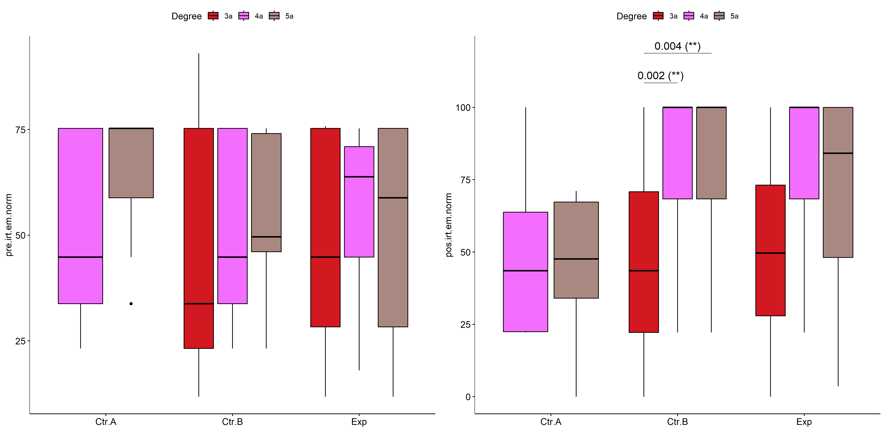

Non-Parametric ANCOVA tests for for assess H4(null) hypothesis
================
Geiser C. Challco <geiser@alumni.usp.br>

- [Setting Initial Variables](#setting-initial-variables)
- [Descriptive Statistics of Initial
  Data](#descriptive-statistics-of-initial-data)
- [One-way factor analysis for: *irt.em.norm ~
  Group*](#one-way-factor-analysis-for-irtemnorm--group)
  - [Pre-test and Post-test PairWise comparisons for: *irt.em.norm ~
    Group*](#pre-test-and-post-test-pairwise-comparisons-for-irtemnorm--group)
  - [Kruskal and Wilcoxon PairWise comparisons for: *irt.em.norm ~
    Group*](#kruskal-and-wilcoxon-pairwise-comparisons-for-irtemnorm--group)
- [Two-way factor analysis for: *irt.em.norm ~
  Group:Gender*](#two-way-factor-analysis-for-irtemnorm--groupgender)
  - [Pre-test and Post-test PairWise comparisons for: *irt.em.norm ~
    Group:Gender*](#pre-test-and-post-test-pairwise-comparisons-for-irtemnorm--groupgender)
  - [Scheirer and Wilcoxon PairWise comparisons for: *irt.em.norm ~
    Group:Gender*](#scheirer-and-wilcoxon-pairwise-comparisons-for-irtemnorm--groupgender)
- [Two-way factor analysis for: *irt.em.norm ~
  Group:Town*](#two-way-factor-analysis-for-irtemnorm--grouptown)
  - [Pre-test and Post-test PairWise comparisons for: *irt.em.norm ~
    Group:Town*](#pre-test-and-post-test-pairwise-comparisons-for-irtemnorm--grouptown)
  - [Scheirer and Wilcoxon PairWise comparisons for: *irt.em.norm ~
    Group:Town*](#scheirer-and-wilcoxon-pairwise-comparisons-for-irtemnorm--grouptown)
- [Two-way factor analysis for: *irt.em.norm ~
  Group:Degree*](#two-way-factor-analysis-for-irtemnorm--groupdegree)
  - [Pre-test and Post-test PairWise comparisons for: *irt.em.norm ~
    Group:Degree*](#pre-test-and-post-test-pairwise-comparisons-for-irtemnorm--groupdegree)
  - [Scheirer and Wilcoxon PairWise comparisons for: *irt.em.norm ~
    Group:Degree*](#scheirer-and-wilcoxon-pairwise-comparisons-for-irtemnorm--groupdegree)
- [Two-way factor analysis for: *irt.em.norm ~
  Group:qtl.irt.em.norm*](#two-way-factor-analysis-for-irtemnorm--groupqtlirtemnorm)
  - [Pre-test and Post-test PairWise comparisons for: *irt.em.norm ~
    Group:qtl.irt.em.norm*](#pre-test-and-post-test-pairwise-comparisons-for-irtemnorm--groupqtlirtemnorm)
  - [Scheirer and Wilcoxon PairWise comparisons for: *irt.em.norm ~
    Group:qtl.irt.em.norm*](#scheirer-and-wilcoxon-pairwise-comparisons-for-irtemnorm--groupqtlirtemnorm)

# Setting Initial Variables

``` r
dv = "irt.em.norm"
dv.pos = "pos.irt.em.norm"
dv.pre = "pre.irt.em.norm"
dv.dif = "dif.irt.em.norm"

fatores2 <- c("Gender","Town","Degree","qtl.irt.em.norm")
lfatores2 <- as.list(fatores2)
names(lfatores2) <- fatores2

fatores1 <- c("Group", fatores2)
lfatores1 <- as.list(fatores1)
names(lfatores1) <- fatores1

lfatores <- c(lfatores1)

color <- list()
color[["prepost"]] = c("#ffee65","#f28e2B")
color[["Group"]] = c("#bcbd22","#fd7f6f","#008000")
color[["Gender"]] = c("#FF007F","#4D4DFF")
color[["Town"]] = c("#AA00CC","#00AA99")
color[["Degree"]] = c("#d21820","#f36dff","#aa8882")


level <- list()
level[["Group"]] = c("Ctr.A","Ctr.B","Exp")
level[["Gender"]] = c("Female","Male")
level[["Town"]] = c("Sorocaba - SP","Limoeiro - PE")
level[["Degree"]] = c("3a","4a","5a")
level[["qtl.irt.em.norm"]] = c("1st","2nd","3rd")
level[["qtl.score"]] = c("1st","2nd","3rd")

# ..

color[["Group:Gender"]] = c(
  "Ctr.A:Female"="#ffccbb", "Ctr.B:Female"="#ff99cc", "Exp:Female"="#FF007F",
  "Ctr.A:Male"="#aabbff", "Ctr.B:Male"="#bbaaff", "Exp:Male"="#4D4DFF",
  "Ctr.A.Female"="#ffccbb", "Ctr.B.Female"="#ff99cc", "Exp.Female"="#FF007F",
  "Ctr.A.Male"="#aabbff", "Ctr.B.Male"="#bbaaff", "Exp.Male"="#4D4DFF"
)
color[["Group:Town"]] = c(
  "Ctr.A:Sorocaba - SP"="#AA00FF", "Ctr.B:Sorocaba - SP"="#FF00FF", "Exp:Sorocaba - SP"="#AA00FF",
  "Ctr.A:Limoeiro - PE"="#00EEFF", "Ctr.B:Limoeiro - PE"="#00EECC", "Exp:Limoeiro - PE"="#00CFCF",
  "Ctr.A.Sorocaba - SP"="#AA00FF", "Ctr.B.Sorocaba - SP"="#FF00FF", "Exp.Sorocaba - SP"="#AA00FF",
  "Ctr.A.Limoeiro - PE"="#00EEFF", "Ctr.B.Limoeiro - PE"="#00EECC", "Exp.Limoeiro - PE"="#00CFCF"
)


for (coln in c("vocab")) {
  color[[paste0(coln,".quintile")]] = c("#BF0040","#FF0000","#800080","#0000FF","#4000BF")
  level[[paste0(coln,".quintile")]] = c("1st quintile","2nd quintile","3rd quintile","4th quintile","5th quintile")
  color[[paste0("grupo:",coln,".quintile")]] = c(
    "Experimental.1st quintile"="#BF0040", "Controle.1st quintile"="#d8668c",
    "Experimental.2nd quintile"="#FF0000", "Controle.2nd quintile"="#ff7f7f",
    "Experimental.3rd quintile"="#8fce00", "Controle.3rd quintile"="#ddf0b2",
    "Experimental.4th quintile"="#0000FF", "Controle.4th quintile"="#b2b2ff",
    "Experimental.5th quintile"="#4000BF", "Controle.5th quintile"="#b299e5",
    
    "Experimental:1st quintile"="#BF0040", "Controle:1st quintile"="#d8668c",
    "Experimental:2nd quintile"="#FF0000", "Controle:2nd quintile"="#ff7f7f",
    "Experimental:3rd quintile"="#8fce00", "Controle:3rd quintile"="#ddf0b2",
    "Experimental:4th quintile"="#0000FF", "Controle:4th quintile"="#b2b2ff",
    "Experimental:5th quintile"="#4000BF", "Controle:5th quintile"="#b299e5")
}


gdat <- read_excel("../data/data.xlsx", sheet = "data")
gdat <- gdat[!is.na(gdat[[dv.pre]]) & !is.na(gdat[[dv.pos]]),]

gdat <- gdat[which(gdat$dif.irt.em.norm != 0 & gdat$pre.irt.em.norm != 100),]

dat <- gdat
dat$Group <- factor(dat[["Group"]], level[["Group"]])
for (coln in c(names(lfatores))) {
  if (length(level[[coln]]) > 0)
    plevel = level[[coln]][level[[coln]] %in% unique(dat[[coln]])]
  else
    plevel = unique(dat[[coln]])[!is.na(unique(dat[[coln]]))]
  
  dat[[coln]] <- factor(dat[[coln]], plevel)
}

dat <- dat[,c("ID", names(lfatores), dv.pre, dv.pos, dv.dif)]

dat.long <- rbind(dat, dat)
dat.long$time <- c(rep("pre", nrow(dat)), rep("pos", nrow(dat)))
dat.long$time <- factor(dat.long$time, c("pre","pos"))
dat.long[[dv]] <- c(dat[[dv.pre]], dat[[dv.pos]])


for (f in c("Group", names(lfatores))) {
  if (is.null(color[[f]]) && length(unique(dat[[f]])) > 0) 
      color[[f]] <- distinctColorPalette(length(unique(dat[[f]])))
}

for (f in c(fatores2)) {
  if (is.null(color[[paste0("Group:",f)]]) && length(unique(dat[[f]])) > 0)
    color[[paste0("Group:",f)]] <- distinctColorPalette(
      length(unique(dat[["Group"]]))*length(unique(dat[[f]])))
}

ldat <- list()
laov <- list()
lpwc <- list()
lemms <- list()
```

# Descriptive Statistics of Initial Data

``` r
df <- get.descriptives(dat, c(dv.pre, dv.pos, dv.dif), c("Group"),
                       symmetry.test = T, normality.test = F)
df <- plyr::rbind.fill(
  df, do.call(plyr::rbind.fill, lapply(lfatores2, FUN = function(f) {
    if (nrow(dat) > 0 && sum(!is.na(unique(dat[[f]]))) > 1)
      get.descriptives(dat, c(dv.pre,dv.pos), c("Group", f), include.global = F,
                       symmetry.test = T, normality.test = F)
    }))
)
```

    ## Warning: There was 1 warning in `mutate()`.
    ## ℹ In argument: `ci = abs(stats::qt(alpha/2, .data$n - 1) * .data$se)`.
    ## Caused by warning:
    ## ! There was 1 warning in `mutate()`.
    ## ℹ In argument: `ci = abs(stats::qt(alpha/2, .data$n - 1) * .data$se)`.
    ## Caused by warning in `stats::qt()`:
    ## ! NaNs produced
    ## There was 1 warning in `mutate()`.
    ## ℹ In argument: `ci = abs(stats::qt(alpha/2, .data$n - 1) * .data$se)`.
    ## Caused by warning:
    ## ! There was 1 warning in `mutate()`.
    ## ℹ In argument: `ci = abs(stats::qt(alpha/2, .data$n - 1) * .data$se)`.
    ## Caused by warning in `stats::qt()`:
    ## ! NaNs produced
    ## There was 1 warning in `mutate()`.
    ## ℹ In argument: `ci = abs(stats::qt(alpha/2, .data$n - 1) * .data$se)`.
    ## Caused by warning:
    ## ! There was 1 warning in `mutate()`.
    ## ℹ In argument: `ci = abs(stats::qt(alpha/2, .data$n - 1) * .data$se)`.
    ## Caused by warning in `stats::qt()`:
    ## ! NaNs produced
    ## There was 1 warning in `mutate()`.
    ## ℹ In argument: `ci = abs(stats::qt(alpha/2, .data$n - 1) * .data$se)`.
    ## Caused by warning:
    ## ! There was 1 warning in `mutate()`.
    ## ℹ In argument: `ci = abs(stats::qt(alpha/2, .data$n - 1) * .data$se)`.
    ## Caused by warning in `stats::qt()`:
    ## ! NaNs produced

``` r
df <- df[,c("variable",fatores1[fatores1 %in% colnames(df)],
            colnames(df)[!colnames(df) %in% c(fatores1,"variable")])]
```

| variable        | Group | Gender | Town          | Degree | qtl.irt.em.norm |   n |    mean |  median |     min |     max |     sd |     se |     ci |    iqr | symmetry |   skewness |   kurtosis |
|:----------------|:------|:-------|:--------------|:-------|:----------------|----:|--------:|--------:|--------:|--------:|-------:|-------:|-------:|-------:|:---------|-----------:|-----------:|
| pre.irt.em.norm | Ctr.A |        |               |        |                 |  14 |  61.082 |  75.243 |  23.198 |  75.243 | 20.000 |  5.345 | 11.547 | 30.446 | NO       | -0.7087597 | -1.3689578 |
| pre.irt.em.norm | Ctr.B |        |               |        |                 |  68 |  51.016 |  47.360 |  11.805 |  93.027 | 22.941 |  2.782 |  5.553 | 41.467 | YES      | -0.1454210 | -1.3896233 |
| pre.irt.em.norm | Exp   |        |               |        |                 |  42 |  50.220 |  51.925 |  11.805 |  75.781 | 23.735 |  3.662 |  7.396 | 41.467 | YES      | -0.3646594 | -1.4015677 |
| pos.irt.em.norm | Ctr.A |        |               |        |                 |  14 |  55.233 |  55.682 |   0.000 | 100.000 | 31.798 |  8.498 | 18.359 | 41.720 | YES      |  0.0127877 | -1.2696808 |
| pos.irt.em.norm | Ctr.B |        |               |        |                 |  68 |  66.967 |  68.318 |   0.000 | 100.000 | 32.760 |  3.973 |  7.930 | 58.460 | YES      | -0.4861066 | -1.1182797 |
| pos.irt.em.norm | Exp   |        |               |        |                 |  42 |  66.882 |  69.560 |   0.000 | 100.000 | 33.243 |  5.129 | 10.359 | 56.467 | YES      | -0.4824511 | -1.1061834 |
| dif.irt.em.norm | Ctr.A |        |               |        |                 |  14 |  -5.850 |  -7.947 | -48.335 |  40.593 | 27.762 |  7.420 | 16.029 | 47.352 | YES      |  0.0723598 | -1.3581213 |
| dif.irt.em.norm | Ctr.B |        |               |        |                 |  68 |  15.951 |  24.757 | -62.411 |  88.195 | 30.115 |  3.652 |  7.289 | 36.834 | YES      | -0.0672311 | -0.2059701 |
| dif.irt.em.norm | Exp   |        |               |        |                 |  42 |  16.662 |  22.688 | -31.710 |  81.972 | 25.131 |  3.878 |  7.831 | 33.925 | YES      |  0.2342158 | -0.3658467 |
| pre.irt.em.norm | Ctr.A | Female |               |        |                 |   9 |  61.470 |  75.243 |  23.198 |  75.243 | 21.354 |  7.118 | 16.414 | 30.446 | NO       | -0.7560725 | -1.3824688 |
| pre.irt.em.norm | Ctr.A | Male   |               |        |                 |   5 |  60.385 |  72.864 |  33.776 |  75.243 | 19.674 |  8.798 | 24.428 | 30.446 | YES      | -0.3709082 | -2.0895003 |
| pre.irt.em.norm | Ctr.B | Female |               |        |                 |  36 |  49.292 |  44.797 |  11.805 |  75.243 | 23.402 |  3.900 |  7.918 | 41.467 | YES      | -0.1219004 | -1.5262112 |
| pre.irt.em.norm | Ctr.B | Male   |               |        |                 |  31 |  53.915 |  49.610 |  11.805 |  93.027 | 22.326 |  4.010 |  8.189 | 41.467 | YES      | -0.2119987 | -1.2883002 |
| pre.irt.em.norm | Ctr.B |        |               |        |                 |   1 |  23.198 |  23.198 |  23.198 |  23.198 |        |        |        |  0.000 | few data |  0.0000000 |  0.0000000 |
| pre.irt.em.norm | Exp   | Female |               |        |                 |  18 |  51.025 |  46.078 |  11.805 |  75.243 | 23.308 |  5.494 | 11.591 | 41.467 | YES      | -0.2208823 | -1.6169865 |
| pre.irt.em.norm | Exp   | Male   |               |        |                 |  20 |  51.809 |  60.672 |  11.805 |  75.781 | 24.233 |  5.419 | 11.342 | 38.651 | NO       | -0.6328965 | -1.2099954 |
| pre.irt.em.norm | Exp   |        |               |        |                 |   4 |  38.650 |  33.776 |  11.805 |  75.243 | 26.503 | 13.251 | 42.172 | 15.860 | few data |  0.0000000 |  0.0000000 |
| pos.irt.em.norm | Ctr.A | Female |               |        |                 |   9 |  59.915 |  63.791 |   0.000 | 100.000 | 32.883 | 10.961 | 25.276 | 23.494 | YES      | -0.4341981 | -1.0875306 |
| pos.irt.em.norm | Ctr.A | Male   |               |        |                 |   5 |  46.805 |  43.533 |  22.432 | 100.000 | 31.390 | 14.038 | 38.976 | 19.005 | NO       |  0.8077339 | -1.2271576 |
| pos.irt.em.norm | Ctr.B | Female |               |        |                 |  36 |  60.168 |  68.318 |   0.000 | 100.000 | 35.146 |  5.858 | 11.892 | 77.790 | YES      | -0.1804006 | -1.5343996 |
| pos.irt.em.norm | Ctr.B | Male   |               |        |                 |  31 |  77.024 |  70.801 |  22.210 | 100.000 | 25.421 |  4.566 |  9.324 | 36.209 | NO       | -0.5950995 | -0.9043817 |
| pos.irt.em.norm | Ctr.B |        |               |        |                 |   1 |   0.000 |   0.000 |   0.000 |   0.000 |        |        |        |  0.000 | few data |  0.0000000 |  0.0000000 |
| pos.irt.em.norm | Exp   | Female |               |        |                 |  18 |  68.564 |  68.318 |  22.210 | 100.000 | 27.260 |  6.425 | 13.556 | 55.510 | YES      | -0.1592713 | -1.4519300 |
| pos.irt.em.norm | Exp   | Male   |               |        |                 |  20 |  71.346 |  87.741 |   0.000 | 100.000 | 34.888 |  7.801 | 16.328 | 50.953 | NO       | -0.7836514 | -0.7802592 |
| pos.irt.em.norm | Exp   |        |               |        |                 |   4 |  36.989 |  22.210 |   3.538 | 100.000 | 42.919 | 21.460 | 68.294 | 24.115 | few data |  0.0000000 |  0.0000000 |
| pre.irt.em.norm | Ctr.A |        | Limoeiro - PE |        |                 |  14 |  61.082 |  75.243 |  23.198 |  75.243 | 20.000 |  5.345 | 11.547 | 30.446 | NO       | -0.7087597 | -1.3689578 |
| pre.irt.em.norm | Ctr.B |        | Sorocaba - SP |        |                 |  26 |  59.953 |  70.801 |  28.443 |  75.243 | 17.343 |  3.401 |  7.005 | 27.883 | YES      | -0.4899631 | -1.5257343 |
| pre.irt.em.norm | Ctr.B |        | Limoeiro - PE |        |                 |  42 |  45.484 |  35.424 |  11.805 |  93.027 | 24.385 |  3.763 |  7.599 | 49.400 | YES      |  0.2276511 | -1.3824847 |
| pre.irt.em.norm | Exp   |        | Sorocaba - SP |        |                 |  13 |  61.318 |  68.318 |  44.797 |  75.243 | 13.163 |  3.651 |  7.954 | 23.706 | YES      | -0.2828356 | -1.8876353 |
| pre.irt.em.norm | Exp   |        | Limoeiro - PE |        |                 |  29 |  45.245 |  35.152 |  11.805 |  75.781 | 25.843 |  4.799 |  9.830 | 52.453 | YES      | -0.0014812 | -1.7087455 |
| pos.irt.em.norm | Ctr.A |        | Limoeiro - PE |        |                 |  14 |  55.233 |  55.682 |   0.000 | 100.000 | 31.798 |  8.498 | 18.359 | 41.720 | YES      |  0.0127877 | -1.2696808 |
| pos.irt.em.norm | Ctr.B |        | Sorocaba - SP |        |                 |  26 |  89.615 | 100.000 |  22.210 | 100.000 | 19.487 |  3.822 |  7.871 | 18.568 | NO       | -1.8262078 |  2.9780354 |
| pos.irt.em.norm | Ctr.B |        | Limoeiro - PE |        |                 |  42 |  52.947 |  55.575 |   0.000 | 100.000 | 31.553 |  4.869 |  9.833 | 48.591 | YES      |  0.0566616 | -1.1944851 |
| pos.irt.em.norm | Exp   |        | Sorocaba - SP |        |                 |  13 |  90.201 | 100.000 |  29.058 | 100.000 | 21.216 |  5.884 | 12.820 |  0.000 | NO       | -1.8769367 |  2.4478110 |
| pos.irt.em.norm | Exp   |        | Limoeiro - PE |        |                 |  29 |  56.428 |  49.610 |   0.000 | 100.000 | 32.551 |  6.045 | 12.382 | 41.822 | YES      | -0.0905270 | -1.1735271 |
| pre.irt.em.norm | Ctr.A |        |               | 3a     |                 |   2 |  75.243 |  75.243 |  75.243 |  75.243 |  0.000 |  0.000 |  0.000 |  0.000 | few data |  0.0000000 |  0.0000000 |
| pre.irt.em.norm | Ctr.A |        |               | 4a     |                 |   5 |  50.451 |  44.797 |  23.198 |  75.243 | 23.885 | 10.682 | 29.657 | 41.467 | YES      |  0.0794730 | -2.1486168 |
| pre.irt.em.norm | Ctr.A |        |               | 5a     |                 |   7 |  64.630 |  75.243 |  33.776 |  75.243 | 17.624 |  6.661 | 16.299 | 16.412 | NO       | -0.8307167 | -1.3470817 |
| pre.irt.em.norm | Ctr.B |        |               | 3a     |                 |  28 |  45.038 |  33.776 |  11.805 |  93.027 | 27.246 |  5.149 | 10.565 | 52.045 | YES      |  0.1962780 | -1.6228339 |
| pre.irt.em.norm | Ctr.B |        |               | 4a     |                 |  21 |  54.257 |  44.797 |  23.198 |  75.243 | 19.668 |  4.292 |  8.953 | 41.467 | YES      | -0.0272718 | -1.8255975 |
| pre.irt.em.norm | Ctr.B |        |               | 5a     |                 |  19 |  56.244 |  49.610 |  23.198 |  75.243 | 17.860 |  4.097 |  8.608 | 27.975 | YES      | -0.2720853 | -1.4775977 |
| pre.irt.em.norm | Exp   |        |               | 3a     |                 |  19 |  46.374 |  44.797 |  11.805 |  75.781 | 25.261 |  5.795 | 12.176 | 46.960 | YES      | -0.1079885 | -1.6518026 |
| pre.irt.em.norm | Exp   |        |               | 4a     |                 |  15 |  55.156 |  63.791 |  18.028 |  75.243 | 19.498 |  5.034 | 10.798 | 26.136 | NO       | -0.5340963 | -1.2192908 |
| pre.irt.em.norm | Exp   |        |               | 5a     |                 |   8 |  50.097 |  58.831 |  11.805 |  75.243 | 28.391 | 10.038 | 23.735 | 46.960 | YES      | -0.3129260 | -1.8764432 |
| pos.irt.em.norm | Ctr.A |        |               | 3a     |                 |   2 | 100.000 | 100.000 | 100.000 | 100.000 |  0.000 |  0.000 |  0.000 |  0.000 | few data |  0.0000000 |  0.0000000 |
| pos.irt.em.norm | Ctr.A |        |               | 4a     |                 |   5 |  50.393 |  43.533 |  22.210 | 100.000 | 32.648 | 14.601 | 40.538 | 41.360 | YES      |  0.4592566 | -1.7092278 |
| pos.irt.em.norm | Ctr.A |        |               | 5a     |                 |   7 |  45.899 |  47.572 |   0.000 |  71.066 | 26.285 |  9.935 | 24.310 | 33.265 | NO       | -0.5455584 | -1.3435247 |
| pos.irt.em.norm | Ctr.B |        |               | 3a     |                 |  28 |  46.955 |  43.533 |   0.000 | 100.000 | 31.513 |  5.955 | 12.219 | 48.591 | YES      |  0.2482926 | -1.1163764 |
| pos.irt.em.norm | Ctr.B |        |               | 4a     |                 |  21 |  82.305 | 100.000 |  22.210 | 100.000 | 23.282 |  5.081 | 10.598 | 31.682 | NO       | -0.9366991 | -0.1662967 |
| pos.irt.em.norm | Ctr.B |        |               | 5a     |                 |  19 |  79.506 | 100.000 |  22.210 | 100.000 | 28.972 |  6.647 | 13.964 | 31.682 | NO       | -1.0339818 | -0.4318475 |
| pos.irt.em.norm | Exp   |        |               | 3a     |                 |  19 |  54.597 |  49.610 |   0.000 | 100.000 | 32.727 |  7.508 | 15.774 | 45.207 | YES      | -0.0652619 | -1.2265291 |
| pos.irt.em.norm | Exp   |        |               | 4a     |                 |  15 |  80.445 | 100.000 |  22.210 | 100.000 | 28.230 |  7.289 | 15.633 | 31.682 | NO       | -0.9479436 | -0.7231581 |
| pos.irt.em.norm | Exp   |        |               | 5a     |                 |   8 |  70.625 |  84.159 |   3.538 | 100.000 | 36.121 | 12.771 | 30.198 | 51.909 | NO       | -0.6092978 | -1.2400616 |
| pre.irt.em.norm | Ctr.A |        |               |        | 1st             |   1 |  23.198 |  23.198 |  23.198 |  23.198 |        |        |        |  0.000 | few data |  0.0000000 |  0.0000000 |
| pre.irt.em.norm | Ctr.A |        |               |        | 2nd             |   5 |  46.002 |  44.797 |  33.776 |  72.864 | 15.995 |  7.153 | 19.861 | 11.021 | few data |  0.0000000 |  0.0000000 |
| pre.irt.em.norm | Ctr.A |        |               |        | 3rd             |   8 |  75.243 |  75.243 |  75.243 |  75.243 |  0.000 |  0.000 |  0.000 |  0.000 | few data |  0.0000000 |  0.0000000 |
| pre.irt.em.norm | Ctr.B |        |               |        | 1st             |  12 |  17.939 |  17.501 |  11.805 |  28.443 |  6.567 |  1.896 |  4.173 | 11.393 | few data |  0.0000000 |  0.0000000 |
| pre.irt.em.norm | Ctr.B |        |               |        | 2nd             |  33 |  45.620 |  44.797 |  33.776 |  72.864 | 13.715 |  2.387 |  4.863 | 13.583 | NO       |  0.9057667 | -0.6149984 |
| pre.irt.em.norm | Ctr.B |        |               |        | 3rd             |  23 |  76.016 |  75.243 |  75.243 |  93.027 |  3.708 |  0.773 |  1.604 |  0.000 | few data |  0.0000000 |  0.0000000 |
| pre.irt.em.norm | Exp   |        |               |        | 1st             |   9 |  14.983 |  11.805 |  11.805 |  23.198 |  4.979 |  1.660 |  3.827 |  6.223 | NO       |  0.7796101 | -1.3784196 |
| pre.irt.em.norm | Exp   |        |               |        | 2nd             |  21 |  50.997 |  47.360 |  33.776 |  72.864 | 14.441 |  3.151 |  6.573 | 28.639 | YES      |  0.1626342 | -1.5980329 |
| pre.irt.em.norm | Exp   |        |               |        | 3rd             |  12 |  75.288 |  75.243 |  75.243 |  75.781 |  0.155 |  0.045 |  0.099 |  0.000 | few data |  0.0000000 |  0.0000000 |
| pos.irt.em.norm | Ctr.A |        |               |        | 1st             |   1 |  63.791 |  63.791 |  63.791 |  63.791 |        |        |        |  0.000 | few data |  0.0000000 |  0.0000000 |
| pos.irt.em.norm | Ctr.A |        |               |        | 2nd             |   5 |  22.541 |  22.432 |   0.000 |  43.533 | 15.434 |  6.902 | 19.164 |  2.319 | YES      | -0.1193175 | -1.4055909 |
| pos.irt.em.norm | Ctr.A |        |               |        | 3rd             |   8 |  74.595 |  70.933 |  43.533 | 100.000 | 23.222 |  8.210 | 19.414 | 40.264 | YES      | -0.0187306 | -1.8274973 |
| pos.irt.em.norm | Ctr.B |        |               |        | 1st             |  12 |  37.670 |  22.210 |   0.000 | 100.000 | 35.017 | 10.109 | 22.249 | 29.251 | NO       |  0.7927758 | -0.9741981 |
| pos.irt.em.norm | Ctr.B |        |               |        | 2nd             |  33 |  69.806 |  68.318 |   0.000 | 100.000 | 30.844 |  5.369 | 10.937 | 56.467 | YES      | -0.4999557 | -1.0393866 |
| pos.irt.em.norm | Ctr.B |        |               |        | 3rd             |  23 |  78.180 |  70.801 |  12.832 | 100.000 | 25.685 |  5.356 | 11.107 | 31.682 | NO       | -0.9746332 |  0.1539423 |
| pos.irt.em.norm | Exp   |        |               |        | 1st             |   9 |  35.637 |  22.210 |   0.000 | 100.000 | 36.024 | 12.008 | 27.691 | 64.780 | NO       |  0.5147071 | -1.4045460 |
| pos.irt.em.norm | Exp   |        |               |        | 2nd             |  21 |  70.943 |  70.801 |  22.210 | 100.000 | 29.244 |  6.382 | 13.312 | 52.640 | YES      | -0.3005251 | -1.5268078 |
| pos.irt.em.norm | Exp   |        |               |        | 3rd             |  12 |  83.207 | 100.000 |  43.533 | 100.000 | 22.343 |  6.450 | 14.196 | 32.813 | NO       | -0.6458141 | -1.3681401 |

# One-way factor analysis for: *irt.em.norm ~ Group*

``` r
pdat = remove_group_data(dat[!is.na(dat[["Group"]]),], "dif.irt.em.norm", "Group")

pdat.long <- rbind(pdat[,c("ID","Group")], pdat[,c("ID","Group")])
pdat.long[["time"]] <- c(rep("pre", nrow(pdat)), rep("pos", nrow(pdat)))
pdat.long[["time"]] <- factor(pdat.long[["time"]], c("pre","pos"))
pdat.long[["irt.em.norm"]] <- c(pdat[["pre.irt.em.norm"]], pdat[["pos.irt.em.norm"]])

y.position.min <- abs(
  max(pdat.long[["irt.em.norm"]])
  - min(pdat.long[["irt.em.norm"]]))/20

lvars = as.list(c("dif.irt.em.norm","pos.irt.em.norm","pre.irt.em.norm"))
names(lvars) = unlist(lvars)
```

## Pre-test and Post-test PairWise comparisons for: *irt.em.norm ~ Group*

``` r
pwc.long <- group_by(pdat.long, Group) %>%
  pairwise_wilcox_test(irt.em.norm ~ time, detailed = T)

df <- pwc.long[,c(".y.","Group","group1","group2","n1","n2","estimate",
                  "statistic","p.adj","p.adj.signif")]
```

| .y.         | Group | group1 | group2 |  n1 |  n2 |   estimate | statistic | p.adj | p.adj.signif |
|:------------|:------|:-------|:-------|----:|----:|-----------:|----------:|------:|:-------------|
| irt.em.norm | Ctr.A | pre    | pos    |  14 |  14 |   7.672307 |     122.0 | 0.274 | ns           |
| irt.em.norm | Ctr.B | pre    | pos    |  68 |  68 | -24.757101 |    1734.5 | 0.011 | \*           |
| irt.em.norm | Exp   | pre    | pos    |  42 |  42 | -24.757119 |     617.0 | 0.017 | \*           |

``` r
stat.test <- pwc.long %>% add_xy_position(x = "Group", fun = "max")
stat.test$y.position <- stat.test$y.position + y.position.min

ggboxplot(pdat.long, x = "Group", y = "irt.em.norm",
          palette = color$prepost, fill = "time") +
  stat_pvalue_manual(stat.test, tip.length = 0, hide.ns = T,
                     label = "{ p.adj } ({ p.adj.signif })") + xlab("")
```

<!-- -->

``` r
stat.test <- pwc.long %>% add_xy_position(x = "time", fun = "max")
stat.test$y.position <- stat.test$y.position + y.position.min

gg <- ggline(
  pdat.long, x = "time", y = "irt.em.norm", size = 1.5,
  facet.by = "Group", add = c("mean_se"), color = "Group",
  position = position_dodge(width = 0.3), palette = color[["Group"]])

pdat.long$xj = jitter(as.numeric(pdat.long[["time"]]), amount=.1)
pdat.long$yj = jitter(pdat.long[["irt.em.norm"]], amount = .01)

gg + geom_point(
  data = pdat.long, aes_string(x="xj",y="yj", color = "Group"), size=0.5) +
  stat_pvalue_manual(
    stat.test, tip.length = 0, hide.ns = T, label.size = 5,
    position = position_dodge(width = 0.3),
    label = "{ p.adj } ({ p.adj.signif })") + xlab("") +
  theme(strip.text = element_text(size = 16),
        axis.text = element_text(size = 18))
```

<!-- -->

## Kruskal and Wilcoxon PairWise comparisons for: *irt.em.norm ~ Group*

``` r
kt <- lapply(lvars, FUN = function(x) {
  kruskal_test(pdat, as.formula(paste0(x," ~ Group")))  
})

df <- do.call(rbind.fill, lapply(lvars, function(x) {
  add_significance(merge(
    kt[[x]], kruskal_effsize(pdat, as.formula(paste0(x," ~ Group"))),
    by = c(".y.","n"), suffixes = c("",".ez")))
}))

df <- df[,c(".y.","n","df","statistic","p","p.signif","effsize","magnitude")]
```

| .y.             |   n |  df | statistic |      p | p.signif |    effsize | magnitude |
|:----------------|----:|----:|----------:|-------:|:---------|-----------:|:----------|
| dif.irt.em.norm | 124 |   2 |  6.413810 | 0.0405 | \*       |  0.0364778 | small     |
| pos.irt.em.norm | 124 |   2 |  1.407533 | 0.4950 | ns       | -0.0048964 | small     |
| pre.irt.em.norm | 124 |   2 |  2.832761 | 0.2430 | ns       |  0.0068823 | small     |

``` r
pwc <- lapply(lvars, FUN = function(x) {
  pairwise_wilcox_test(pdat, as.formula(paste0(x," ~ Group")))  
})

df <- do.call(rbind.fill, pwc)
```

| .y.             | group1 | group2 |  n1 |  n2 | statistic |     p | p.adj | p.adj.signif |
|:----------------|:-------|:-------|----:|----:|----------:|------:|------:|:-------------|
| dif.irt.em.norm | Ctr.A  | Ctr.B  |  14 |  68 |     280.0 | 0.016 | 0.047 | \*           |
| dif.irt.em.norm | Ctr.A  | Exp    |  14 |  42 |     170.5 | 0.020 | 0.047 | \*           |
| dif.irt.em.norm | Ctr.B  | Exp    |  68 |  42 |    1453.0 | 0.880 | 0.880 | ns           |
| pos.irt.em.norm | Ctr.A  | Ctr.B  |  14 |  68 |     392.0 | 0.290 | 0.735 | ns           |
| pos.irt.em.norm | Ctr.A  | Exp    |  14 |  42 |     233.5 | 0.245 | 0.735 | ns           |
| pos.irt.em.norm | Ctr.B  | Exp    |  68 |  42 |    1405.0 | 0.886 | 0.886 | ns           |
| pre.irt.em.norm | Ctr.A  | Ctr.B  |  14 |  68 |     597.5 | 0.125 | 0.306 | ns           |
| pre.irt.em.norm | Ctr.A  | Exp    |  14 |  42 |     379.0 | 0.102 | 0.306 | ns           |
| pre.irt.em.norm | Ctr.B  | Exp    |  68 |  42 |    1464.5 | 0.822 | 0.822 | ns           |

``` r
plots <- lapply(lvars, FUN = function(y) {
  stat.test <- pwc[[y]] %>% add_xy_position(x = "Group")
  stat.test$y.position <- stat.test$y.position + y.position.min
  ggboxplot(pdat, x = "Group", y = y, fill = "Group",
            palette = color[["Group"]]) +
    stat_pvalue_manual(stat.test, tip.length = 0, hide.ns = T, label.size = 5,
                       label="{ p.adj } ({ p.adj.signif })") + xlab("")
})
```

``` r
egg::ggarrange(plots[["pre.irt.em.norm"]], plots[["pos.irt.em.norm"]], nrow = 1)
```

<!-- -->

``` r
plots[["dif.irt.em.norm"]] +
  labs(subtitle = get_test_label(kt[["dif.irt.em.norm"]], detailed = T),
       caption = get_pwc_label(pwc[["dif.irt.em.norm"]])) +
  ylab("irt.em.norm (dif)")  +
  theme(strip.text = element_text(size = 16),
        axis.text = element_text(size = 18))
```

<!-- -->

# Two-way factor analysis for: *irt.em.norm ~ Group:Gender*

``` r
pdat = remove_group_data(
  dat[!is.na(dat[["Group"]]) & !is.na(dat[["Gender"]]),],
  "dif.irt.em.norm", c("Group","Gender"))

pdat.long <- rbind(pdat[,c("ID","Group","Gender")],
                   pdat[,c("ID","Group","Gender")])
pdat.long[["time"]] <- c(rep("pre", nrow(pdat)), rep("pos", nrow(pdat)))
pdat.long[["time"]] <- factor(pdat.long[["time"]], c("pre","pos"))
pdat.long[["irt.em.norm"]] <- c(pdat[["pre.irt.em.norm"]], pdat[["pos.irt.em.norm"]])

y.position.min <- abs(
  max(pdat.long[["irt.em.norm"]])
  - min(pdat.long[["irt.em.norm"]]))/20

lvars = as.list(c("dif.irt.em.norm","pos.irt.em.norm","pre.irt.em.norm"))
names(lvars) = unlist(lvars)
```

## Pre-test and Post-test PairWise comparisons for: *irt.em.norm ~ Group:Gender*

``` r
pwc.long <- group_by(pdat.long, Group:Gender) %>%
  pairwise_wilcox_test(irt.em.norm ~ time, detailed = T)

df <- pwc.long[,c(".y.","Group:Gender","group1","group2","n1","n2","estimate",
                  "statistic","p.adj","p.adj.signif")]
```

| .y.         | Group:Gender | group1 | group2 |  n1 |  n2 |   estimate | statistic | p.adj | p.adj.signif |
|:------------|:-------------|:-------|:-------|----:|----:|-----------:|----------:|------:|:-------------|
| irt.em.norm | Ctr.A:Female | pre    | pos    |   9 |   9 |   4.441848 |      48.0 | 0.529 | ns           |
| irt.em.norm | Ctr.A:Male   | pre    | pos    |   5 |   5 |  22.365539 |      18.0 | 0.293 | ns           |
| irt.em.norm | Ctr.B:Female | pre    | pos    |  36 |  36 | -10.405021 |     574.5 | 0.408 | ns           |
| irt.em.norm | Ctr.B:Male   | pre    | pos    |  31 |  31 | -24.757179 |     270.0 | 0.003 | \*\*         |
| irt.em.norm | Exp:Female   | pre    | pos    |  18 |  18 | -23.521266 |     119.0 | 0.176 | ns           |
| irt.em.norm | Exp:Male     | pre    | pos    |  20 |  20 | -24.757198 |     120.5 | 0.031 | \*           |

``` r
stat.test <- pwc.long %>% add_xy_position(x = "Group:Gender", fun = "max")
sidx = which(stat.test$p.adj.signif != "ns")
stat.test$y.position[sidx] <- stat.test$y.position[sidx] + y.position.min * (1:length(sidx))

pdat.long[[paste0(c("Group","Gender"), collapse = ":")]] = apply(
  pdat.long[, c("Group","Gender")], 1, paste0, collapse = ":")

ggboxplot(pdat.long, x = "Group:Gender", y = "irt.em.norm",
          palette = color$prepost, fill = "time") +
  stat_pvalue_manual(stat.test, tip.length = 0, hide.ns = T,
                     label = "{ p.adj } ({ p.adj.signif })") + xlab("")
```

<!-- -->

``` r
pwc.long <- group_by(pdat.long, Group, Gender) %>%
  pairwise_wilcox_test(irt.em.norm ~ time, detailed = T)

stat.test <- pwc.long %>% add_xy_position(x = "time", fun = "mean_se")
sidx = which(stat.test$p.adj.signif != "ns")
stat.test$y.position[sidx] <- stat.test$y.position[sidx] + y.position.min * (1:length(sidx))

gg <- ggline(
  pdat.long, x = "time", y = "irt.em.norm",
  color = "Gender", linetype = "Gender", shape = "Gender", size = 1.5,
  facet.by = "Group", add = c("mean_se"),
  position = position_dodge(width = 0.3), palette = color[["Gender"]])

pdat.long$xj = jitter(as.numeric(pdat.long[["time"]]), amount=.1)
pdat.long$yj = jitter(pdat.long[["irt.em.norm"]], amount = .01)

gg + geom_point(
  data = pdat.long, aes_string(x="xj",y="yj",colour="Gender"), size=0.5) +
  stat_pvalue_manual(
    stat.test, tip.length = 0, hide.ns = T, label.size = 5,
    position = position_dodge(width = 0.3), color = "Gender",
    label = "{ p.adj } ({ p.adj.signif })") + xlab("") +
  theme(strip.text = element_text(size = 16),
        axis.text = element_text(size = 18))
```

<!-- -->

## Scheirer and Wilcoxon PairWise comparisons for: *irt.em.norm ~ Group:Gender*

``` r
sch <- lapply(lvars, FUN = function(x) {
  scheirer.test(pdat, x, c("Group","Gender"), as.table = T) 
})
df <- do.call(rbind.fill, sch)
```

| var             | Effect       |  Df |      Sum Sq |         H |   p.value | p.value.signif |
|:----------------|:-------------|----:|------------:|----------:|----------:|:---------------|
| dif.irt.em.norm | Group        |   2 |   7658.5419 | 6.4692197 | 0.0393756 | \*             |
| dif.irt.em.norm | Gender       |   1 |   1804.5449 | 1.5243107 | 0.2169683 | ns             |
| dif.irt.em.norm | Group:Gender |   2 |   1691.0919 | 1.4284762 | 0.4895650 | ns             |
| dif.irt.em.norm | Residuals    | 113 | 127829.9913 |           |           |                |
| pos.irt.em.norm | Group        |   2 |   1916.2193 | 1.7152319 | 0.4241721 | ns             |
| pos.irt.em.norm | Gender       |   1 |   2514.9765 | 2.2511870 | 0.1335120 | ns             |
| pos.irt.em.norm | Group:Gender |   2 |   2270.3878 | 2.0322526 | 0.3619945 | ns             |
| pos.irt.em.norm | Residuals    | 113 | 124655.0630 |           |           |                |
| pre.irt.em.norm | Group        |   2 |   2942.0016 | 2.5847863 | 0.2746128 | ns             |
| pre.irt.em.norm | Gender       |   1 |    289.4244 | 0.2542827 | 0.6140755 | ns             |
| pre.irt.em.norm | Group:Gender |   2 |    465.9460 | 0.4093712 | 0.8149035 | ns             |
| pre.irt.em.norm | Residuals    | 113 | 130745.8694 |           |           |                |

``` r
pwc <- lapply(lvars, FUN = function(x) {
  list(
    Group = tryCatch(pairwise_wilcox_test(group_by(pdat, Gender),
                                 as.formula(paste0(x," ~ Group")))
                         , error = function(e) NULL),
    Gender = tryCatch(pairwise_wilcox_test(group_by(pdat, Group),
                                 as.formula(paste0(x," ~ Gender")))
                         , error = function(e) NULL)
  )
})

df <- do.call(rbind.fill, lapply(pwc, FUN =  function(x) {
  do.call(rbind.fill, x)
}))

ivs = c()
if ("Group" %in% colnames(df)) ivs = c(ivs, "Group")
if ("Gender" %in% colnames(df)) ivs = c(ivs, "Gender")
df <- df[,c(".y.",ivs,"group1","group2","n1","n2",
            "statistic","p.adj","p.adj.signif")]
```

| .y.             | Group | Gender | group1 | group2 |  n1 |  n2 | statistic | p.adj | p.adj.signif |
|:----------------|:------|:-------|:-------|:-------|----:|----:|----------:|------:|:-------------|
| dif.irt.em.norm |       | Female | Ctr.A  | Ctr.B  |   9 |  36 |     118.5 | 0.489 | ns           |
| dif.irt.em.norm |       | Female | Ctr.A  | Exp    |   9 |  18 |      53.5 | 0.489 | ns           |
| dif.irt.em.norm |       | Female | Ctr.B  | Exp    |  36 |  18 |     308.0 | 0.775 | ns           |
| dif.irt.em.norm |       | Male   | Ctr.A  | Ctr.B  |   5 |  31 |      26.5 | 0.062 | ns           |
| dif.irt.em.norm |       | Male   | Ctr.A  | Exp    |   5 |  20 |      18.0 | 0.064 | ns           |
| dif.irt.em.norm |       | Male   | Ctr.B  | Exp    |  31 |  20 |     323.5 | 0.802 | ns           |
| dif.irt.em.norm | Ctr.A |        | Female | Male   |   9 |   5 |      29.0 | 0.422 | ns           |
| dif.irt.em.norm | Ctr.B |        | Female | Male   |  36 |  31 |     446.5 | 0.162 | ns           |
| dif.irt.em.norm | Exp   |        | Female | Male   |  18 |  20 |     157.0 | 0.510 | ns           |
| pos.irt.em.norm |       | Female | Ctr.A  | Ctr.B  |   9 |  36 |     159.0 | 1.000 | ns           |
| pos.irt.em.norm |       | Female | Ctr.A  | Exp    |   9 |  18 |      71.0 | 1.000 | ns           |
| pos.irt.em.norm |       | Female | Ctr.B  | Exp    |  36 |  18 |     279.0 | 1.000 | ns           |
| pos.irt.em.norm |       | Male   | Ctr.A  | Ctr.B  |   5 |  31 |      35.5 | 0.139 | ns           |
| pos.irt.em.norm |       | Male   | Ctr.A  | Exp    |   5 |  20 |      28.0 | 0.252 | ns           |
| pos.irt.em.norm |       | Male   | Ctr.B  | Exp    |  31 |  20 |     319.5 | 0.853 | ns           |
| pos.irt.em.norm | Ctr.A |        | Female | Male   |   9 |   5 |      29.0 | 0.421 | ns           |
| pos.irt.em.norm | Ctr.B |        | Female | Male   |  36 |  31 |     421.5 | 0.076 | ns           |
| pos.irt.em.norm | Exp   |        | Female | Male   |  18 |  20 |     157.0 | 0.494 | ns           |
| pre.irt.em.norm |       | Female | Ctr.A  | Ctr.B  |   9 |  36 |     213.5 | 0.399 | ns           |
| pre.irt.em.norm |       | Female | Ctr.A  | Exp    |   9 |  18 |     106.0 | 0.399 | ns           |
| pre.irt.em.norm |       | Female | Ctr.B  | Exp    |  36 |  18 |     313.0 | 0.844 | ns           |
| pre.irt.em.norm |       | Male   | Ctr.A  | Ctr.B  |   5 |  31 |      88.0 | 1.000 | ns           |
| pre.irt.em.norm |       | Male   | Ctr.A  | Exp    |   5 |  20 |      59.5 | 1.000 | ns           |
| pre.irt.em.norm |       | Male   | Ctr.B  | Exp    |  31 |  20 |     323.0 | 1.000 | ns           |
| pre.irt.em.norm | Ctr.A |        | Female | Male   |   9 |   5 |      26.0 | 0.657 | ns           |
| pre.irt.em.norm | Ctr.B |        | Female | Male   |  36 |  31 |     497.5 | 0.440 | ns           |
| pre.irt.em.norm | Exp   |        | Female | Male   |  18 |  20 |     180.0 | 1.000 | ns           |

``` r
plots <- lapply(lvars, FUN = function(y) {
  livs = list("Group", "Gender")
  names(livs) = unlist(livs)
  lapply(livs, FUN = function(x) {
    iv2 = setdiff(names(livs), x)
    if (!is.null(pwc[[y]][[iv2]])) {
      stat.test <- pwc[[y]][[iv2]] %>% add_xy_position(x = x, fun = "max")
      sidx = which(stat.test$p.adj.signif != "ns")
      stat.test$y.position[sidx] <- stat.test$y.position[sidx] + y.position.min * (1:length(sidx))
      
      ggboxplot(pdat, x = x, y = y, fill = iv2, palette = color[[iv2]]) +
        stat_pvalue_manual(stat.test, tip.length = 0, hide.ns = T, label.size = 5,
                           label="{ p.adj } ({ p.adj.signif })") + xlab("")
    }
  })
})
```

``` r
if (!is.null(plots[["pre.irt.em.norm"]][["Group"]]) &&
    !is.null(plots[["pos.irt.em.norm"]][["Group"]])) {
  egg::ggarrange(plots[["pre.irt.em.norm"]][["Group"]],
                 plots[["pos.irt.em.norm"]][["Group"]], nrow = 1)  
}
```

<!-- -->

``` r
if (!is.null(plots[["pre.irt.em.norm"]][["Gender"]]) &&
    !is.null(plots[["pos.irt.em.norm"]][["Gender"]])) {
  egg::ggarrange(plots[["pre.irt.em.norm"]][["Gender"]],
                 plots[["pos.irt.em.norm"]][["Gender"]], nrow = 1)
}
```

<!-- -->

``` r
psch = sch[["dif.irt.em.norm"]]
idx = which(psch$Effect == "Group:Gender") 

dof = floor(as.double(psch$Df[idx]))
dof.res = floor(as.double(psch$Df[which(psch$Effect == "Residuals")]))
statistic = round(as.double(psch$H[idx]), 3)
p = round(as.double(psch[["p.value"]][idx]), 3)
pval = ifelse(p < 0.001,paste0(" , p<0.001"),paste0(" , p=",p))

if (!is.null(plots[["dif.irt.em.norm"]][["Group"]]))
  plots[["dif.irt.em.norm"]][["Group"]] +
    labs(subtitle = paste0("Scheirer-Ray-Hare H(", dof, ",", 
          dof.res, ")=", statistic, pval),
         caption = get_pwc_label(pwc[["dif.irt.em.norm"]][["Gender"]])) +
    ylab("irt.em.norm (dif)") +
  theme(strip.text = element_text(size = 16),
        axis.text = element_text(size = 18))
```

<!-- -->

``` r
psch = sch[["dif.irt.em.norm"]]
idx = which(psch$Effect == "Group:Gender") 

dof = floor(as.double(psch$Df[idx]))
dof.res = floor(as.double(psch$Df[which(psch$Effect == "Residuals")]))
statistic = round(as.double(psch$H[idx]), 3)
p = round(as.double(psch[["p.value"]][idx]), 3)
pval = ifelse(p < 0.001,paste0(" , p<0.001"),paste0(" , p=",p))

if (!is.null(plots[["dif.irt.em.norm"]][["Gender"]]))
  plots[["dif.irt.em.norm"]][["Gender"]] +
    labs(subtitle = paste0("Scheirer-Ray-Hare H(", dof, ",", 
          dof.res, ")=", statistic, pval),
         caption = get_pwc_label(pwc[["dif.irt.em.norm"]][["Group"]])) +
    ylab("irt.em.norm (dif)") +
  theme(strip.text = element_text(size = 16),
        axis.text = element_text(size = 18))
```

<!-- -->

# Two-way factor analysis for: *irt.em.norm ~ Group:Town*

``` r
pdat = remove_group_data(
  dat[!is.na(dat[["Group"]]) & !is.na(dat[["Town"]]),],
  "dif.irt.em.norm", c("Group","Town"))

pdat.long <- rbind(pdat[,c("ID","Group","Town")],
                   pdat[,c("ID","Group","Town")])
pdat.long[["time"]] <- c(rep("pre", nrow(pdat)), rep("pos", nrow(pdat)))
pdat.long[["time"]] <- factor(pdat.long[["time"]], c("pre","pos"))
pdat.long[["irt.em.norm"]] <- c(pdat[["pre.irt.em.norm"]], pdat[["pos.irt.em.norm"]])

y.position.min <- abs(
  max(pdat.long[["irt.em.norm"]])
  - min(pdat.long[["irt.em.norm"]]))/20

lvars = as.list(c("dif.irt.em.norm","pos.irt.em.norm","pre.irt.em.norm"))
names(lvars) = unlist(lvars)
```

## Pre-test and Post-test PairWise comparisons for: *irt.em.norm ~ Group:Town*

``` r
pwc.long <- group_by(pdat.long, Group:Town) %>%
  pairwise_wilcox_test(irt.em.norm ~ time, detailed = T)

df <- pwc.long[,c(".y.","Group:Town","group1","group2","n1","n2","estimate",
                  "statistic","p.adj","p.adj.signif")]
```

| .y.         | Group:Town          | group1 | group2 |  n1 |  n2 |   estimate | statistic |    p.adj | p.adj.signif |
|:------------|:--------------------|:-------|:-------|----:|----:|-----------:|----------:|---------:|:-------------|
| irt.em.norm | Ctr.A:Limoeiro - PE | pre    | pos    |  14 |  14 |   7.672307 |     122.0 | 0.274000 | ns           |
| irt.em.norm | Ctr.B:Sorocaba - SP | pre    | pos    |  26 |  26 | -26.718532 |     104.5 | 0.000011 | \*\*\*\*     |
| irt.em.norm | Ctr.B:Limoeiro - PE | pre    | pos    |  42 |  42 |  -7.763449 |     829.0 | 0.637000 | ns           |
| irt.em.norm | Exp:Sorocaba - SP   | pre    | pos    |  13 |  13 | -29.199082 |      20.5 | 0.000768 | \*\*\*       |
| irt.em.norm | Exp:Limoeiro - PE   | pre    | pos    |  29 |  29 | -10.461074 |     350.0 | 0.275000 | ns           |

``` r
stat.test <- pwc.long %>% add_xy_position(x = "Group:Town", fun = "max")
sidx = which(stat.test$p.adj.signif != "ns")
stat.test$y.position[sidx] <- stat.test$y.position[sidx] + y.position.min * (1:length(sidx))

pdat.long[[paste0(c("Group","Town"), collapse = ":")]] = apply(
  pdat.long[, c("Group","Town")], 1, paste0, collapse = ":")

ggboxplot(pdat.long, x = "Group:Town", y = "irt.em.norm",
          palette = color$prepost, fill = "time") +
  stat_pvalue_manual(stat.test, tip.length = 0, hide.ns = T,
                     label = "{ p.adj } ({ p.adj.signif })") + xlab("")
```

<!-- -->

``` r
pwc.long <- group_by(pdat.long, Group, Town) %>%
  pairwise_wilcox_test(irt.em.norm ~ time, detailed = T)

stat.test <- pwc.long %>% add_xy_position(x = "time", fun = "mean_se")
sidx = which(stat.test$p.adj.signif != "ns")
stat.test$y.position[sidx] <- stat.test$y.position[sidx] + y.position.min * (1:length(sidx))

gg <- ggline(
  pdat.long, x = "time", y = "irt.em.norm",
  color = "Town", linetype = "Town", shape = "Town", size = 1.5,
  facet.by = "Group", add = c("mean_se"),
  position = position_dodge(width = 0.3), palette = color[["Town"]])

pdat.long$xj = jitter(as.numeric(pdat.long[["time"]]), amount=.1)
pdat.long$yj = jitter(pdat.long[["irt.em.norm"]], amount = .01)

gg + geom_point(
  data = pdat.long, aes_string(x="xj",y="yj",colour="Town"), size=0.5) +
  stat_pvalue_manual(
    stat.test, tip.length = 0, hide.ns = T, label.size = 5,
    position = position_dodge(width = 0.3), color = "Town",
    label = "{ p.adj } ({ p.adj.signif })") + xlab("") +
  theme(strip.text = element_text(size = 16),
        axis.text = element_text(size = 18))
```

<!-- -->

## Scheirer and Wilcoxon PairWise comparisons for: *irt.em.norm ~ Group:Town*

``` r
sch <- lapply(lvars, FUN = function(x) {
  scheirer.test(pdat, x, c("Group","Town"), as.table = T) 
})
df <- do.call(rbind.fill, sch)
```

| var             | Effect     |  Df |       Sum Sq |          H |   p.value | p.value.signif |
|:----------------|:-----------|----:|-------------:|-----------:|----------:|:---------------|
| dif.irt.em.norm | Group      |   2 | 2.958046e+03 |  2.3022728 | 0.3162771 | ns             |
| dif.irt.em.norm | Town       |   1 | 1.968526e+04 | 15.3212058 | 0.0000907 | \*\*\*\*       |
| dif.irt.em.norm | Group:Town |   1 | 3.822288e+00 |  0.0029749 | 0.9565027 | ns             |
| dif.irt.em.norm | Residuals  | 119 | 1.301052e+05 |            |           |                |
| pos.irt.em.norm | Group      |   2 | 4.506456e+02 |  0.3704642 | 0.8309114 | ns             |
| pos.irt.em.norm | Town       |   1 | 3.811459e+04 | 31.3330262 | 0.0000000 | \*\*\*\*       |
| pos.irt.em.norm | Group:Town |   1 | 4.492732e+01 |  0.0369336 | 0.8476003 | ns             |
| pos.irt.em.norm | Residuals  | 119 | 1.097498e+05 |            |           |                |
| pre.irt.em.norm | Group      |   2 | 6.565912e+03 |  5.3087169 | 0.0703440 | ns             |
| pre.irt.em.norm | Town       |   1 | 9.930455e+03 |  8.0290411 | 0.0046033 | \*\*           |
| pre.irt.em.norm | Group:Town |   1 | 1.459214e+01 |  0.0117981 | 0.9135045 | ns             |
| pre.irt.em.norm | Residuals  | 119 | 1.386798e+05 |            |           |                |

``` r
pwc <- lapply(lvars, FUN = function(x) {
  list(
    Group = tryCatch(pairwise_wilcox_test(group_by(pdat, Town),
                                 as.formula(paste0(x," ~ Group")))
                         , error = function(e) NULL),
    Town = tryCatch(pairwise_wilcox_test(group_by(pdat, Group),
                                 as.formula(paste0(x," ~ Town")))
                         , error = function(e) NULL)
  )
})

df <- do.call(rbind.fill, lapply(pwc, FUN =  function(x) {
  do.call(rbind.fill, x)
}))

ivs = c()
if ("Group" %in% colnames(df)) ivs = c(ivs, "Group")
if ("Town" %in% colnames(df)) ivs = c(ivs, "Town")
df <- df[,c(".y.",ivs,"group1","group2","n1","n2",
            "statistic","p.adj","p.adj.signif")]
```

| .y.             | Town          | group1 | group2 |  n1 |  n2 | statistic | p.adj | p.adj.signif |
|:----------------|:--------------|:-------|:-------|----:|----:|----------:|------:|:-------------|
| dif.irt.em.norm | Sorocaba - SP | Ctr.B  | Exp    |  26 |  13 |     171.5 | 0.952 | ns           |
| dif.irt.em.norm | Limoeiro - PE | Ctr.A  | Ctr.B  |  14 |  42 |     220.0 | 0.330 | ns           |
| dif.irt.em.norm | Limoeiro - PE | Ctr.A  | Exp    |  14 |  29 |     141.0 | 0.330 | ns           |
| dif.irt.em.norm | Limoeiro - PE | Ctr.B  | Exp    |  42 |  29 |     575.0 | 0.695 | ns           |
| pos.irt.em.norm | Sorocaba - SP | Ctr.B  | Exp    |  26 |  13 |     161.0 | 0.771 | ns           |
| pos.irt.em.norm | Limoeiro - PE | Ctr.A  | Ctr.B  |  14 |  42 |     321.0 | 1.000 | ns           |
| pos.irt.em.norm | Limoeiro - PE | Ctr.A  | Exp    |  14 |  29 |     200.5 | 1.000 | ns           |
| pos.irt.em.norm | Limoeiro - PE | Ctr.B  | Exp    |  42 |  29 |     559.0 | 1.000 | ns           |
| pre.irt.em.norm | Sorocaba - SP | Ctr.B  | Exp    |  26 |  13 |     181.5 | 0.715 | ns           |
| pre.irt.em.norm | Limoeiro - PE | Ctr.A  | Ctr.B  |  14 |  42 |     398.5 | 0.127 | ns           |
| pre.irt.em.norm | Limoeiro - PE | Ctr.A  | Exp    |  14 |  29 |     274.0 | 0.127 | ns           |
| pre.irt.em.norm | Limoeiro - PE | Ctr.B  | Exp    |  42 |  29 |     621.5 | 0.886 | ns           |

``` r
plots <- lapply(lvars, FUN = function(y) {
  livs = list("Group", "Town")
  names(livs) = unlist(livs)
  lapply(livs, FUN = function(x) {
    iv2 = setdiff(names(livs), x)
    if (!is.null(pwc[[y]][[iv2]])) {
      stat.test <- pwc[[y]][[iv2]] %>% add_xy_position(x = x, fun = "max")
      sidx = which(stat.test$p.adj.signif != "ns")
      stat.test$y.position[sidx] <- stat.test$y.position[sidx] + y.position.min * (1:length(sidx))
      
      ggboxplot(pdat, x = x, y = y, fill = iv2, palette = color[[iv2]]) +
        stat_pvalue_manual(stat.test, tip.length = 0, hide.ns = T, label.size = 5,
                           label="{ p.adj } ({ p.adj.signif })") + xlab("")
    }
  })
})
```

``` r
if (!is.null(plots[["pre.irt.em.norm"]][["Group"]]) &&
    !is.null(plots[["pos.irt.em.norm"]][["Group"]])) {
  egg::ggarrange(plots[["pre.irt.em.norm"]][["Group"]],
                 plots[["pos.irt.em.norm"]][["Group"]], nrow = 1)  
}
```

``` r
if (!is.null(plots[["pre.irt.em.norm"]][["Town"]]) &&
    !is.null(plots[["pos.irt.em.norm"]][["Town"]])) {
  egg::ggarrange(plots[["pre.irt.em.norm"]][["Town"]],
                 plots[["pos.irt.em.norm"]][["Town"]], nrow = 1)
}
```

<!-- -->

``` r
psch = sch[["dif.irt.em.norm"]]
idx = which(psch$Effect == "Group:Town") 

dof = floor(as.double(psch$Df[idx]))
dof.res = floor(as.double(psch$Df[which(psch$Effect == "Residuals")]))
statistic = round(as.double(psch$H[idx]), 3)
p = round(as.double(psch[["p.value"]][idx]), 3)
pval = ifelse(p < 0.001,paste0(" , p<0.001"),paste0(" , p=",p))

if (!is.null(plots[["dif.irt.em.norm"]][["Group"]]))
  plots[["dif.irt.em.norm"]][["Group"]] +
    labs(subtitle = paste0("Scheirer-Ray-Hare H(", dof, ",", 
          dof.res, ")=", statistic, pval),
         caption = get_pwc_label(pwc[["dif.irt.em.norm"]][["Town"]])) +
    ylab("irt.em.norm (dif)") +
  theme(strip.text = element_text(size = 16),
        axis.text = element_text(size = 18))
```

``` r
psch = sch[["dif.irt.em.norm"]]
idx = which(psch$Effect == "Group:Town") 

dof = floor(as.double(psch$Df[idx]))
dof.res = floor(as.double(psch$Df[which(psch$Effect == "Residuals")]))
statistic = round(as.double(psch$H[idx]), 3)
p = round(as.double(psch[["p.value"]][idx]), 3)
pval = ifelse(p < 0.001,paste0(" , p<0.001"),paste0(" , p=",p))

if (!is.null(plots[["dif.irt.em.norm"]][["Town"]]))
  plots[["dif.irt.em.norm"]][["Town"]] +
    labs(subtitle = paste0("Scheirer-Ray-Hare H(", dof, ",", 
          dof.res, ")=", statistic, pval),
         caption = get_pwc_label(pwc[["dif.irt.em.norm"]][["Group"]])) +
    ylab("irt.em.norm (dif)") +
  theme(strip.text = element_text(size = 16),
        axis.text = element_text(size = 18))
```

<!-- -->

# Two-way factor analysis for: *irt.em.norm ~ Group:Degree*

``` r
pdat = remove_group_data(
  dat[!is.na(dat[["Group"]]) & !is.na(dat[["Degree"]]),],
  "dif.irt.em.norm", c("Group","Degree"))

pdat.long <- rbind(pdat[,c("ID","Group","Degree")],
                   pdat[,c("ID","Group","Degree")])
pdat.long[["time"]] <- c(rep("pre", nrow(pdat)), rep("pos", nrow(pdat)))
pdat.long[["time"]] <- factor(pdat.long[["time"]], c("pre","pos"))
pdat.long[["irt.em.norm"]] <- c(pdat[["pre.irt.em.norm"]], pdat[["pos.irt.em.norm"]])

y.position.min <- abs(
  max(pdat.long[["irt.em.norm"]])
  - min(pdat.long[["irt.em.norm"]]))/20

lvars = as.list(c("dif.irt.em.norm","pos.irt.em.norm","pre.irt.em.norm"))
names(lvars) = unlist(lvars)
```

## Pre-test and Post-test PairWise comparisons for: *irt.em.norm ~ Group:Degree*

``` r
pwc.long <- group_by(pdat.long, Group:Degree) %>%
  pairwise_wilcox_test(irt.em.norm ~ time, detailed = T)

df <- pwc.long[,c(".y.","Group:Degree","group1","group2","n1","n2","estimate",
                  "statistic","p.adj","p.adj.signif")]
```

| .y.         | Group:Degree | group1 | group2 |  n1 |  n2 |    estimate | statistic | p.adj | p.adj.signif |
|:------------|:-------------|:-------|:-------|----:|----:|------------:|----------:|------:|:-------------|
| irt.em.norm | Ctr.A:4a     | pre    | pos    |   5 |   5 |   1.2639448 |      15.0 | 0.675 | ns           |
| irt.em.norm | Ctr.A:5a     | pre    | pos    |   7 |   7 |  11.4515997 |      40.0 | 0.053 | ns           |
| irt.em.norm | Ctr.B:3a     | pre    | pos    |  28 |  28 |   0.9883975 |     402.0 | 0.876 | ns           |
| irt.em.norm | Ctr.B:4a     | pre    | pos    |  21 |  21 | -24.7571802 |      98.0 | 0.002 | \*\*         |
| irt.em.norm | Ctr.B:5a     | pre    | pos    |  19 |  19 | -24.7571682 |      94.0 | 0.011 | \*           |
| irt.em.norm | Exp:3a       | pre    | pos    |  19 |  19 | -10.4049400 |     159.0 | 0.539 | ns           |
| irt.em.norm | Exp:4a       | pre    | pos    |  15 |  15 | -28.9344905 |      52.5 | 0.012 | \*           |
| irt.em.norm | Exp:5a       | pre    | pos    |   8 |   8 | -24.7571766 |      21.0 | 0.265 | ns           |

``` r
stat.test <- pwc.long %>% add_xy_position(x = "Group:Degree", fun = "max")
sidx = which(stat.test$p.adj.signif != "ns")
stat.test$y.position[sidx] <- stat.test$y.position[sidx] + y.position.min * (1:length(sidx))

pdat.long[[paste0(c("Group","Degree"), collapse = ":")]] = apply(
  pdat.long[, c("Group","Degree")], 1, paste0, collapse = ":")

ggboxplot(pdat.long, x = "Group:Degree", y = "irt.em.norm",
          palette = color$prepost, fill = "time") +
  stat_pvalue_manual(stat.test, tip.length = 0, hide.ns = T,
                     label = "{ p.adj } ({ p.adj.signif })") + xlab("")
```

<!-- -->

``` r
pwc.long <- group_by(pdat.long, Group, Degree) %>%
  pairwise_wilcox_test(irt.em.norm ~ time, detailed = T)

stat.test <- pwc.long %>% add_xy_position(x = "time", fun = "mean_se")
sidx = which(stat.test$p.adj.signif != "ns")
stat.test$y.position[sidx] <- stat.test$y.position[sidx] + y.position.min * (1:length(sidx))

gg <- ggline(
  pdat.long, x = "time", y = "irt.em.norm",
  color = "Degree", linetype = "Degree", shape = "Degree", size = 1.5,
  facet.by = "Group", add = c("mean_se"),
  position = position_dodge(width = 0.3), palette = color[["Degree"]])

pdat.long$xj = jitter(as.numeric(pdat.long[["time"]]), amount=.1)
pdat.long$yj = jitter(pdat.long[["irt.em.norm"]], amount = .01)

gg + geom_point(
  data = pdat.long, aes_string(x="xj",y="yj",colour="Degree"), size=0.5) +
  stat_pvalue_manual(
    stat.test, tip.length = 0, hide.ns = T, label.size = 5,
    position = position_dodge(width = 0.3), color = "Degree",
    label = "{ p.adj } ({ p.adj.signif })") + xlab("") +
  theme(strip.text = element_text(size = 16),
        axis.text = element_text(size = 18))
```

<!-- -->

## Scheirer and Wilcoxon PairWise comparisons for: *irt.em.norm ~ Group:Degree*

``` r
sch <- lapply(lvars, FUN = function(x) {
  scheirer.test(pdat, x, c("Group","Degree"), as.table = T) 
})
df <- do.call(rbind.fill, sch)
```

| var             | Effect       |  Df |      Sum Sq |          H |   p.value | p.value.signif |
|:----------------|:-------------|----:|------------:|-----------:|----------:|:---------------|
| dif.irt.em.norm | Group        |   2 |  17343.0632 | 13.9278137 | 0.0009454 | \*\*\*         |
| dif.irt.em.norm | Degree       |   2 |  21003.9892 | 16.8678188 | 0.0002174 | \*\*\*         |
| dif.irt.em.norm | Group:Degree |   3 |    925.6556 |  0.7433726 | 0.8629579 | ns             |
| dif.irt.em.norm | Residuals    | 114 | 118072.4111 |            |           |                |
| pos.irt.em.norm | Group        |   2 |  10204.9967 |  8.6280586 | 0.0133795 | \*             |
| pos.irt.em.norm | Degree       |   2 |  25121.6060 | 21.2396627 | 0.0000244 | \*\*\*\*       |
| pos.irt.em.norm | Group:Degree |   3 |   1102.7887 |  0.9323791 | 0.8176078 | ns             |
| pos.irt.em.norm | Residuals    | 114 | 112764.7928 |            |           |                |
| pre.irt.em.norm | Group        |   2 |    499.8375 |  0.4160614 | 0.8121821 | ns             |
| pre.irt.em.norm | Degree       |   2 |   3596.6117 |  2.9937950 | 0.2238235 | ns             |
| pre.irt.em.norm | Group:Degree |   3 |   1385.9006 |  1.1536142 | 0.7641497 | ns             |
| pre.irt.em.norm | Residuals    | 114 | 138667.8594 |            |           |                |

``` r
pwc <- lapply(lvars, FUN = function(x) {
  list(
    Group = tryCatch(pairwise_wilcox_test(group_by(pdat, Degree),
                                 as.formula(paste0(x," ~ Group")))
                         , error = function(e) NULL),
    Degree = tryCatch(pairwise_wilcox_test(group_by(pdat, Group),
                                 as.formula(paste0(x," ~ Degree")))
                         , error = function(e) NULL)
  )
})

df <- do.call(rbind.fill, lapply(pwc, FUN =  function(x) {
  do.call(rbind.fill, x)
}))

ivs = c()
if ("Group" %in% colnames(df)) ivs = c(ivs, "Group")
if ("Degree" %in% colnames(df)) ivs = c(ivs, "Degree")
df <- df[,c(".y.",ivs,"group1","group2","n1","n2",
            "statistic","p.adj","p.adj.signif")]
```

| .y.             | Group | Degree | group1 | group2 |  n1 |  n2 | statistic | p.adj | p.adj.signif |
|:----------------|:------|:-------|:-------|:-------|----:|----:|----------:|------:|:-------------|
| dif.irt.em.norm |       | 3a     | Ctr.B  | Exp    |  28 |  19 |     224.0 | 0.368 | ns           |
| dif.irt.em.norm |       | 4a     | Ctr.A  | Ctr.B  |   5 |  21 |      25.5 | 0.240 | ns           |
| dif.irt.em.norm |       | 4a     | Ctr.A  | Exp    |   5 |  15 |      20.0 | 0.274 | ns           |
| dif.irt.em.norm |       | 4a     | Ctr.B  | Exp    |  21 |  15 |     166.5 | 0.783 | ns           |
| dif.irt.em.norm |       | 5a     | Ctr.A  | Ctr.B  |   7 |  19 |      21.5 | 0.030 | \*           |
| dif.irt.em.norm |       | 5a     | Ctr.A  | Exp    |   7 |   8 |       8.0 | 0.048 | \*           |
| dif.irt.em.norm |       | 5a     | Ctr.B  | Exp    |  19 |   8 |      79.5 | 0.873 | ns           |
| dif.irt.em.norm | Ctr.A |        | 4a     | 5a     |   5 |   7 |      22.0 | 0.530 | ns           |
| dif.irt.em.norm | Ctr.B |        | 3a     | 4a     |  28 |  21 |     134.0 | 0.004 | \*\*         |
| dif.irt.em.norm | Ctr.B |        | 3a     | 5a     |  28 |  19 |     161.5 | 0.048 | \*           |
| dif.irt.em.norm | Ctr.B |        | 4a     | 5a     |  21 |  19 |     216.5 | 0.653 | ns           |
| dif.irt.em.norm | Exp   |        | 3a     | 4a     |  19 |  15 |      83.0 | 0.121 | ns           |
| dif.irt.em.norm | Exp   |        | 3a     | 5a     |  19 |   8 |      47.0 | 0.258 | ns           |
| dif.irt.em.norm | Exp   |        | 4a     | 5a     |  15 |   8 |      64.5 | 0.796 | ns           |
| pos.irt.em.norm |       | 3a     | Ctr.B  | Exp    |  28 |  19 |     224.5 | 0.369 | ns           |
| pos.irt.em.norm |       | 4a     | Ctr.A  | Ctr.B  |   5 |  21 |      22.0 | 0.109 | ns           |
| pos.irt.em.norm |       | 4a     | Ctr.A  | Exp    |   5 |  15 |      17.5 | 0.137 | ns           |
| pos.irt.em.norm |       | 4a     | Ctr.B  | Exp    |  21 |  15 |     153.5 | 0.900 | ns           |
| pos.irt.em.norm |       | 5a     | Ctr.A  | Ctr.B  |   7 |  19 |      26.5 | 0.052 | ns           |
| pos.irt.em.norm |       | 5a     | Ctr.A  | Exp    |   7 |   8 |      15.5 | 0.322 | ns           |
| pos.irt.em.norm |       | 5a     | Ctr.B  | Exp    |  19 |   8 |      86.5 | 0.559 | ns           |
| pos.irt.em.norm | Ctr.A |        | 4a     | 5a     |   5 |   7 |      16.0 | 0.871 | ns           |
| pos.irt.em.norm | Ctr.B |        | 3a     | 4a     |  28 |  21 |     126.5 | 0.002 | \*\*         |
| pos.irt.em.norm | Ctr.B |        | 3a     | 5a     |  28 |  19 |     124.5 | 0.004 | \*\*         |
| pos.irt.em.norm | Ctr.B |        | 4a     | 5a     |  21 |  19 |     199.0 | 1.000 | ns           |
| pos.irt.em.norm | Exp   |        | 3a     | 4a     |  19 |  15 |      80.0 | 0.080 | ns           |
| pos.irt.em.norm | Exp   |        | 3a     | 5a     |  19 |   8 |      54.5 | 0.516 | ns           |
| pos.irt.em.norm | Exp   |        | 4a     | 5a     |  15 |   8 |      68.5 | 0.568 | ns           |
| pre.irt.em.norm |       | 3a     | Ctr.B  | Exp    |  28 |  19 |     253.5 | 0.790 | ns           |
| pre.irt.em.norm |       | 4a     | Ctr.A  | Ctr.B  |   5 |  21 |      47.5 | 1.000 | ns           |
| pre.irt.em.norm |       | 4a     | Ctr.A  | Exp    |   5 |  15 |      35.0 | 1.000 | ns           |
| pre.irt.em.norm |       | 4a     | Ctr.B  | Exp    |  21 |  15 |     159.5 | 1.000 | ns           |
| pre.irt.em.norm |       | 5a     | Ctr.A  | Ctr.B  |   7 |  19 |      86.0 | 0.783 | ns           |
| pre.irt.em.norm |       | 5a     | Ctr.A  | Exp    |   7 |   8 |      36.5 | 0.783 | ns           |
| pre.irt.em.norm |       | 5a     | Ctr.B  | Exp    |  19 |   8 |      82.5 | 0.783 | ns           |
| pre.irt.em.norm | Ctr.A |        | 4a     | 5a     |   5 |   7 |      12.0 | 0.384 | ns           |
| pre.irt.em.norm | Ctr.B |        | 3a     | 4a     |  28 |  21 |     224.5 | 0.420 | ns           |
| pre.irt.em.norm | Ctr.B |        | 3a     | 5a     |  28 |  19 |     198.5 | 0.420 | ns           |
| pre.irt.em.norm | Ctr.B |        | 4a     | 5a     |  21 |  19 |     186.0 | 0.719 | ns           |
| pre.irt.em.norm | Exp   |        | 3a     | 4a     |  19 |  15 |     119.0 | 1.000 | ns           |
| pre.irt.em.norm | Exp   |        | 3a     | 5a     |  19 |   8 |      72.5 | 1.000 | ns           |
| pre.irt.em.norm | Exp   |        | 4a     | 5a     |  15 |   8 |      61.0 | 1.000 | ns           |

``` r
plots <- lapply(lvars, FUN = function(y) {
  livs = list("Group", "Degree")
  names(livs) = unlist(livs)
  lapply(livs, FUN = function(x) {
    iv2 = setdiff(names(livs), x)
    if (!is.null(pwc[[y]][[iv2]])) {
      stat.test <- pwc[[y]][[iv2]] %>% add_xy_position(x = x, fun = "max")
      sidx = which(stat.test$p.adj.signif != "ns")
      stat.test$y.position[sidx] <- stat.test$y.position[sidx] + y.position.min * (1:length(sidx))
      
      ggboxplot(pdat, x = x, y = y, fill = iv2, palette = color[[iv2]]) +
        stat_pvalue_manual(stat.test, tip.length = 0, hide.ns = T, label.size = 5,
                           label="{ p.adj } ({ p.adj.signif })") + xlab("")
    }
  })
})
```

``` r
if (!is.null(plots[["pre.irt.em.norm"]][["Group"]]) &&
    !is.null(plots[["pos.irt.em.norm"]][["Group"]])) {
  egg::ggarrange(plots[["pre.irt.em.norm"]][["Group"]],
                 plots[["pos.irt.em.norm"]][["Group"]], nrow = 1)  
}
```

<!-- -->

``` r
if (!is.null(plots[["pre.irt.em.norm"]][["Degree"]]) &&
    !is.null(plots[["pos.irt.em.norm"]][["Degree"]])) {
  egg::ggarrange(plots[["pre.irt.em.norm"]][["Degree"]],
                 plots[["pos.irt.em.norm"]][["Degree"]], nrow = 1)
}
```

<!-- -->

``` r
psch = sch[["dif.irt.em.norm"]]
idx = which(psch$Effect == "Group:Degree") 

dof = floor(as.double(psch$Df[idx]))
dof.res = floor(as.double(psch$Df[which(psch$Effect == "Residuals")]))
statistic = round(as.double(psch$H[idx]), 3)
p = round(as.double(psch[["p.value"]][idx]), 3)
pval = ifelse(p < 0.001,paste0(" , p<0.001"),paste0(" , p=",p))

if (!is.null(plots[["dif.irt.em.norm"]][["Group"]]))
  plots[["dif.irt.em.norm"]][["Group"]] +
    labs(subtitle = paste0("Scheirer-Ray-Hare H(", dof, ",", 
          dof.res, ")=", statistic, pval),
         caption = get_pwc_label(pwc[["dif.irt.em.norm"]][["Degree"]])) +
    ylab("irt.em.norm (dif)") +
  theme(strip.text = element_text(size = 16),
        axis.text = element_text(size = 18))
```

<!-- -->

``` r
psch = sch[["dif.irt.em.norm"]]
idx = which(psch$Effect == "Group:Degree") 

dof = floor(as.double(psch$Df[idx]))
dof.res = floor(as.double(psch$Df[which(psch$Effect == "Residuals")]))
statistic = round(as.double(psch$H[idx]), 3)
p = round(as.double(psch[["p.value"]][idx]), 3)
pval = ifelse(p < 0.001,paste0(" , p<0.001"),paste0(" , p=",p))

if (!is.null(plots[["dif.irt.em.norm"]][["Degree"]]))
  plots[["dif.irt.em.norm"]][["Degree"]] +
    labs(subtitle = paste0("Scheirer-Ray-Hare H(", dof, ",", 
          dof.res, ")=", statistic, pval),
         caption = get_pwc_label(pwc[["dif.irt.em.norm"]][["Group"]])) +
    ylab("irt.em.norm (dif)") +
  theme(strip.text = element_text(size = 16),
        axis.text = element_text(size = 18))
```

<!-- -->

# Two-way factor analysis for: *irt.em.norm ~ Group:qtl.irt.em.norm*

``` r
pdat = remove_group_data(
  dat[!is.na(dat[["Group"]]) & !is.na(dat[["qtl.irt.em.norm"]]),],
  "dif.irt.em.norm", c("Group","qtl.irt.em.norm"))
```

    ## Warning: There was 1 warning in `mutate()`.
    ## ℹ In argument: `ci = abs(stats::qt(alpha/2, .data$n - 1) * .data$se)`.
    ## Caused by warning:
    ## ! There was 1 warning in `mutate()`.
    ## ℹ In argument: `ci = abs(stats::qt(alpha/2, .data$n - 1) * .data$se)`.
    ## Caused by warning in `stats::qt()`:
    ## ! NaNs produced

``` r
pdat.long <- rbind(pdat[,c("ID","Group","qtl.irt.em.norm")],
                   pdat[,c("ID","Group","qtl.irt.em.norm")])
pdat.long[["time"]] <- c(rep("pre", nrow(pdat)), rep("pos", nrow(pdat)))
pdat.long[["time"]] <- factor(pdat.long[["time"]], c("pre","pos"))
pdat.long[["irt.em.norm"]] <- c(pdat[["pre.irt.em.norm"]], pdat[["pos.irt.em.norm"]])

y.position.min <- abs(
  max(pdat.long[["irt.em.norm"]])
  - min(pdat.long[["irt.em.norm"]]))/20

lvars = as.list(c("dif.irt.em.norm","pos.irt.em.norm","pre.irt.em.norm"))
names(lvars) = unlist(lvars)
```

## Pre-test and Post-test PairWise comparisons for: *irt.em.norm ~ Group:qtl.irt.em.norm*

``` r
pwc.long <- group_by(pdat.long, Group:qtl.irt.em.norm) %>%
  pairwise_wilcox_test(irt.em.norm ~ time, detailed = T)

df <- pwc.long[,c(".y.","Group:qtl.irt.em.norm","group1","group2","n1","n2","estimate",
                  "statistic","p.adj","p.adj.signif")]
```

| .y.         | Group:qtl.irt.em.norm | group1 | group2 |  n1 |  n2 |   estimate | statistic | p.adj | p.adj.signif |
|:------------|:----------------------|:-------|:-------|----:|----:|-----------:|----------:|------:|:-------------|
| irt.em.norm | Ctr.A:2nd             | pre    | pos    |   5 |   5 |  22.365413 |      23.0 | 0.036 | \*           |
| irt.em.norm | Ctr.A:3rd             | pre    | pos    |   8 |   8 |   4.384584 |      40.0 | 0.399 | ns           |
| irt.em.norm | Ctr.B:1st             | pre    | pos    |  12 |  12 | -10.404944 |      60.0 | 0.498 | ns           |
| irt.em.norm | Ctr.B:2nd             | pre    | pos    |  33 |  33 | -29.199056 |     296.0 | 0.001 | \*\*         |
| irt.em.norm | Ctr.B:3rd             | pre    | pos    |  23 |  23 |   4.441855 |     276.0 | 0.796 | ns           |
| irt.em.norm | Exp:1st               | pre    | pos    |   9 |   9 | -10.404991 |      31.0 | 0.418 | ns           |
| irt.em.norm | Exp:2nd               | pre    | pos    |  21 |  21 | -26.003887 |     131.5 | 0.025 | \*           |
| irt.em.norm | Exp:3rd               | pre    | pos    |  12 |  12 | -24.757073 |      49.0 | 0.166 | ns           |

``` r
stat.test <- pwc.long %>% add_xy_position(x = "Group:qtl.irt.em.norm", fun = "max")
sidx = which(stat.test$p.adj.signif != "ns")
stat.test$y.position[sidx] <- stat.test$y.position[sidx] + y.position.min * (1:length(sidx))

pdat.long[[paste0(c("Group","qtl.irt.em.norm"), collapse = ":")]] = apply(
  pdat.long[, c("Group","qtl.irt.em.norm")], 1, paste0, collapse = ":")

ggboxplot(pdat.long, x = "Group:qtl.irt.em.norm", y = "irt.em.norm",
          palette = color$prepost, fill = "time") +
  stat_pvalue_manual(stat.test, tip.length = 0, hide.ns = T,
                     label = "{ p.adj } ({ p.adj.signif })") + xlab("")
```

<!-- -->

``` r
pwc.long <- group_by(pdat.long, Group, qtl.irt.em.norm) %>%
  pairwise_wilcox_test(irt.em.norm ~ time, detailed = T)

stat.test <- pwc.long %>% add_xy_position(x = "time", fun = "mean_se")
sidx = which(stat.test$p.adj.signif != "ns")
stat.test$y.position[sidx] <- stat.test$y.position[sidx] + y.position.min * (1:length(sidx))

gg <- ggline(
  pdat.long, x = "time", y = "irt.em.norm",
  color = "qtl.irt.em.norm", linetype = "qtl.irt.em.norm", shape = "qtl.irt.em.norm", size = 1.5,
  facet.by = "Group", add = c("mean_se"),
  position = position_dodge(width = 0.3), palette = color[["qtl.irt.em.norm"]])

pdat.long$xj = jitter(as.numeric(pdat.long[["time"]]), amount=.1)
pdat.long$yj = jitter(pdat.long[["irt.em.norm"]], amount = .01)

gg + geom_point(
  data = pdat.long, aes_string(x="xj",y="yj",colour="qtl.irt.em.norm"), size=0.5) +
  stat_pvalue_manual(
    stat.test, tip.length = 0, hide.ns = T, label.size = 5,
    position = position_dodge(width = 0.3), color = "qtl.irt.em.norm",
    label = "{ p.adj } ({ p.adj.signif })") + xlab("") +
  theme(strip.text = element_text(size = 16),
        axis.text = element_text(size = 18))
```

<!-- -->

## Scheirer and Wilcoxon PairWise comparisons for: *irt.em.norm ~ Group:qtl.irt.em.norm*

``` r
sch <- lapply(lvars, FUN = function(x) {
  scheirer.test(pdat, x, c("Group","qtl.irt.em.norm"), as.table = T) 
})
df <- do.call(rbind.fill, sch)
```

| var             | Effect                |  Df |      Sum Sq |           H |   p.value | p.value.signif |
|:----------------|:----------------------|----:|------------:|------------:|----------:|:---------------|
| dif.irt.em.norm | Group                 |   2 |   8017.7590 |   6.3425879 | 0.0419493 | \*             |
| dif.irt.em.norm | qtl.irt.em.norm       |   2 |   6574.1092 |   5.2005636 | 0.0742526 | ns             |
| dif.irt.em.norm | Group:qtl.irt.em.norm |   3 |   6703.0291 |   5.3025480 | 0.1509371 | ns             |
| dif.irt.em.norm | Residuals             | 115 | 130115.3448 |             |           |                |
| pos.irt.em.norm | Group                 |   2 |   5396.9226 |   4.5151228 | 0.1046053 | ns             |
| pos.irt.em.norm | qtl.irt.em.norm       |   2 |  27899.2532 |  23.3408118 | 0.0000085 | \*\*\*\*       |
| pos.irt.em.norm | Group:qtl.irt.em.norm |   3 |   4269.4145 |   3.5718376 | 0.3115639 | ns             |
| pos.irt.em.norm | Residuals             | 115 | 112149.3954 |             |           |                |
| pre.irt.em.norm | Group                 |   2 |    219.7309 |   0.1807314 | 0.9135970 | ns             |
| pre.irt.em.norm | qtl.irt.em.norm       |   2 | 125574.1638 | 103.2863287 | 0.0000000 | \*\*\*\*       |
| pre.irt.em.norm | Group:qtl.irt.em.norm |   3 |    345.6199 |   0.2842767 | 0.9629580 | ns             |
| pre.irt.em.norm | Residuals             | 115 |  17200.6493 |             |           |                |

``` r
pwc <- lapply(lvars, FUN = function(x) {
  list(
    Group = tryCatch(pairwise_wilcox_test(group_by(pdat, qtl.irt.em.norm),
                                 as.formula(paste0(x," ~ Group")))
                         , error = function(e) NULL),
    qtl.irt.em.norm = tryCatch(pairwise_wilcox_test(group_by(pdat, Group),
                                 as.formula(paste0(x," ~ qtl.irt.em.norm")))
                         , error = function(e) NULL)
  )
})

df <- do.call(rbind.fill, lapply(pwc, FUN =  function(x) {
  do.call(rbind.fill, x)
}))

ivs = c()
if ("Group" %in% colnames(df)) ivs = c(ivs, "Group")
if ("qtl.irt.em.norm" %in% colnames(df)) ivs = c(ivs, "qtl.irt.em.norm")
df <- df[,c(".y.",ivs,"group1","group2","n1","n2",
            "statistic","p.adj","p.adj.signif")]
```

| .y.             | Group | qtl.irt.em.norm | group1 | group2 |  n1 |  n2 | statistic |    p.adj | p.adj.signif |
|:----------------|:------|:----------------|:-------|:-------|----:|----:|----------:|---------:|:-------------|
| dif.irt.em.norm |       | 1st             | Ctr.B  | Exp    |  12 |   9 |      54.0 | 1.00e+00 | ns           |
| dif.irt.em.norm |       | 2nd             | Ctr.A  | Ctr.B  |   5 |  33 |      18.0 | 1.50e-02 | \*           |
| dif.irt.em.norm |       | 2nd             | Ctr.A  | Exp    |   5 |  21 |       9.0 | 1.50e-02 | \*           |
| dif.irt.em.norm |       | 2nd             | Ctr.B  | Exp    |  33 |  21 |     383.5 | 5.17e-01 | ns           |
| dif.irt.em.norm |       | 3rd             | Ctr.A  | Ctr.B  |   8 |  23 |      85.0 | 1.00e+00 | ns           |
| dif.irt.em.norm |       | 3rd             | Ctr.A  | Exp    |   8 |  12 |      38.5 | 1.00e+00 | ns           |
| dif.irt.em.norm |       | 3rd             | Ctr.B  | Exp    |  23 |  12 |     124.5 | 1.00e+00 | ns           |
| dif.irt.em.norm | Ctr.A |                 | 2nd    | 3rd    |   5 |   8 |       9.0 | 1.22e-01 | ns           |
| dif.irt.em.norm | Ctr.B |                 | 1st    | 2nd    |  12 |  33 |     177.0 | 5.98e-01 | ns           |
| dif.irt.em.norm | Ctr.B |                 | 1st    | 3rd    |  12 |  23 |     170.0 | 5.30e-01 | ns           |
| dif.irt.em.norm | Ctr.B |                 | 2nd    | 3rd    |  33 |  23 |     563.0 | 7.00e-03 | \*\*         |
| dif.irt.em.norm | Exp   |                 | 1st    | 2nd    |   9 |  21 |      88.0 | 1.00e+00 | ns           |
| dif.irt.em.norm | Exp   |                 | 1st    | 3rd    |   9 |  12 |      57.0 | 1.00e+00 | ns           |
| dif.irt.em.norm | Exp   |                 | 2nd    | 3rd    |  21 |  12 |     157.0 | 7.53e-01 | ns           |
| pos.irt.em.norm |       | 1st             | Ctr.B  | Exp    |  12 |   9 |      57.0 | 8.54e-01 | ns           |
| pos.irt.em.norm |       | 2nd             | Ctr.A  | Ctr.B  |   5 |  33 |      22.0 | 1.50e-02 | \*           |
| pos.irt.em.norm |       | 2nd             | Ctr.A  | Exp    |   5 |  21 |       9.0 | 1.30e-02 | \*           |
| pos.irt.em.norm |       | 2nd             | Ctr.B  | Exp    |  33 |  21 |     332.0 | 7.96e-01 | ns           |
| pos.irt.em.norm |       | 3rd             | Ctr.A  | Ctr.B  |   8 |  23 |      83.5 | 1.00e+00 | ns           |
| pos.irt.em.norm |       | 3rd             | Ctr.A  | Exp    |   8 |  12 |      38.5 | 1.00e+00 | ns           |
| pos.irt.em.norm |       | 3rd             | Ctr.B  | Exp    |  23 |  12 |     126.5 | 1.00e+00 | ns           |
| pos.irt.em.norm | Ctr.A |                 | 2nd    | 3rd    |   5 |   8 |       0.5 | 5.00e-03 | \*\*         |
| pos.irt.em.norm | Ctr.B |                 | 1st    | 2nd    |  12 |  33 |      98.5 | 1.80e-02 | \*           |
| pos.irt.em.norm | Ctr.B |                 | 1st    | 3rd    |  12 |  23 |      58.0 | 1.30e-02 | \*           |
| pos.irt.em.norm | Ctr.B |                 | 2nd    | 3rd    |  33 |  23 |     313.5 | 2.52e-01 | ns           |
| pos.irt.em.norm | Exp   |                 | 1st    | 2nd    |   9 |  21 |      41.0 | 2.90e-02 | \*           |
| pos.irt.em.norm | Exp   |                 | 1st    | 3rd    |   9 |  12 |      16.0 | 1.80e-02 | \*           |
| pos.irt.em.norm | Exp   |                 | 2nd    | 3rd    |  21 |  12 |      98.0 | 2.74e-01 | ns           |
| pre.irt.em.norm |       | 1st             | Ctr.B  | Exp    |  12 |   9 |      69.5 | 2.31e-01 | ns           |
| pre.irt.em.norm |       | 2nd             | Ctr.A  | Ctr.B  |   5 |  33 |      81.0 | 9.74e-01 | ns           |
| pre.irt.em.norm |       | 2nd             | Ctr.A  | Exp    |   5 |  21 |      41.5 | 9.74e-01 | ns           |
| pre.irt.em.norm |       | 2nd             | Ctr.B  | Exp    |  33 |  21 |     275.0 | 5.91e-01 | ns           |
| pre.irt.em.norm |       | 3rd             | Ctr.A  | Ctr.B  |   8 |  23 |      88.0 | 1.00e+00 | ns           |
| pre.irt.em.norm |       | 3rd             | Ctr.A  | Exp    |   8 |  12 |      44.0 | 1.00e+00 | ns           |
| pre.irt.em.norm |       | 3rd             | Ctr.B  | Exp    |  23 |  12 |     133.0 | 1.00e+00 | ns           |
| pre.irt.em.norm | Ctr.A |                 | 2nd    | 3rd    |   5 |   8 |       0.0 | 1.00e-03 | \*\*         |
| pre.irt.em.norm | Ctr.B |                 | 1st    | 2nd    |  12 |  33 |       0.0 | 3.00e-07 | \*\*\*\*     |
| pre.irt.em.norm | Ctr.B |                 | 1st    | 3rd    |  12 |  23 |       0.0 | 1.00e-07 | \*\*\*\*     |
| pre.irt.em.norm | Ctr.B |                 | 2nd    | 3rd    |  33 |  23 |       0.0 | 0.00e+00 | \*\*\*\*     |
| pre.irt.em.norm | Exp   |                 | 1st    | 2nd    |   9 |  21 |       0.0 | 3.64e-05 | \*\*\*\*     |
| pre.irt.em.norm | Exp   |                 | 1st    | 3rd    |   9 |  12 |       0.0 | 3.64e-05 | \*\*\*\*     |
| pre.irt.em.norm | Exp   |                 | 2nd    | 3rd    |  21 |  12 |       0.0 | 4.80e-06 | \*\*\*\*     |

``` r
plots <- lapply(lvars, FUN = function(y) {
  livs = list("Group", "qtl.irt.em.norm")
  names(livs) = unlist(livs)
  lapply(livs, FUN = function(x) {
    iv2 = setdiff(names(livs), x)
    if (!is.null(pwc[[y]][[iv2]])) {
      stat.test <- pwc[[y]][[iv2]] %>% add_xy_position(x = x, fun = "max")
      sidx = which(stat.test$p.adj.signif != "ns")
      stat.test$y.position[sidx] <- stat.test$y.position[sidx] + y.position.min * (1:length(sidx))
      
      ggboxplot(pdat, x = x, y = y, fill = iv2, palette = color[[iv2]]) +
        stat_pvalue_manual(stat.test, tip.length = 0, hide.ns = T, label.size = 5,
                           label="{ p.adj } ({ p.adj.signif })") + xlab("")
    }
  })
})
```

``` r
if (!is.null(plots[["pre.irt.em.norm"]][["Group"]]) &&
    !is.null(plots[["pos.irt.em.norm"]][["Group"]])) {
  egg::ggarrange(plots[["pre.irt.em.norm"]][["Group"]],
                 plots[["pos.irt.em.norm"]][["Group"]], nrow = 1)  
}
```

<!-- -->

``` r
if (!is.null(plots[["pre.irt.em.norm"]][["qtl.irt.em.norm"]]) &&
    !is.null(plots[["pos.irt.em.norm"]][["qtl.irt.em.norm"]])) {
  egg::ggarrange(plots[["pre.irt.em.norm"]][["qtl.irt.em.norm"]],
                 plots[["pos.irt.em.norm"]][["qtl.irt.em.norm"]], nrow = 1)
}
```

<!-- -->

``` r
psch = sch[["dif.irt.em.norm"]]
idx = which(psch$Effect == "Group:qtl.irt.em.norm") 

dof = floor(as.double(psch$Df[idx]))
dof.res = floor(as.double(psch$Df[which(psch$Effect == "Residuals")]))
statistic = round(as.double(psch$H[idx]), 3)
p = round(as.double(psch[["p.value"]][idx]), 3)
pval = ifelse(p < 0.001,paste0(" , p<0.001"),paste0(" , p=",p))

if (!is.null(plots[["dif.irt.em.norm"]][["Group"]]))
  plots[["dif.irt.em.norm"]][["Group"]] +
    labs(subtitle = paste0("Scheirer-Ray-Hare H(", dof, ",", 
          dof.res, ")=", statistic, pval),
         caption = get_pwc_label(pwc[["dif.irt.em.norm"]][["qtl.irt.em.norm"]])) +
    ylab("irt.em.norm (dif)") +
  theme(strip.text = element_text(size = 16),
        axis.text = element_text(size = 18))
```

<!-- -->

``` r
psch = sch[["dif.irt.em.norm"]]
idx = which(psch$Effect == "Group:qtl.irt.em.norm") 

dof = floor(as.double(psch$Df[idx]))
dof.res = floor(as.double(psch$Df[which(psch$Effect == "Residuals")]))
statistic = round(as.double(psch$H[idx]), 3)
p = round(as.double(psch[["p.value"]][idx]), 3)
pval = ifelse(p < 0.001,paste0(" , p<0.001"),paste0(" , p=",p))

if (!is.null(plots[["dif.irt.em.norm"]][["qtl.irt.em.norm"]]))
  plots[["dif.irt.em.norm"]][["qtl.irt.em.norm"]] +
    labs(subtitle = paste0("Scheirer-Ray-Hare H(", dof, ",", 
          dof.res, ")=", statistic, pval),
         caption = get_pwc_label(pwc[["dif.irt.em.norm"]][["Group"]])) +
    ylab("irt.em.norm (dif)") +
  theme(strip.text = element_text(size = 16),
        axis.text = element_text(size = 18))
```

<!-- -->
